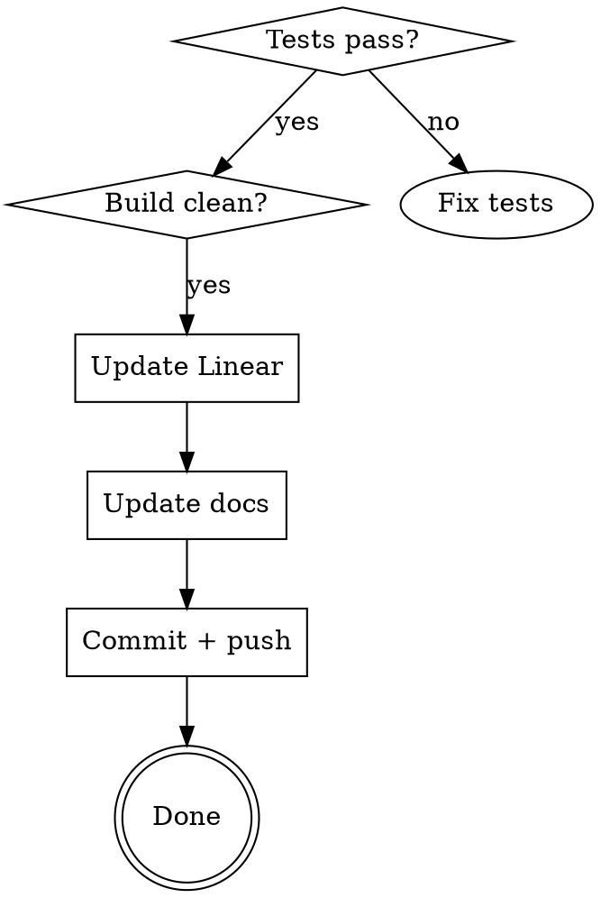

# Complete Milestone (VoxPopuli)

## Overview

Structured wrap-up process for finishing a VoxPopuli milestone. Ensures nothing is missed between "code works" and "milestone is Done."

## When to Use

- All implementation issues for a milestone are coded and passing
- Ready to mark a milestone complete in Linear
- **Not for:** mid-milestone work, single issue completion

## Completion Checklist



### 1. Verify

```bash
npx nx test api          # All tests pass
npx nx build api         # Build compiles
npx nx affected:lint     # No new lint errors
```

### 2. Linear Issues

- Query: `project:VoxPopuli milestone:"M{N}: ..."` to find ALL issues (keyword search can miss some)
- Close **every** issue including epics, implementation tasks, test tasks, and ADRs
- Watch for individual sub-tasks (e.g., per-provider issues) that keyword search may miss

### 3. Documentation (use parallel subagents)

| Document                   | What to update                             |
| -------------------------- | ------------------------------------------ |
| `README.md`                | Milestone status table                     |
| `architecture.md`          | Module specs, milestone progress, diagrams |
| `CLAUDE.md`                | Repo structure, new conventions, pitfalls  |
| `docs/codebase-summary.md` | Module inventory, test counts              |

### 4. Commit Convention

```
Implement M{N}: {milestone name}

- {key deliverable 1}
- {key deliverable 2}
- {test count} tests passing

Closes AI-{x}, AI-{y}, AI-{z}
```

## Common Mistakes

- Keyword-searching Linear instead of filtering by milestone (misses issues)
- Forgetting to close epic issues (only closing leaf tasks)
- Not updating `docs/codebase-summary.md` with new module inventory
- Committing before running full test + build + lint
