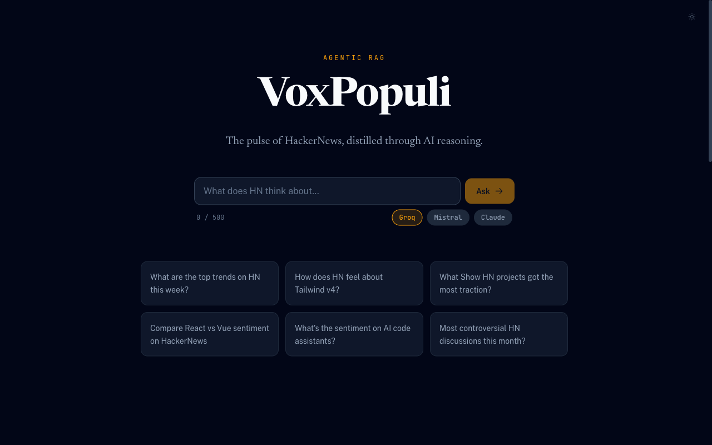
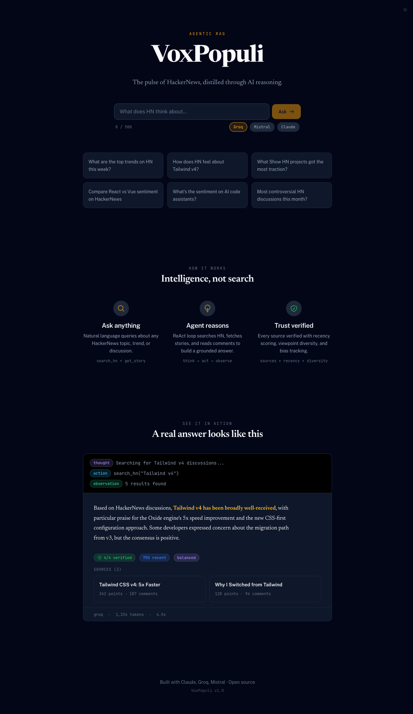
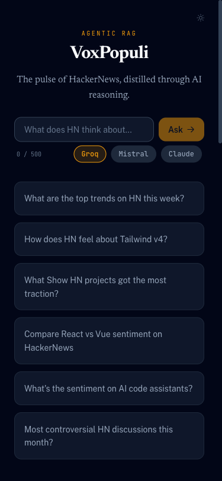
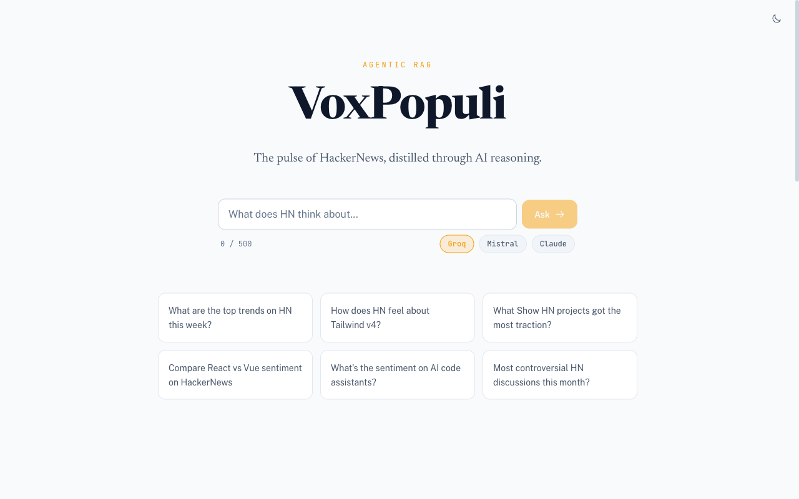

# VoxPopuli

[](https://github.com/darth-dodo/voxpopuli/actions/workflows/ci.yml)
[](https://codecov.io/gh/darth-dodo/voxpopuli)
[](LICENSE)
[](https://nodejs.org)
[](https://nestjs.com)
[](https://angular.dev)

> _"Voice of the People."_

**Ask anything about HackerNews. Get a sourced, reasoned answer -- with receipts.**

VoxPopuli is an agentic RAG system that turns 18+ years of [HackerNews](https://news.ycombinator.com) discussion into answers you can trust. It searches stories, reads comment threads, cross-references sources, and delivers a synthesized answer -- cited, verified, and transparent.

<p align="center">
  
</p>

<p align="center">
  <em>Dark theme with editorial typography and amber accents</em>
</p>

---

## How It Works

Ask a question in natural language. A **multi-agent pipeline** collects evidence, synthesizes insights, and writes a sourced editorial answer.

```
You:   "Is SQLite good enough for production web apps?"

VoxPopuli:
  [Retriever]   Searching "SQLite production"       5 stories
  [Retriever]   Searching "SQLite scaling"           3 stories
  [Retriever]   Reading comments #39482731           28 comments
  [Synthesizer] Extracting insights & contradictions
  [Writer]      Composing editorial answer

  "HN is broadly positive, with caveats around write-heavy workloads.
   Specific projects like Litestream and Turso were frequently cited..."

  All 4 sources verified · Mostly recent sources · Multiple viewpoints
```

The pipeline has three stages:

1. **Retriever** -- ReAct agent (up to 7 tool calls) collects and compacts HN evidence
2. **Synthesizer** -- extracts insights, contradictions, and sentiment from the evidence bundle
3. **Writer** -- produces an editorial answer with citations and trust metadata

The single-agent ReAct loop is available as a fallback (`useMultiAgent=false`). Both modes use the same three tools: `search_hn`, `get_story`, and `get_comments`.

---

## Screenshots

<table>
<tr>
<td width="60%">

**Desktop -- Dark Theme**



</td>
<td width="40%">

**Mobile**



</td>
</tr>
</table>

<p align="center">
  
</p>
<p align="center"><em>Light theme with warm, papery surfaces</em></p>

---

## Features

### Real-Time Reasoning

Every step streams to the UI as it happens. You see what the agent searches, what it finds, and when it decides to dig deeper. No black box.

### Trust Indicators

Every answer comes with verification metadata:

- **Sources verified** -- how many story IDs were confirmed
- **Recency** -- are sources from the last 12 months?
- **Viewpoint diversity** -- balanced, one-sided, or actively debated?
- **Show HN bias** -- flagged when the author has a vested interest

### Three LLM Providers

Pick your tradeoff. Switch from the UI.

| Provider                 | Best for               | Speed         |
| ------------------------ | ---------------------- | ------------- |
| **Groq** (Llama 3.3 70B) | Fast development       | ~300 tokens/s |
| **Mistral** Large 3      | Cost-optimized         | ~80 tokens/s  |
| **Claude** Sonnet 4      | Best synthesis quality | ~50 tokens/s  |

### Multi-Agent Pipeline

Three-stage pipeline (Retriever / Synthesizer / Writer) orchestrated by LangGraph. Each stage has per-stage failure recovery with retry and fallback response construction.

### Eval Harness

Automated quality scoring with 27 test queries across 5 evaluators (source accuracy, quality judge, efficiency, latency, cost). LangSmith integration for tracing and dataset management.

### Dark + Light Themes

Toggle between a dark OLED theme (optimized for eye comfort) and a warm light theme. Smooth CSS transitions.

---

## Getting Started

### Prerequisites

- Node.js >= 22, pnpm
- At least one LLM API key:
  - [Groq](https://console.groq.com) (free tier -- recommended for development)
  - [Mistral](https://console.mistral.ai)
  - [Anthropic](https://console.anthropic.com)

### Setup

```bash
git clone https://github.com/darth-dodo/voxpopuli.git
cd voxpopuli
pnpm install

cp .env.example .env
# Add at least one LLM API key, set LLM_PROVIDER=groq
```

### Run

```bash
# Terminal 1 -- Backend
npx nx serve api

# Terminal 2 -- Frontend (proxies /api/** to backend)
npx nx serve web --port 4201
```

Open [http://localhost:4201](http://localhost:4201) and ask a question.

### API Only

```bash
curl -X POST http://localhost:3000/api/rag/query \
  -H "Content-Type: application/json" \
  -d '{"query": "What does HN think about Rust?"}'
```

---

## Architecture

| Layer        | Technology                                              |
| ------------ | ------------------------------------------------------- |
| Monorepo     | Nx                                                      |
| Backend      | NestJS 11 (TypeScript)                                  |
| Frontend     | Angular 21 (standalone components, signals)             |
| Design       | Tailwind CSS v4, "Data Noir Editorial" design system    |
| LLM          | Claude / Mistral / Groq via LangChain.js                |
| Pipeline     | LangGraph (OrchestratorService, 3-stage pipeline)       |
| Streaming    | Server-Sent Events (SSE) with native EventSource        |
| Caching      | node-cache (in-memory, TTL-based)                       |
| Data         | HN Algolia API (search) + Firebase API (items/comments) |
| Eval         | Custom harness + LangSmith tracing                      |
| Markdown     | ngx-markdown + marked                                   |
| Shared types | `@voxpopuli/shared-types`                               |

### Frontend Components

| Component        | Purpose                                                                     |
| ---------------- | --------------------------------------------------------------------------- |
| ChatComponent    | Landing page + results page with SSE streaming                              |
| AgentSteps       | Compact timeline with merged action/result rows + pipeline stage indicators |
| SourceCard       | Clickable HN story card with metadata                                       |
| TrustBar         | Human-friendly trust indicators                                             |
| ProviderSelector | LLM provider chip selector                                                  |
| MetaBar          | Provider, tokens, human-readable latency                                    |

See [architecture.md](architecture.md) for the full technical blueprint and [product.md](product.md) for the product specification.

---

## Project Status

| Milestone                  | Status  | Highlights                                      |
| -------------------------- | ------- | ----------------------------------------------- |
| M1: Scaffold & Data Layer  | Done    | Nx monorepo, shared types, HN data + caching    |
| M2: LLM & Chunker          | Done    | Triple-stack LLM providers, token budgeting     |
| M3: Agent Core             | Done    | ReAct agent, RAG endpoints, trust framework     |
| M4: Frontend               | Done    | Chat UI, real-time streaming, design system     |
| M5: Voice Output           | Planned | ElevenLabs TTS with podcast-style narration     |
| M6: Eval Harness           | Done    | 27 queries, 5 evaluators, LangSmith integration |
| M7: Deploy & Observability | ~87%    | Docker, Render, CORS, structured logging        |
| M8: Multi-Agent Pipeline   | Done    | 3-stage pipeline, failure recovery, fallback    |

**Current stats:** ~195 tests passing across 20 test suites.

---

## Who Is This For?

| You are...                          | You ask...                                                         |
| ----------------------------------- | ------------------------------------------------------------------ |
| An **engineer** choosing tools      | "What does HN think about Bun vs Deno in 2026?"                    |
| A **founder** validating an idea    | "Has anyone built a competitor to Notion? What was the reception?" |
| A **researcher** tracking discourse | "How has sentiment on LLM agents changed over the past year?"      |
| Just **curious**                    | "What's the most controversial HN post about remote work?"         |

---

## Development

```bash
npx nx test              # Run all tests
npx nx test web          # Frontend tests (Vitest)
npx nx test api          # Backend tests (Jest)
npx nx lint              # Lint all projects
npx nx build api         # Build backend
npx nx build web         # Build frontend
npx nx test web --coverage  # Coverage report

# Eval harness (requires running API)
npx tsx evals/run-eval.ts               # Run eval harness
npx tsx evals/run-eval.ts -p groq       # Test specific provider
npx tsx evals/run-eval.ts --no-judge    # Fast mode (skip LLM judge)
```

---

## License

MIT
