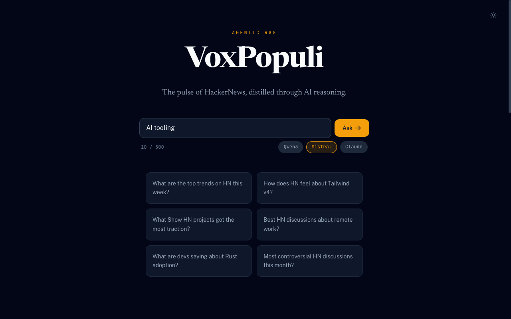
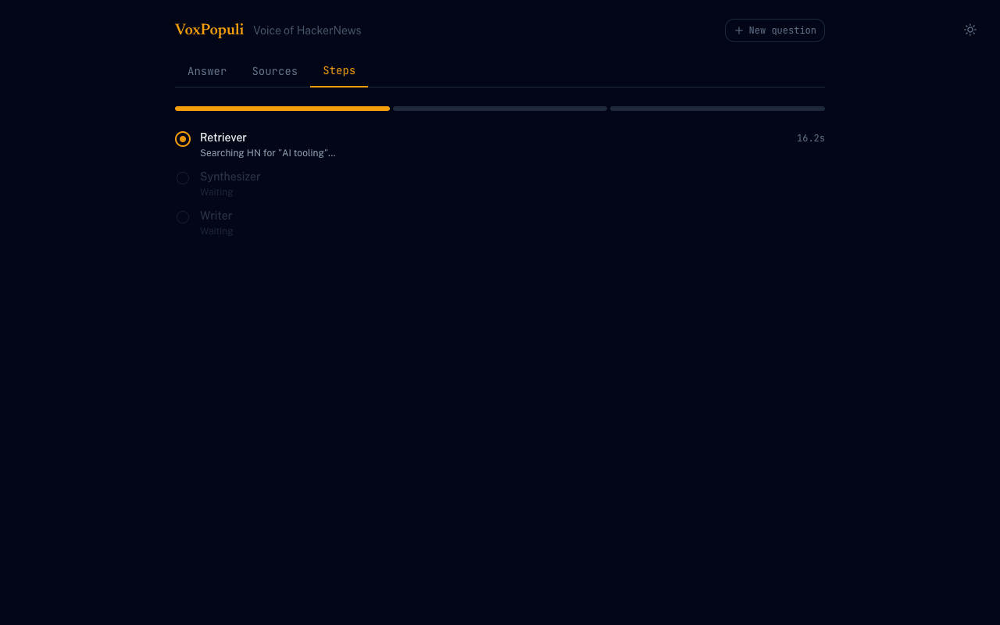
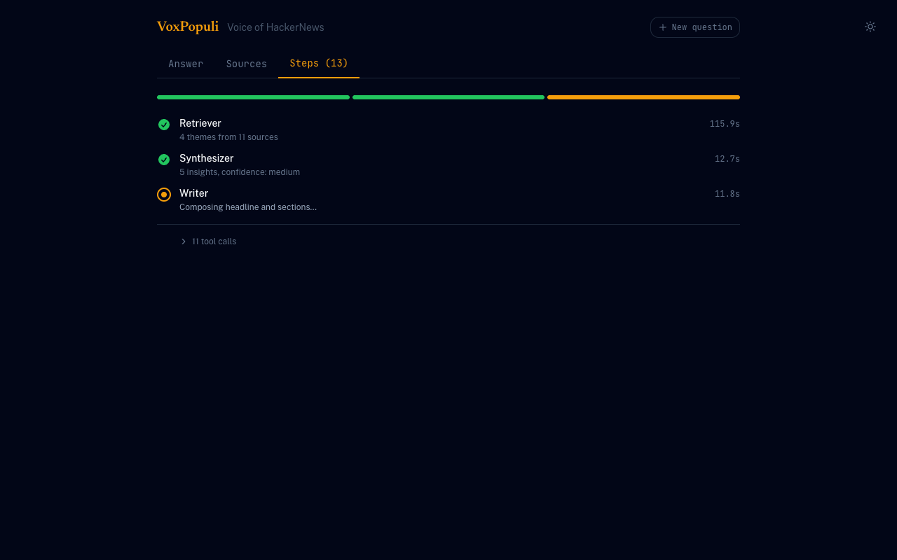
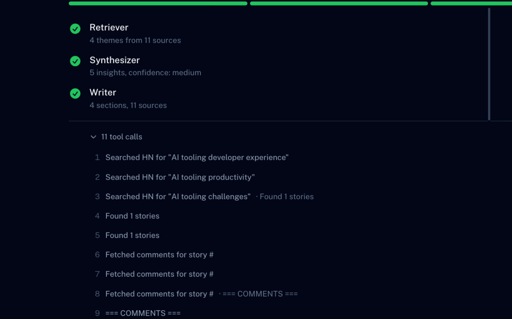
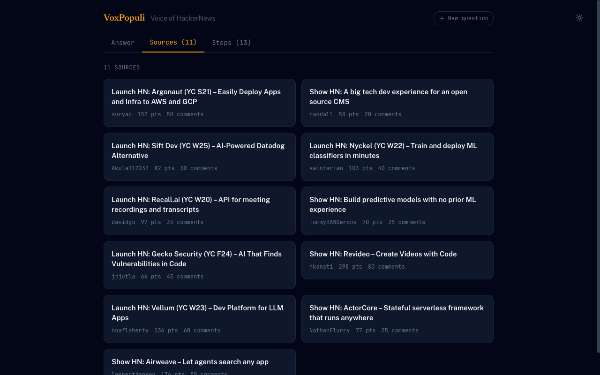
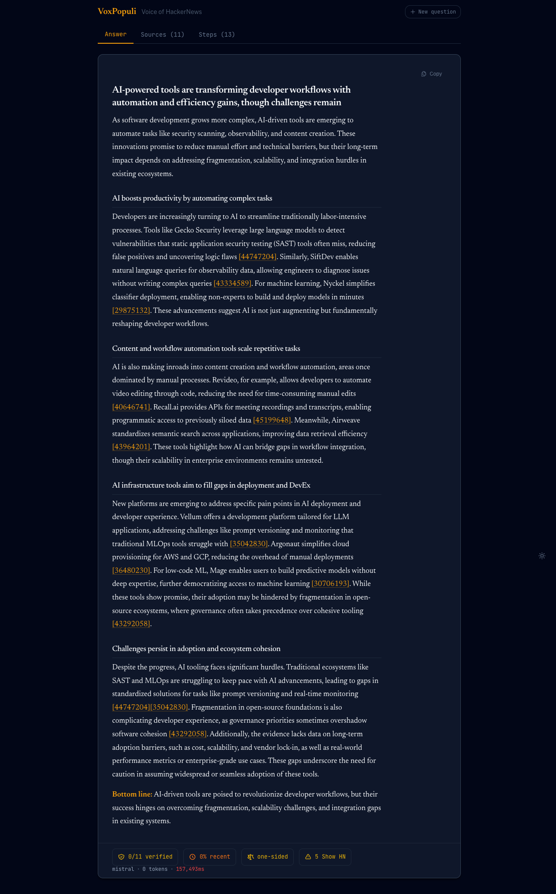

# VoxPopuli

[](https://github.com/darth-dodo/voxpopuli/actions/workflows/ci.yml)
[](https://codecov.io/gh/darth-dodo/voxpopuli)
[](LICENSE)
[](https://nodejs.org)
[](https://nestjs.com)
[](https://angular.dev)
[](https://console.groq.com)
[](https://console.mistral.ai)
[](https://console.anthropic.com)

> _"Voice of the People."_

An **agentic RAG system** that turns 18+ years of [HackerNews](https://news.ycombinator.com) discussion into sourced, reasoned answers. Multi-agent pipeline, real-time streaming, trust verification, and automated evaluation -- built as a technical showcase of modern LLM application architecture.

<p align="center">
  
</p>

---

## Technical Highlights

- **Multi-agent pipeline** orchestrated by LangGraph StateGraph: Retriever (ReAct + compaction) → Synthesizer → Writer, with per-stage retry, fallback response construction, and dry-well circuit breaker
- **Triple-stack LLM providers** (Claude / Mistral / Groq) behind a facade pattern -- hot-switchable from the UI, each with provider-specific retry and TPM handling
- **SSE streaming with query-ID resilience** -- results stored server-side by queryId so mobile background-tab kills don't lose agent runs; automatic SSE reconnect with backend dedup prevents duplicate LLM calls
- **Trust framework** computing source verification, recency, viewpoint diversity, and bias detection on every answer
- **Automated eval harness** with 27 queries, 5 evaluators (source accuracy, LLM-as-judge quality, efficiency, latency, cost), and LangSmith tracing integration
- **536 tests** (293 API + 243 Web) with CI on every push

---

## How It Works

```
You:   "Is SQLite good enough for production web apps?"

VoxPopuli:
  [Retriever]   Searching "SQLite production"       5 stories
  [Retriever]   Searching "SQLite scaling"           3 stories
  [Retriever]   Reading comments #39482731           28 comments
  [Synthesizer] Extracting insights & contradictions
  [Writer]      Composing editorial answer

  "HN is broadly positive, with caveats around write-heavy workloads.
   Specific projects like Litestream and Turso were frequently cited..."

  All 4 sources verified · Mostly recent sources · Multiple viewpoints
```

**Pipeline stages:**

1. **Retriever** -- ReAct agent searches HN via Algolia, crawls Firebase comment threads, then compacts raw data into a structured EvidenceBundle via a second LLM call
2. **Synthesizer** -- extracts insights, contradictions, confidence scores, and knowledge gaps from the evidence bundle
3. **Writer** -- produces an editorial answer with headline, sections, citations, and a bottom-line summary

The pipeline falls back to a single-agent ReAct loop on failure, preserving accurate stage status (only incomplete stages marked as error).

---

<details>
<summary><strong>Query Flow Screenshots</strong> (click to expand)</summary>

|                                                                                                      |                                                                                                 |
| ---------------------------------------------------------------------------------------------------- | ----------------------------------------------------------------------------------------------- |
| **1. Type your question**                                                                            | **2. Retriever searching HN**                                                                   |
|                  |  |
| **3. All stages complete**                                                                           | **4. Editorial answer with citations**                                                          |
|  |     |
| **5. Sources tab**                                                                                   | **6. Full answer with trust badges**                                                            |
|                      |        |

</details>

---

## Architecture

| Layer        | Technology                                                              |
| ------------ | ----------------------------------------------------------------------- |
| Monorepo     | Nx                                                                      |
| Backend      | NestJS 11 (TypeScript, module-per-domain DI)                            |
| Frontend     | Angular 21 (standalone components, signals, Tailwind CSS v4)            |
| LLM          | Claude / Mistral / Groq via LangChain.js facade                         |
| Pipeline     | LangGraph StateGraph with per-stage retry and fallback                  |
| Streaming    | SSE for live progress + QueryStore for result persistence and reconnect |
| Caching      | LRU cache (in-memory, TTL-based) with query deduplication               |
| Data         | HN Algolia API (search) + Firebase API (items/comments)                 |
| Eval         | Custom 5-evaluator harness + LangSmith tracing                          |
| TTS          | ElevenLabs with LLM-rewritten podcast scripts                           |
| Shared types | `@voxpopuli/shared-types` consumed by both apps                         |

### Key Design Decisions

| Decision            | Approach                                                           | Why                                                                                                             |
| ------------------- | ------------------------------------------------------------------ | --------------------------------------------------------------------------------------------------------------- |
| Streaming primitive | AsyncGenerator yielding discriminated unions                       | Single source of truth -- `run()` wraps `runStream()`, zero duplication between blocking and streaming paths    |
| Result delivery     | QueryStore decouples results from SSE connection                   | Mobile browsers kill background SSE; storing results server-side eliminates babysitting and duplicate LLM costs |
| LLM abstraction     | Facade over LangChain providers with interface contract            | Hot-swap providers without touching agent or pipeline code                                                      |
| Pipeline fallback   | Completed-stage tracking in generator consumer                     | Fallback preserves valid retriever output instead of marking all stages as failed                               |
| Token budgeting     | Character-based estimation (1 token ≈ 4 chars) with priority tiers | Good enough for context window management without shipping a tokenizer to Node.js                               |
| Trust computation   | Pure function, post-loop, no NestJS dependencies                   | Testable independently, runs on any agent output regardless of execution path                                   |

See [docs/architecture.md](docs/architecture.md) for the full technical blueprint and [docs/product.md](docs/product.md) for the product specification.

---

## Engineering Quality

| Metric          | Value                                                                   |
| --------------- | ----------------------------------------------------------------------- |
| Test count      | 536 (293 API + 243 Web)                                                 |
| Test framework  | Jest (API) + Vitest (Web)                                               |
| Eval queries    | 27 (20 general + 7 trust-specific)                                      |
| Eval dimensions | Source accuracy, quality judge, efficiency, latency, cost               |
| CI              | GitHub Actions on affected projects                                     |
| ADRs            | 7 architectural decision records                                        |
| Type safety     | Strict mode, shared types lib, `satisfies` enforcement on API responses |

---

## Milestone Progress

| Milestone                  | Status | Highlights                                                             |
| -------------------------- | ------ | ---------------------------------------------------------------------- |
| M1: Scaffold & Data Layer  | Done   | Nx monorepo, shared types, HN data + caching                           |
| M2: LLM & Chunker          | Done   | Triple-stack LLM providers, token budgeting                            |
| M3: Agent Core             | Done   | ReAct agent, RAG endpoints, trust framework                            |
| M4: Frontend               | Done   | Chat UI, real-time streaming, design system                            |
| M5: Voice Output           | Done   | ElevenLabs TTS with podcast-style narration                            |
| M6: Eval Harness           | Done   | 27 queries, 5 evaluators, LangSmith integration                        |
| M7: Deploy & Observability | ~87%   | Docker, Render, CORS, structured logging                               |
| M8: Multi-Agent Pipeline   | Done   | LangGraph StateGraph, per-stage retry, circuit breaker, step streaming |

---

## Quick Start

```bash
git clone https://github.com/darth-dodo/voxpopuli.git && cd voxpopuli
pnpm install
cp .env.example .env   # Add at least one LLM API key (default: Mistral)

npx nx serve api        # Backend on :3000
npx nx serve web        # Frontend on :4200 (proxies /api/** to backend)
```

```bash
npx nx test              # All tests
npx nx test api          # Backend (Jest)
npx nx test web          # Frontend (Vitest)
npx tsx evals/run-eval.ts               # Eval harness (requires running API)
npx tsx evals/run-eval.ts -p groq -n 5  # Groq provider, 5 concurrent
npx tsx evals/run-eval.ts --no-judge    # Fast mode (skip LLM judge)
```

---

## License

MIT
