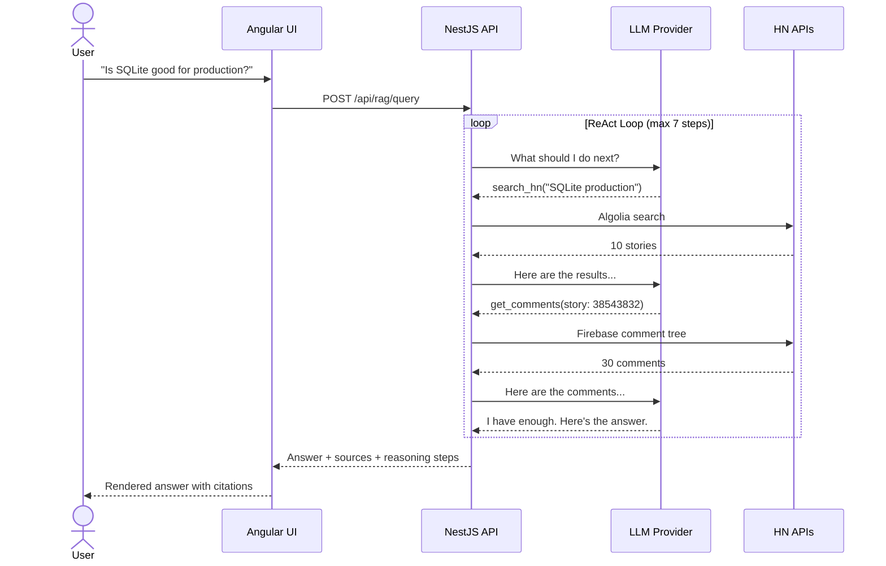
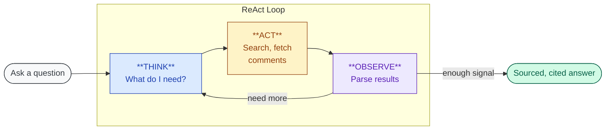
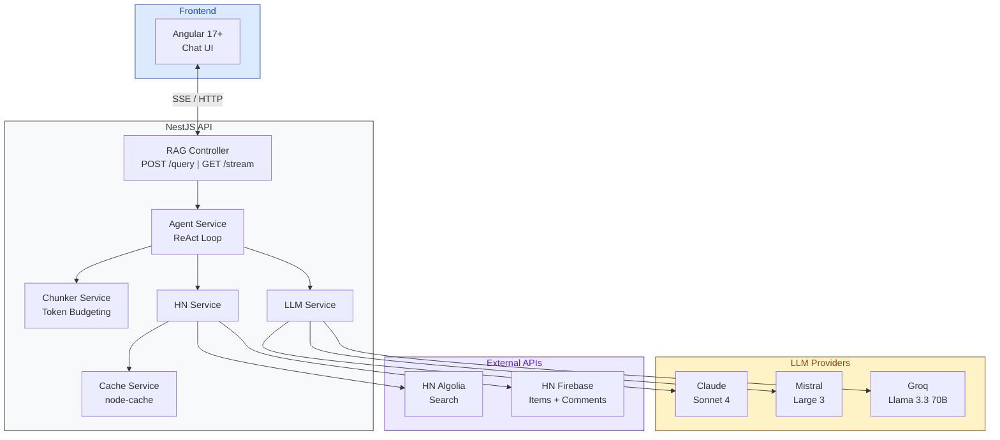

# VoxPopuli

> _"Sapientiam persequere."_ - Pursue wisdom.

**Ask anything. Get the internet's smartest crowd-sourced answer, with receipts.**

VoxPopuli turns 18+ years of [Hacker News](https://news.ycombinator.com) discussion into answers you can actually use. Ask a question. The agent searches stories, reads comment threads, cross-references sources, and delivers a synthesized answer -- cited, sourced, and transparent.

---

## The Problem

Hacker News is one of the richest knowledge bases on the internet. Engineers, founders, and researchers have spent nearly two decades debating tools, sharing war stories, and dissecting technical decisions. But that knowledge is effectively locked:

| What you want                                 | What you get today                                                        |
| --------------------------------------------- | ------------------------------------------------------------------------- |
| "Best database for time-series data"          | Keyword results that miss threads about "storing sensor data efficiently" |
| The practitioner take on SQLite in production | A 400-comment thread where the best insight is at comment #247            |
| A synthesized view across 5 relevant threads  | Five browser tabs and an hour of reading                                  |

**The knowledge exists. The retrieval doesn't.**

## The Solution

VoxPopuli is an autonomous research agent. It doesn't just search -- it _reasons_.

```
You:   "Is SQLite good enough for production web apps?"

VoxPopuli:
  -> Searches "SQLite production web app" (50+ point stories)
  -> Searches "SQLite scaling limitations" (sorted by date)
  -> Reads 28 comments from the highest-signal thread
  -> Synthesizes: "HN is broadly positive, with caveats around
     write-heavy workloads. Specific projects like Litestream
     and Turso were frequently cited..."
  -> Links to 4 HN threads with attributed opinions
```

Every claim traces back to a specific story or comment. No hallucination. If the agent can't find it, it says so.



## Who Is This For?

| You are...                          | You ask...                                                         |
| ----------------------------------- | ------------------------------------------------------------------ |
| An **engineer** choosing tools      | "What does HN think about Bun vs Deno in 2026?"                    |
| A **founder** validating an idea    | "Has anyone built a competitor to Notion? What was the reception?" |
| A **researcher** tracking discourse | "How has sentiment on LLM agents changed over the past year?"      |
| A **job seeker**                    | "What companies is HN excited about right now?"                    |
| Just **curious**                    | "What's the most controversial HN post about remote work?"         |

## What Makes It Different

### It reasons, not just retrieves

Most RAG systems: search once, stuff context, generate. VoxPopuli runs a multi-step reasoning loop. It reformulates queries based on initial results, decides whether to dive into comments, and cross-references multiple threads before answering. This produces dramatically better answers.

### You see the thinking

Every reasoning step streams to the UI in real time. You see what the agent searches, what it reads, and why it decides to dig deeper. Full transparency. No black box.

### Every answer has receipts

Story titles, authors, point counts, direct HN links, and commenter usernames for attributed opinions. You can verify anything the agent tells you.

### Three LLM providers, one interface

Pick your tradeoff:

| Provider                 | Best for                  | Cost/query      |
| ------------------------ | ------------------------- | --------------- |
| **Groq** (Llama 3.3 70B) | Speed + free dev tier     | $0 - $0.016     |
| **Mistral** Large 3      | Cost-optimized production | $0.003 - $0.015 |
| **Claude** Sonnet 4      | Best synthesis quality    | $0.02 - $0.08   |

Switch with a single environment variable. No code changes.

## How It Works



The agent loops up to 7 times, using three tools:

- **Search HN** -- query stories with filters (points, date, relevance)
- **Get Story** -- fetch full story details
- **Get Comments** -- fetch comment trees (up to 30 comments, 3 levels deep)

The LLM decides which to call, when, and in what order.

## Getting Started

### Prerequisites

- Node.js >= 18, npm >= 9
- At least one LLM API key:
  - [Groq](https://console.groq.com) (free tier available)
  - [Mistral](https://console.mistral.ai)
  - [Anthropic](https://console.anthropic.com)

### Setup

```bash
git clone https://github.com/your-username/voxpopuli.git
cd voxpopuli
npm install

cp .env.example .env
# Add at least one API key, set LLM_PROVIDER

npx nx serve api     # Backend on :3000
npx nx serve web     # Frontend on :4200
```

### Try It

```bash
curl -X POST http://localhost:3000/api/rag/query \
  -H "Content-Type: application/json" \
  -d '{"query": "What does HN think about the best programming fonts?"}'
```

## What You Get Back

```json
{
  "answer": "HN is broadly positive on Tailwind v4, with...",
  "steps": ["searched 'Tailwind v4'", "read 28 comments", "..."],
  "sources": [{ "title": "Tailwind CSS v4.0", "points": 842, "url": "https://..." }],
  "meta": {
    "provider": "groq",
    "totalTokens": 24500,
    "durationMs": 6200,
    "cached": false
  }
}
```

Every response includes the full reasoning chain, deduplicated sources with HN links, and metadata showing which provider was used, how many tokens were consumed, and whether the result was cached.

## Under the Hood



| Layer     | Technology                                              |
| --------- | ------------------------------------------------------- |
| Monorepo  | Nx                                                      |
| Backend   | NestJS (TypeScript)                                     |
| Frontend  | Angular 17+ (standalone components, signals)            |
| LLM       | Claude / Mistral / Groq via provider interface          |
| Caching   | node-cache (in-memory, TTL-based)                       |
| Data      | HN Algolia API (search) + Firebase API (items/comments) |
| Streaming | Server-Sent Events                                      |

See [product.md](product.md) for the full product specification and [architecture.md](architecture.md) for the technical blueprint and implementation plan.

## License

MIT
