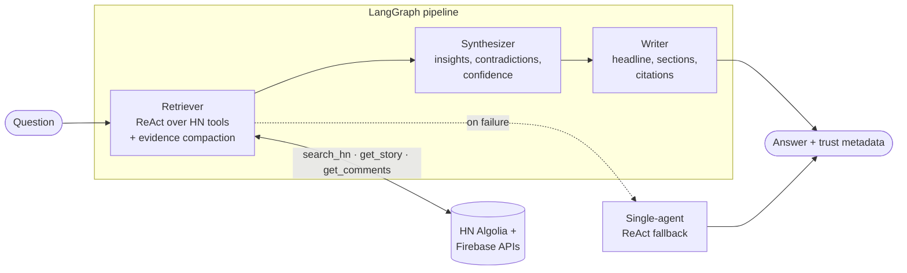
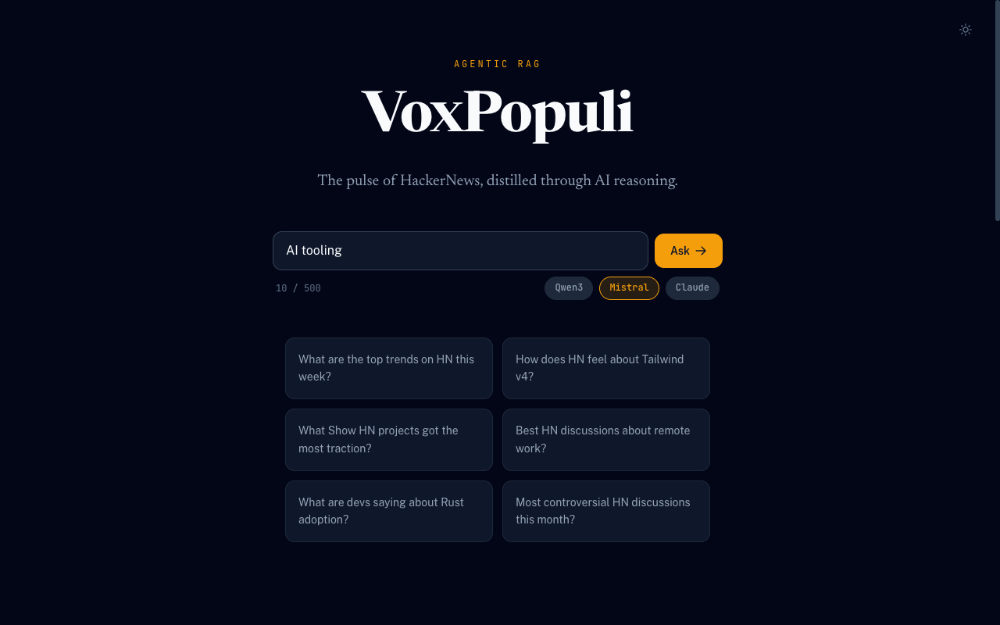
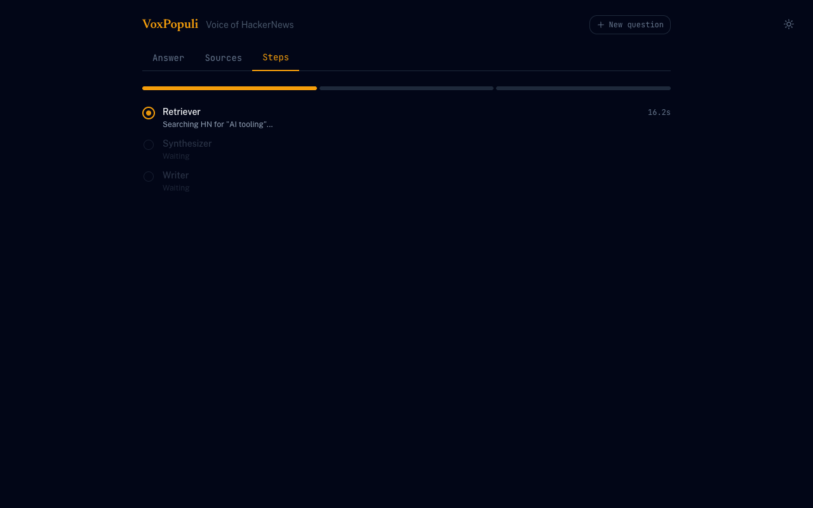
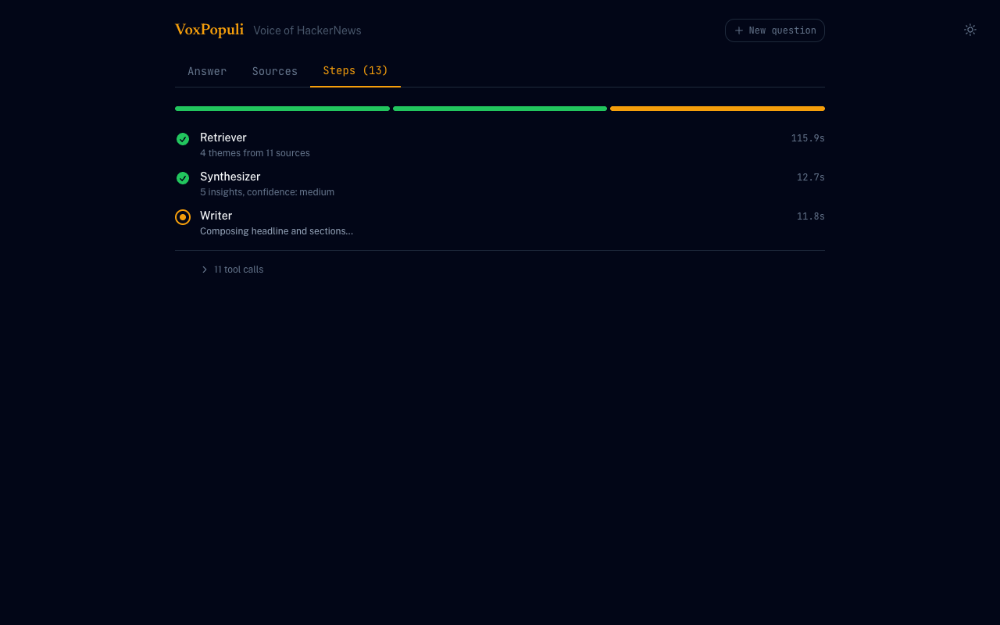
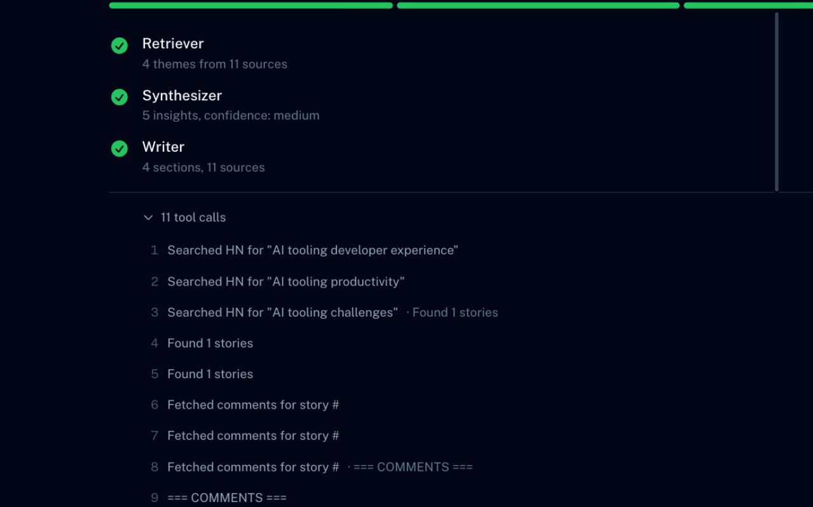
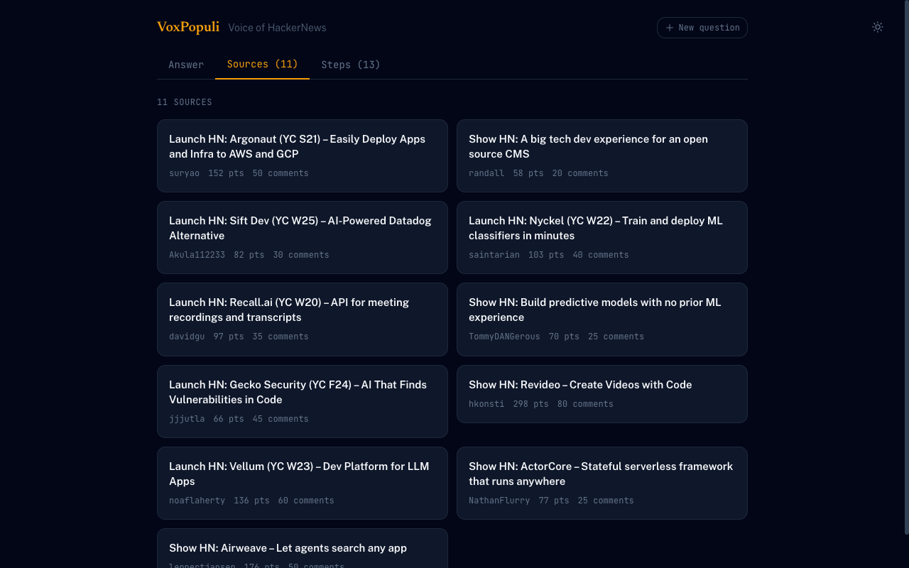
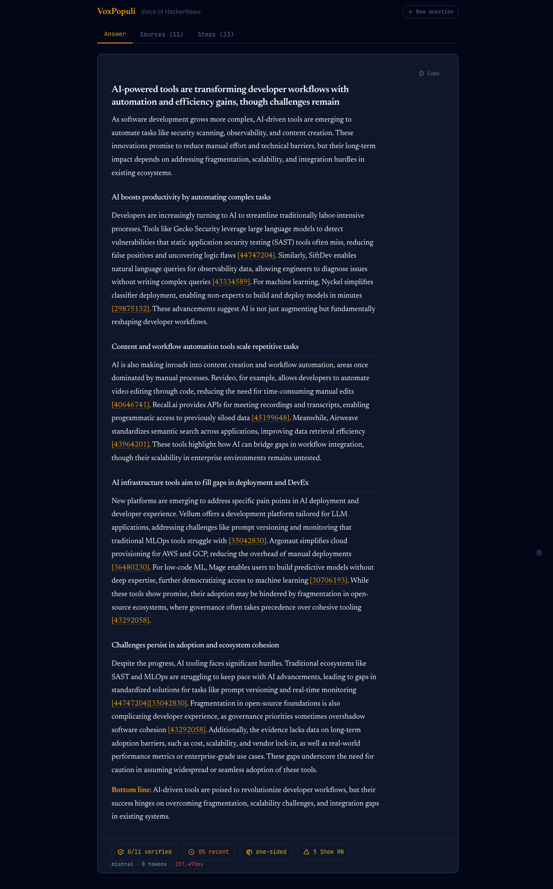

# VoxPopuli

[](https://github.com/darth-dodo/voxpopuli/actions/workflows/ci.yml)
[](https://codecov.io/gh/darth-dodo/voxpopuli)
[](LICENSE)
[](https://nodejs.org)
[](https://nestjs.com)
[](https://angular.dev)
[](https://langchain-ai.github.io/langgraphjs/)
[](https://voxpopuli-web-embx.onrender.com/)

> _"Voice of the People."_ Ask a question, get what Hacker News actually thinks: sourced, reasoned, and read aloud if you like.

VoxPopuli is an **agentic RAG system over Hacker News**. A multi-agent pipeline searches HN, reads the comment threads, weighs contradicting viewpoints, and writes an editorial answer with citations and trust signals, streaming every step to the browser as it happens.

<p align="center">
  <a href="https://voxpopuli-web-embx.onrender.com/"><strong>Try the live demo →</strong></a>
</p>

<p align="center">
  
</p>

## Contents

- [Features](#features)
- [How It Works](#how-it-works)
- [Architecture](#architecture)
- [Getting Started](#getting-started)
- [Configuration](#configuration)
- [API](#api)
- [Testing and Quality](#testing-and-quality)
- [Deployment](#deployment)
- [Project Status](#project-status)
- [Documentation](#documentation)
- [Contributing](#contributing)
- [License](#license)

## Features

- **Grounded answers.** Every claim comes from real HN stories and comments, with inline links back to the source thread.
- **Visible reasoning.** Watch the Retriever search, the Synthesizer weigh evidence, and the Writer compose, live, stage by stage.
- **Live draft.** The answer appears as a draft while the Writer is still composing it, then is replaced by the final, cited version.
- **Trust signals.** Each answer reports how many sources were verified, how recent they are, and whether the discussion is balanced, one-sided, or contested. With fewer than three sources, the stated confidence is capped and the gap is called out.
- **Follow-up questions.** Ask a follow-up under an answer and it is answered from the same evidence, without searching HN again (evidence is kept for 30 minutes).
- **Instant repeats.** Asking the same question again (same provider, ignoring case and spacing) within 15 minutes replays the completed answer instead of re-running the pipeline.
- **Choice of model.** Switch between Mistral, Claude, and Qwen3 (via OpenRouter) per question.
- **Listen mode.** One click turns an answer into a short podcast-style narration (rewritten for speech, voiced by Mistral Voxtral) with playback speed and MP3 download.
- **Resilient on mobile.** Results are stored server-side by query ID, so locking your phone or switching tabs doesn't lose a run in progress.
- **Light and dark themes**, responsive from phone to desktop.

## How It Works

```
You:   "Is SQLite good enough for production web apps?"

VoxPopuli:
  [Retriever]   Searching "SQLite production"        5 stories
  [Retriever]   Searching "SQLite scaling"           3 stories
  [Retriever]   Reading comments #39482731           28 comments
  [Synthesizer] Extracting insights & contradictions
  [Writer]      Composing editorial answer

  "HN is broadly positive, with caveats around write-heavy workloads.
   Projects like Litestream and Turso were frequently cited..."

  4/4 sources verified · mostly recent · multiple viewpoints
```


```mermaid
flowchart LR
    Q([Question]) --> R
    subgraph Pipeline [LangGraph pipeline]
      R[Retriever<br/>ReAct over HN tools<br/>+ evidence compaction] --> S[Synthesizer<br/>insights, contradictions,<br/>confidence]
      S --> W[Writer<br/>headline, sections,<br/>citations]
    end
    R <-->|search_hn · get_story · get_comments| HN[(HN Algolia +<br/>Firebase APIs)]
    W --> A([Answer + trust metadata])
    R -. on failure .-> F[Single-agent<br/>ReAct fallback] --> A
```

1. **Retriever**: a ReAct agent decomposes the question (comparisons, temporal questions, multi-faceted topics), searches HN via Algolia, reads Firebase comment trees, then compacts the raw material into a structured `EvidenceBundle`.
2. **Synthesizer**: extracts insights, contradictions, confidence, and knowledge gaps from the bundle.
3. **Writer**: produces the editorial answer with a headline, sections, citations, and a bottom line, streaming a draft to the browser as it writes.
4. **Trust metadata**: computed afterwards by a pure function covering source verification, recency, viewpoint diversity, and Show HN bias.

The LLMs only write judgement: the tools record each source's metadata (title, points, posted date) as they fetch it, and code attaches those sources to the answer ([ADR-009](docs/adr/009-pipeline-latency.md)). An opt-in merged mode (`PIPELINE_MERGED_WRITER=true`) skips the Synthesizer's LLM call and lets the Writer analyze the evidence directly ([ADR-010](docs/adr/010-merged-writer-and-model-speed.md)).

Each stage retries once. If the pipeline fails, it falls back to a single-agent ReAct loop on the same provider and keeps the output of any stage that already completed; a rejected API key ends the query immediately with a message naming the env var to fix. Every step streams to the UI over Server-Sent Events.

<details>
<summary><strong>Query flow screenshots</strong></summary>

|                                                                                             |                                                                                              |
| ------------------------------------------------------------------------------------------- | -------------------------------------------------------------------------------------------- |
| **1. Ask a question**                                                                       | **2. Retriever searching HN**                                                                |
|         |  |
| **3. All stages complete**                                                                  | **4. Editorial answer with citations**                                                       |
|  |       |
| **5. Sources**                                                                              | **6. Full answer with trust badges**                                                         |
|             |          |

</details>

## Architecture

| Layer         | Technology                                                                                                          |
| ------------- | ------------------------------------------------------------------------------------------------------------------- |
| Monorepo      | Nx, pnpm workspaces                                                                                                 |
| Backend       | NestJS 11, one module per domain (agent, cache, chunker, hn, llm, rag, tts)                                         |
| Frontend      | Angular 21: standalone components, signals, Tailwind CSS v4, "Data Noir Editorial" design system                    |
| Orchestration | LangGraph `StateGraph` with per-stage retry, fallback, and a dry-well circuit breaker                               |
| LLMs          | LangChain.js facade over Mistral (`mistral-small-latest`, default), Claude (Haiku 4.5), and OpenRouter (Qwen3 235B) |
| Streaming     | SSE from an `AsyncGenerator`, plus a query store for stored results, reconnect, dedup, and 15-minute replay         |
| Data          | HN Algolia (search) and HN Firebase (items and comments), behind an in-memory LRU cache                             |
| Voice         | Mistral Voxtral TTS (`voxtral-mini-tts-latest`) with an LLM-rewritten narration script                              |
| Evaluation    | Custom 5-evaluator harness with LangSmith tracing                                                                   |
| Contracts     | `@voxpopuli/shared-types`, shared by API and web                                                                    |

```
apps/
  api/src/        NestJS API: agent (ReAct + pipeline nodes), llm (providers), rag (HTTP + SSE),
                  hn, chunker, cache, tts, health
  web/src/app/    Angular app: chat, agent-steps timeline, trust bar, source cards, audio player
libs/
  shared-types/   API contracts and trust framework types
evals/            Evaluation harness: 27 queries, evaluators, LangSmith sync
docs/             Product spec, architecture, ADRs, screenshots
```

### Key design decisions

| Decision            | Approach                                                      | Why                                                                                         |
| ------------------- | ------------------------------------------------------------- | ------------------------------------------------------------------------------------------- |
| Streaming primitive | `AsyncGenerator` yielding discriminated unions                | `run()` wraps `runStream()`, so the blocking and streaming paths share one implementation   |
| Result delivery     | Query store decoupled from the SSE connection                 | Mobile browsers kill background SSE; stored results avoid lost runs and duplicate LLM spend |
| LLM abstraction     | Provider facade behind `LlmProviderInterface`                 | Swap providers per request without touching agent or pipeline code                          |
| Provider routing    | OpenRouter for open-weight models                             | One key for many models; routing prefers the highest-throughput host                        |
| Pipeline fallback   | Track completed stages in the generator consumer              | A fallback keeps valid Retriever output instead of failing the whole run                    |
| Token budgeting     | Character-based estimate (≈4 chars/token) with priority tiers | Good enough for context management without shipping a tokenizer                             |
| Trust computation   | Pure function, run after the loop, no framework dependencies  | Unit-testable and applies to any execution path                                             |

The full blueprint is in [docs/architecture.md](docs/architecture.md) and the product spec in [docs/product.md](docs/product.md).

## Getting Started

**Prerequisites:** Node.js 22, pnpm 10 (`corepack enable`), and an API key for at least one LLM provider. Mistral is the default and also powers Listen mode.

```bash
git clone https://github.com/darth-dodo/voxpopuli.git
cd voxpopuli
pnpm install
cp .env.example .env        # add MISTRAL_API_KEY (and optionally other provider keys)

pnpm exec nx serve api      # API on http://localhost:3000/api
pnpm exec nx serve web      # Web on http://localhost:4200 (proxies /api/** to the API)
```

Open http://localhost:4200 and ask something like _"What does HN think about htmx?"_

## Configuration

All configuration is through environment variables (see [`.env.example`](.env.example)). Only the active provider's key is required.

| Variable                 | Default                     | Purpose                                                  |
| ------------------------ | --------------------------- | -------------------------------------------------------- |
| `LLM_PROVIDER`           | `mistral`                   | Default provider: `mistral`, `claude`, or `openrouter`   |
| `PIPELINE_MERGED_WRITER` | `false`                     | Experimental: skip the Synthesizer's LLM call (ADR-010)  |
| `MISTRAL_API_KEY`        | —                           | Mistral LLM, and Voxtral TTS for Listen mode             |
| `ANTHROPIC_API_KEY`      | —                           | Claude provider                                          |
| `OPENROUTER_API_KEY`     | —                           | OpenRouter provider                                      |
| `OPENROUTER_MODEL`       | `qwen/qwen3-235b-a22b-2507` | OpenRouter model slug                                    |
| `MISTRAL_TTS_MODEL`      | `voxtral-mini-tts-latest`   | Voxtral TTS model                                        |
| `MISTRAL_TTS_VOICE`      | `en_paul_neutral`           | Narrator voice: a Voxtral preset slug or custom voice ID |
| `PORT`                   | `3000`                      | API port                                                 |
| `FRONTEND_URL`           | `http://localhost:4200`     | Allowed CORS origin                                      |
| `LOG_LEVEL`              | `info`                      | Pino log level                                           |
| `SENTRY_DSN`             | —                           | Error reporting (optional)                               |
| `LANGSMITH_API_KEY`      | —                           | Tracing and eval dashboards (optional)                   |
| `EVAL_JUDGE_PROVIDER`    | `mistral`                   | Provider for the LLM-as-judge evaluator                  |

## API

All routes are served under `/api`.

| Method | Route                                                 | Description                                                                                                                                                                                                                 |
| ------ | ----------------------------------------------------- | --------------------------------------------------------------------------------------------------------------------------------------------------------------------------------------------------------------------------- |
| `GET`  | `/rag/stream`                                         | SSE stream of pipeline, step, draft `token`, and answer events (`query`, `provider`, `useMultiAgent=true` for the pipeline, otherwise the single agent; `followUpOf=<queryId>` to answer from an earlier answer's evidence) |
| `POST` | `/rag/query`                                          | Blocking query that returns the full answer, sources, trust, and metadata (cached 10 min)                                                                                                                                   |
| `GET`  | `/rag/query/:id/result`                               | Stored result for a query ID (`202` while still running)                                                                                                                                                                    |
| `POST` | `/tts/narrate`                                        | Narrate text as MP3 (`{ text, rewrite?, voiceId? }`)                                                                                                                                                                        |
| `GET`  | `/tts/voices`                                         | Active narrator voice and model                                                                                                                                                                                             |
| `GET`  | `/hn/search`, `/hn/item/:id`, `/hn/comments/:storyId` | Cached HN data access                                                                                                                                                                                                       |
| `GET`  | `/health`                                             | Status, uptime, cache stats, and memory                                                                                                                                                                                     |
| `GET`  | `/health/llm`                                         | Live tiny check of the active LLM provider (cached 60s; 503 with `error: auth` on a rejected key, `unavailable` otherwise)                                                                                                  |

Queries are limited to 500 characters and rate-limited to 60 requests per minute. Security headers are set with Helmet.

## Testing and Quality

```bash
pnpm exec nx run-many -t test lint build   # everything CI runs, except the format check
pnpm exec nx test api                      # API unit tests (Jest)
pnpm exec nx test web                      # web unit tests (Vitest)
pnpm exec prettier --check .               # format check
```

| Area        | Details                                                                            |
| ----------- | ---------------------------------------------------------------------------------- |
| Unit tests  | 655 (404 API, 251 web); external APIs and LLM providers are always mocked          |
| CI          | GitHub Actions on affected projects: lint, test with coverage, format check, build |
| Type safety | Strict TypeScript, shared contract types, `satisfies` on API responses             |
| Git hooks   | lint-staged on commit; lint, test, and format checks on push                       |

**Evaluation harness.** 27 benchmark queries (20 general, 7 trust-specific) scored on source accuracy (30%), LLM-judged quality (30%), efficiency (15%, tool calls), latency (15%), and cost (10%), with an optional LangSmith dataset and experiment sync. It runs against a live API and, by default, exercises what users run: the multi-agent pipeline over SSE. Reports include mean/p50/p95 latency, per-stage timings, and fallback counts.

```bash
pnpm eval                                  # all queries, default provider, pipeline over SSE
pnpm exec tsx evals/run-eval.ts -p openrouter -n 5 --no-judge   # one provider, 5 concurrent, no judge
pnpm exec tsx evals/run-eval.ts -n 1 --baseline evals/results/<old>.json   # latency A/B vs a saved report
pnpm exec tsx evals/run-eval.ts --legacy   # single-agent path (users only reach it on fallback)
pnpm exec tsx evals/run-eval.ts --no-stream   # POST /rag/query instead of SSE (no stage timings)
pnpm eval:compare                          # compare openrouter, mistral, claude
```

See [evals/README.md](evals/README.md) for every option.

## Deployment

VoxPopuli ships as a [Render Blueprint](render.yaml):

- **`voxpopuli-api`**: a Docker web service built from the multi-stage [`Dockerfile`](Dockerfile) (Node 22). It is a long-running process, which the SSE streams and in-memory cache need.
- **`voxpopuli-web`**: a static site on Render's CDN, live at [voxpopuli-web-embx.onrender.com](https://voxpopuli-web-embx.onrender.com/). The API URL is injected at build time.
- **Secrets** live in the `voxpopuli-secrets` env group, shared by production and automatic PR preview environments.

> Values already set in a Render env group are not overwritten by `render.yaml`. After renaming or removing a variable, update the group in the dashboard.

## Project Status

| Milestone                    | Status | Highlights                                           |
| ---------------------------- | ------ | ---------------------------------------------------- |
| M1: Scaffold and data layer  | Done   | Nx monorepo, shared types, HN clients, caching       |
| M2: LLMs and chunker         | Done   | Provider facade, token budgeting                     |
| M3: Agent core               | Done   | ReAct agent, RAG endpoints, trust framework          |
| M4: Frontend                 | Done   | Chat UI, live streaming, design system               |
| M5: Voice output             | Done   | Podcast-style narration (now Mistral Voxtral)        |
| M6: Eval harness             | Done   | 27 queries, 5 evaluators, LangSmith                  |
| M7: Deploy and observability | ~87%   | Docker, Render, structured logging, Sentry           |
| M8: Multi-agent pipeline     | Done   | LangGraph pipeline, per-stage retry, circuit breaker |

## Documentation

| Document                                             | Contents                                                                                                                                       |
| ---------------------------------------------------- | ---------------------------------------------------------------------------------------------------------------------------------------------- |
| [docs/product.md](docs/product.md)                   | Product specification: features, API contracts, roadmap                                                                                        |
| [docs/architecture.md](docs/architecture.md)         | Technical blueprint, module specs, milestones                                                                                                  |
| [docs/codebase-summary.md](docs/codebase-summary.md) | Module inventory and environment reference                                                                                                     |
| [docs/design-system.md](docs/design-system.md)       | "Data Noir Editorial" design system                                                                                                            |
| [docs/adr/](docs/adr/)                               | Architecture Decision Records: chunking, providers, ReAct, SSE, query decomposition, query-ID resilience, TTS, pipeline latency, merged writer |
| [CHANGELOG.md](CHANGELOG.md)                         | Release notes                                                                                                                                  |

## Contributing

1. Branch from `main` (`feat/…`, `fix/…`).
2. Keep changes covered by tests, and mock all external HTTP and LLM calls.
3. Before opening a PR, run `pnpm exec nx run-many -t test lint build` and `pnpm exec prettier --check .`.
4. Use [Conventional Commits](https://www.conventionalcommits.org) (`feat:`, `fix:`, `docs:`, …) and update `CHANGELOG.md` for user-visible changes.
5. Record significant design decisions as an ADR in `docs/adr/`.

Project conventions for AI-assisted development are in [CLAUDE.md](CLAUDE.md) and [`.claude/skills/`](.claude/skills/).

## License

[MIT](LICENSE)
