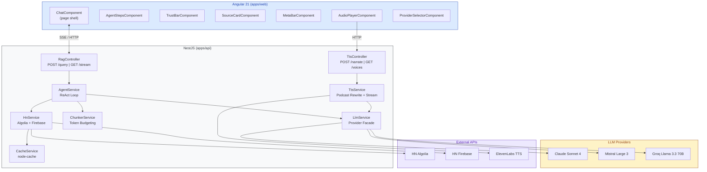
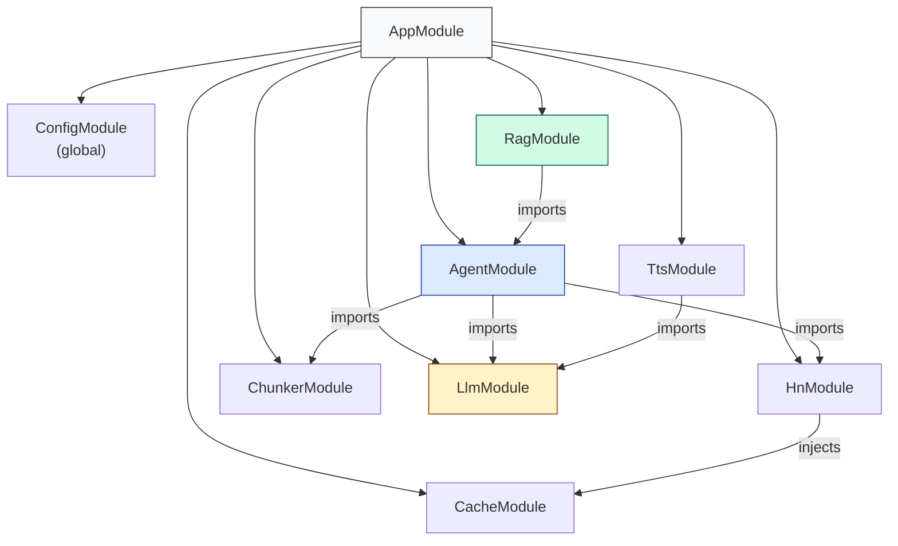
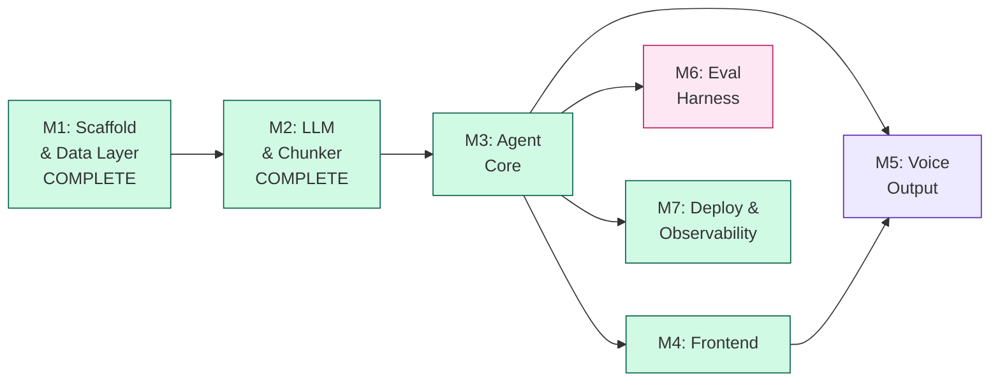

# VoxPopuli — Architecture & Implementation Plan

**Companion to:** [product.md](product.md) (what & why)
**This document:** how to build it, in what order, and how to track it in Linear

---

## Document Map

| Document                   | Purpose                                                                  |
| -------------------------- | ------------------------------------------------------------------------ |
| [product.md](product.md)   | Product vision, capabilities, API contracts, design decisions            |
| **architecture.md** (this) | Technical architecture, module design, milestones, Linear task breakdown |
| [README.md](README.md)     | Public-facing overview for users and contributors                        |

---

## 1. System Architecture

### 1.1 High-Level Diagram



### 1.2 Module Dependency Graph



### 1.3 Tech Stack

| Layer           | Technology         | Version                               |
| --------------- | ------------------ | ------------------------------------- |
| Monorepo        | Nx                 | Latest                                |
| Backend         | NestJS             | 10+                                   |
| Frontend        | Angular            | 21                                    |
| LLM (quality)   | Claude Sonnet 4    | LangChain.js (`@langchain/anthropic`) |
| LLM (cost)      | Mistral Large 3    | LangChain.js (`@langchain/mistralai`) |
| LLM (speed/dev) | Groq Llama 3.3 70B | LangChain.js (`@langchain/groq`)      |
| TTS             | ElevenLabs         | elevenlabs SDK                        |
| Cache           | node-cache         | Latest                                |
| Shared Types    | TypeScript lib     | `@voxpopuli/shared-types`             |

### 1.4 Project Structure

```
voxpopuli/
+-- apps/
|   +-- api/src/
|   |   +-- app/           # AppModule, main.ts
|   |   +-- agent/         # AgentService, tools, system prompt
|   |   +-- cache/         # CacheService (node-cache wrapper)
|   |   +-- chunker/       # ChunkerService (HTML cleanup, token budgeting)
|   |   +-- hn/            # HnService (Algolia + Firebase + caching)
|   |   +-- llm/           # LlmService, LlmProviderInterface, providers/
|   |   +-- rag/           # RagController (POST + SSE)
|   |   +-- tts/           # TtsService, TtsController, podcast-rewrite prompt
|   +-- web/src/app/
|       +-- components/    # chat, agent-steps, trust-bar, source-card, meta-bar, provider-selector
|       +-- pages/         # design-system (Tailwind token playground)
|       +-- services/      # rag.service.ts
+-- libs/
|   +-- shared-types/src/  # All shared interfaces (AgentResponse, AgentStep, etc.)
+-- evals/                 # queries.json, run-eval.ts, score.ts, results/
```

---

## 2. Module Specifications

### 2.1 Shared Types (`libs/shared-types`)

Single source of truth for all API contracts. Both apps import from `@voxpopuli/shared-types`.

**Key interfaces:**

| Interface        | Purpose                                                |
| ---------------- | ------------------------------------------------------ |
| `RagQuery`       | Query request shape                                    |
| `AgentResponse`  | Full response: answer + steps + sources + meta         |
| `AgentStep`      | Single reasoning step (thought/action/observation)     |
| `AgentSource`    | Story metadata with HN link                            |
| `StoryChunk`     | Chunked story for context window                       |
| `CommentChunk`   | Chunked comment for context window                     |
| `ToolDefinition` | Agent tool schema (search_hn, get_story, get_comments) |
| `LlmMessage`     | Provider-agnostic message format                       |
| `LlmResponse`    | Provider-agnostic response format                      |
| `TtsRequest`     | TTS narration request shape                            |

### 2.2 CacheModule

Wraps `node-cache` with typed get/set and TTL management.

| Method                           | TTL    | Description                      |
| -------------------------------- | ------ | -------------------------------- |
| `getOrSet<T>(key, fetcher, ttl)` | varies | Cache-aside pattern              |
| Search results                   | 15 min | Algolia responses                |
| Stories                          | 1 hour | Firebase item data               |
| Comments                         | 30 min | Firebase comment data            |
| Query results                    | 10 min | Full AgentResponse by query hash |

### 2.3 HnModule

Two HTTP clients behind one service, all calls wrapped with CacheService.

| Client   | Base URL                        | Methods                         |
| -------- | ------------------------------- | ------------------------------- |
| Algolia  | `hn.algolia.com/api/v1`         | `search()`, `searchByDate()`    |
| Firebase | `hacker-news.firebaseio.com/v0` | `getItem()`, `getCommentTree()` |

**Comment tree fetching:** Parallel batches of 10, hard cap 30 comments, skip deleted/dead. See product.md Section 6.3.

### 2.4 ChunkerModule

Transforms raw HN data into token-budgeted context for the LLM. Implemented in M2.

| Method                                        | Input                          | Output                        |
| --------------------------------------------- | ------------------------------ | ----------------------------- |
| `chunkStories(hits[])`                        | Algolia `HnSearchHit[]`        | `StoryChunk[]`                |
| `chunkComments(comments[])`                   | Firebase `HnComment[]`         | `CommentChunk[]`              |
| `buildContext(stories[], comments[], budget)` | Story + comment chunks, budget | `ContextWindow` (fits budget) |
| `formatForPrompt(context)`                    | `ContextWindow`                | String (ready for LLM)        |
| `estimateTokens(text)`                        | Plain text                     | Token count estimate          |
| `stripHtml(html)`                             | Raw HTML string                | Cleaned text                  |

**Token counting:** Character-based estimate (1 token ~ 4 characters). Simple and dependency-free; adequate for budgeting purposes without requiring tiktoken.

**HTML stripping:** Preserves `<code>` and `<pre>` blocks by converting them to markdown fenced code blocks. Converts `<a>` tags to markdown links. Decodes common HTML entities.

**Priority ordering in `buildContext()`:**

1. Story metadata (title, author, points) -- always included first
2. Story text bodies (Ask HN / Show HN) -- added if budget allows
3. Top-level comments (depth 0-1) -- highest priority comments
4. Nested comments (depth 2+) -- included with remaining budget

**Token budgets** (passed by caller, sourced from provider): Claude 80k, Mistral 100k, Groq 50k.

**Prompt format** (`formatForPrompt()`): Renders `=== STORIES ===` and `=== COMMENTS ===` sections with story IDs, metadata, and indented comments by depth. Appends a truncation notice when the context window was trimmed.

**Tests:** 57 unit tests covering chunking, HTML stripping, token estimation, context assembly, and prompt formatting. See `docs/adr/002-chunker-strategy.md` for design rationale.

### 2.5 LlmModule

Provider interface + facade pattern, implemented via LangChain.js. Implemented in M2.

All three providers wrap LangChain ChatModel classes rather than raw SDKs. LangChain handles tool-calling protocols (tool_use/tool_result content blocks, OpenAI-compatible function calls) internally, so the provider interface is simpler than originally specified -- no `formatTools()` or `buildToolResultMessage()` methods are needed.

| Component              | Responsibility                                                                      |
| ---------------------- | ----------------------------------------------------------------------------------- |
| `LlmProviderInterface` | Contract: `{ name, maxContextTokens, getModel(): BaseChatModel }`                   |
| `ClaudeProvider`       | `ChatAnthropic` wrapping `claude-sonnet-4-20250514` (200k context)                  |
| `MistralProvider`      | `ChatMistralAI` wrapping `mistral-large-latest` (262k context)                      |
| `GroqProvider`         | `ChatGroq` wrapping `llama-3.3-70b-versatile` (128k context)                        |
| `LlmService`           | Facade: reads `LLM_PROVIDER` env, lazy provider instantiation, per-request override |

**Key implementation details:**

- **Lazy instantiation:** Providers are created on first access via a factory map, not at module boot. The `ChatModel` instance within each provider is also lazily created on the first `getModel()` call.
- **API key validation:** Each provider validates its API key at construction time and throws immediately if missing.
- **Per-request override:** `LlmService.getModel(providerOverride?)` and `getMaxContextTokens(providerOverride?)` accept an optional provider name to use a different provider for a single call.
- **Provider registry:** A `PROVIDER_FACTORIES` map provides type-safe construction. Valid values: `groq`, `claude`, `mistral`.

**Tests:** 22 unit tests covering provider resolution, lazy instantiation, API key validation, override support, and error handling. See `docs/adr/003-llm-provider-architecture.md` for design rationale.

### 2.6 AgentModule

The ReAct loop. See product.md Section 3.3 for the pattern and Section 8 for tool specs.

| Method                      | Description                                   |
| --------------------------- | --------------------------------------------- |
| `run(query, options)`       | Execute full ReAct loop, return AgentResponse |
| `executeTool(name, params)` | Dispatch to HnService, return chunked results |

**Constraints:** Max 7 steps, 60s global timeout, 5 concurrent runs (semaphore).

**Tools:** `search_hn`, `get_story`, `get_comments`. Defined in `tools.ts`, system prompt in `system-prompt.ts`.

### 2.7 RagModule

Thin controller layer. No business logic.

| Endpoint          | Method | Description                      |
| ----------------- | ------ | -------------------------------- |
| `/api/rag/query`  | POST   | Full blocking response           |
| `/api/rag/stream` | GET    | SSE streaming of reasoning steps |
| `/api/health`     | GET    | Provider status + cache stats    |

**Middleware:** Rate limiting (10/min per IP, 60/min global) via `express-rate-limit`.

### 2.8 TtsModule

See product.md Section 18 for full pipeline, voice config, and cost analysis.

| Method                              | Description                                    |
| ----------------------------------- | ---------------------------------------------- |
| `TtsService.narrate(text, sources)` | Full pipeline: rewrite + stream audio          |
| `TtsService.rewriteForSpeech(text)` | LLM call to convert markdown to podcast script |
| `TtsService.streamAudio(script)`    | ElevenLabs streaming TTS                       |

| Endpoint           | Method | Description                  |
| ------------------ | ------ | ---------------------------- |
| `/api/tts/narrate` | POST   | Streaming MP3 audio response |
| `/api/tts/voices`  | GET    | Active narrator info         |

### 2.9 Frontend Architecture

#### Component Hierarchy

All components are **Angular 21 standalone components** (no NgModules). Reactive state is managed with **Angular signals** -- no RxJS stores or BehaviorSubjects.

```
ChatComponent (page shell — query input, answer display, conversation layout)
├── AgentStepsComponent    — real-time step timeline; merges action+observation pairs into compact rows; auto-collapses when answer arrives
├── TrustBarComponent      — trust metadata visualization (source count, recency, diversity)
├── SourceCardComponent    — story card with title, author, points, HN link
├── MetaBarComponent       — response metadata (provider, timing, step count)
└── ProviderSelectorComponent — LLM provider dropdown
```

| Component                   | Responsibility                                                                                  |
| --------------------------- | ----------------------------------------------------------------------------------------------- |
| `ChatComponent`             | Page shell: query input, answer display with `ngx-markdown` rendering, conversation layout      |
| `AgentStepsComponent`       | Real-time step timeline (expandable); merges action+observation pairs; auto-collapses on answer |
| `TrustBarComponent`         | Trust metadata badges (source count, recency, viewpoint diversity)                              |
| `SourceCardComponent`       | Story card with title, author, points, HN link                                                  |
| `MetaBarComponent`          | Response metadata: provider name, latency, step count                                           |
| `ProviderSelectorComponent` | LLM provider dropdown                                                                           |
| `AudioPlayerComponent`      | Listen button, play/pause, progress, speed, download (M5)                                       |
| `RagService`                | HTTP POST for blocking queries + native `EventSource` for SSE streaming                         |
| `TtsService`                | HTTP client for TTS endpoint, audio blob management (M5)                                        |

#### Styling

- **Tailwind CSS v4** with CSS-first `@theme` configuration (no `tailwind.config.js`)
- Design system utility classes: `vp-card`, `vp-prose`, `vp-badge`, etc.
- Light/dark theme via CSS custom property overrides on `:root` / `.dark`
- Markdown rendering via `ngx-markdown` (used in ChatComponent for answer display)

#### Dev Server Setup

- `npx nx serve api` — backend on port 3000
- `npx nx serve web --port 4201` — frontend on port 4201
- Proxy config at `apps/web/proxy.conf.json` forwards `/api/**` to `http://localhost:3000`

---

## 3. Milestones & Linear Task Breakdown

### How to Read This

```
Epic (Linear Project or Cycle)
  Story (Linear Issue, type: Story)
    Task (Linear Sub-issue or checklist item)
```

**Milestone = a shippable, testable vertical slice.** Each milestone ends with something you can demo.

---

### Milestone 1: Scaffold & Data Layer -- COMPLETE

**Goal:** Nx monorepo running, shared types defined, HN data flowing with caching.
**Demo:** `curl` an internal endpoint that returns cached HN search results.

#### Epic 1.1: Project Bootstrap

- **Story: Initialize Nx monorepo** (AI-101)

  - Create Nx workspace with `apps/api` (NestJS) and `apps/web` (Angular)
  - Create `libs/shared-types` library
  - Configure `tsconfig.base.json` path aliases
  - Add `.env.example` with all config keys
  - Verify `nx serve api` and `nx serve web` both start

- **Story: Define shared types** (AI-102)

  - Define `RagQuery`, `AgentResponse`, `AgentStep`, `AgentSource`
  - Define `StoryChunk`, `CommentChunk`, `ContextWindow`
  - Define `ToolDefinition`, `LlmMessage`, `LlmResponse`
  - Define `TtsRequest`
  - Export all from `@voxpopuli/shared-types`

- **Story: Configure .gitignore** (AI-137)
- **Story: Configure ESLint + Prettier** (AI-138)
- **Story: Set up GitHub Actions CI** (AI-139)
- **Story: Add pre-commit hooks** (AI-140)
- **Story: Add structured JSON logging** (AI-141)
- **Story: Configure graceful shutdown + port binding** (AI-142)
- **Story: Verify nx serve + build + test end-to-end** (AI-143)
- **Story: Create health check endpoint with integration test** (AI-151)
- **Story: Create project Makefile** (AI-152)
- **Story: Configure CORS for Angular dev server** (AI-156)
- **Story: Add Dockerfile and docker-compose** (AI-155)

#### Epic 1.2: HN Data Service

- **Story: Implement CacheModule** (AI-103)

  - Install `node-cache`
  - Implement `CacheService` with typed `getOrSet<T>()` pattern
  - Configure TTLs per data type
  - Add cache stats method (hits, misses, keys)

- **Story: Implement HnService (Algolia)** (AI-104)

  - HTTP client for `hn.algolia.com/api/v1`
  - `search(query, options)` with sort, min_points, max_results
  - `searchByDate(query, options)` for date-sorted results
  - Wrap all calls with CacheService (15 min TTL)
  - Type responses into shared types

- **Story: Implement HnService (Firebase)** (AI-105)

  - HTTP client for `hacker-news.firebaseio.com/v0`
  - `getItem(id)` with 1-hour cache
  - `getCommentTree(storyId, maxDepth)` with 30-comment cap
  - Parallel batching (10 concurrent), skip deleted/dead
  - 30 min cache per comment item

- **Story: Write HnService integration tests** (AI-147)

---

### Milestone 2: LLM & Chunker -- COMPLETE

**Goal:** Any of the 3 LLM providers can receive a prompt and return a response. Content fits token budgets.
**Demo:** A script sends an HN search result through the chunker and gets an LLM summary.

#### Epic 2.1: Content Chunker -- COMPLETE

- **Story: ADR: Chunker strategy and token budget design** (AI-144) -- DONE
  - Documented in `docs/adr/002-chunker-strategy.md`
- **Story: Implement ChunkerService** (AI-108) -- DONE
  - `chunkStories()` -- extract metadata, strip HTML, count tokens
  - `chunkComments()` -- filter deleted/dead, strip HTML, preserve depth
  - `buildContext()` -- 4-phase priority assembly (metadata, text, top-level comments, nested)
  - `formatForPrompt()` -- render context as LLM-ready string with `=== STORIES ===` / `=== COMMENTS ===` sections
  - `estimateTokens()` -- character-based estimate (1 token ~ 4 chars), no tiktoken dependency
  - `stripHtml()` -- preserves `<code>`/`<pre>` as markdown fenced code blocks, converts `<a>` to markdown links
- **Story: Write ChunkerService unit tests** (AI-148) -- DONE (57 tests)

#### Epic 2.2: LLM Provider Stack -- COMPLETE

- **Story: ADR: LLM provider architecture and tool protocol design** (AI-145) -- DONE
  - Documented in `docs/adr/003-llm-provider-architecture.md`
- **Story: Define LlmProviderInterface** (AI-109) -- DONE
  - Simplified from original spec: `{ name, maxContextTokens, getModel(): BaseChatModel }`
  - `chat()`, `formatTools()`, `buildToolResultMessage()` not needed -- LangChain.js handles tool protocols internally
  - No separate `ChatOptions`, `LlmMessage`, or `LlmResponse` types needed at the provider level
- **Story: Implement GroqProvider** (AI-110) -- DONE (`ChatGroq`, `llama-3.3-70b-versatile`, 128k)
- **Story: Implement ClaudeProvider** (AI-111) -- DONE (`ChatAnthropic`, `claude-sonnet-4-20250514`, 200k)
- **Story: Implement MistralProvider** (AI-112) -- DONE (`ChatMistralAI`, `mistral-large-latest`, 262k)
- **Story: Implement LlmService facade** (AI-113) -- DONE (lazy instantiation, per-request override, 22 tests)

---

### Milestone 3: Agent Core

**Goal:** The ReAct loop works end-to-end. Ask a question, get a sourced answer.
**Demo:** `curl POST /api/rag/query` returns a full `AgentResponse` with steps and sources.
**Status:** DONE -- 14 issues, 103 tests, live-tested with Mistral.

#### Epic 3.1: ReAct Agent

- **Story: ADR: ReAct agent design and tool selection strategy** (AI-146) -- DONE (`docs/adr/004-react-agent-design.md`)
- **Story: Add trust-related shared types** (AI-159) -- DONE (`TrustMetadata`, `RewriteTrustMetadata`, `Claim` in shared-types)
- **Story: Define agent tools** (AI-116) -- DONE (`search_hn`, `get_story`, `get_comments` via LangChain `tool()` helper with Zod schemas)
- **Story: Write system prompt** (AI-117) -- DONE (claim taxonomy, contrarian search, honesty rules from product.md Section 13)
- **Story: Implement AgentService.run()** (AI-118) -- DONE
  - Uses LangChain `createAgent` (v1.2+) instead of `createReactAgent` + `AgentExecutor`
  - Streaming via `.stream()` with `streamMode: "values"`
  - Max 7 steps via `recursionLimit`, 60s timeout via `AbortSignal.timeout()`
  - Concurrent run semaphore (max 5, simple counter)
  - Returns `AgentResponse` with steps, sources, trust metadata
- **Story: Implement trust metadata** (AI-160) -- DONE (source verification, recency, viewpoint diversity, Show HN detection, honesty flags)
- **Story: Return partial results on LLM failure** (AI-164) -- DONE (returns collected data on mid-loop errors, clean error on first-call failure)
- **Story: Add retry logic with exponential backoff** (AI-163) -- DONE (3 attempts, jitter, applied to Algolia + Firebase)
- **Story: Write AgentService integration tests** (AI-149) -- DONE (6 tests: execution, concurrency, semaphore cleanup, prompt template, source extraction)

#### Epic 3.2: RAG Endpoints

- **Story: Implement RagController** (AI-119) -- DONE
  - `POST /api/rag/query` -- blocking, cached (10 min TTL), returns full AgentResponse
  - `GET /api/rag/stream` -- SSE with thought/action/observation/answer/error events (post-completion replay model)
  - Rate limiting: global 60 req/min (timestamp array, no per-IP tracking)
  - Input validation via class-validator DTO + global ValidationPipe
- **Story: Implement global exception filter** (AI-154) -- DONE (400/429/502/500 mapping, structured error body, request context logging)
- **Story: Write RagController integration tests** (AI-150) -- DONE (7 tests: POST cached/uncached, SSE events, error events, input validation, rate limiting)

---

### Milestone 4: Frontend

**Goal:** Working chat UI with live reasoning visualization and source cards.
**Demo:** Open browser, ask a question, see the agent think in real time, get a sourced answer.

#### Epic 4.1: Core UI

- **Story: Set up Tailwind CSS** (AI-153)
- **Story: Implement ChatComponent** (AI-121)
- **Story: Implement AgentStepsComponent** (AI-122)
- **Story: Implement SourceCardComponent** (AI-123)
- **Story: Implement ProviderSelectorComponent + meta bar** (AI-124)
- **Story: Implement RagService (HTTP + EventSource)** (AI-125)

---

### Milestone 5: Voice Output

**Goal:** Click Listen on any answer and hear it narrated as a podcast.
**Demo:** Ask a question, get an answer, click Listen, hear the podcast-style narration.

#### Epic 5.1: TTS Backend

- **Story: Implement TtsService**

  - Install `elevenlabs` SDK
  - `rewriteForSpeech()` -- LLM call with podcast rewrite prompt
  - `streamAudio()` -- ElevenLabs streaming TTS API
  - `narrate()` -- full pipeline (rewrite + stream)
  - Voice config from env (voice ID, model ID)
  - Character count header for cost tracking

- **Story: Implement TtsController**

  - `POST /api/tts/narrate` -- streaming MP3 response
  - `GET /api/tts/voices` -- active narrator info
  - Input validation (text required, max length)
  - Rate limiting

- **Story: Write podcast rewrite prompt**
  - System prompt for conversational rewrite
  - Strip markdown, naturalize citations, add transitions
  - Target 800-1200 characters
  - Sign-off: "That's the signal from HN. I'm VoxPopuli."

#### Epic 5.2: TTS Frontend

- **Story: Implement AudioPlayerComponent**

  - Listen button on answer bubble
  - States: idle -> loading -> streaming -> paused -> complete
  - Play/pause, progress bar
  - Speed selector (0.75x / 1x / 1.25x / 1.5x)
  - Download MP3 button

- **Story: Implement TtsService (frontend)**
  - POST to `/api/tts/narrate`
  - Receive audio blob, create object URL
  - Feed to HTML5 `<audio>` element
  - Cleanup URLs on component destroy

---

### Milestone 6: Eval Harness

**Goal:** Automated quality checks catch regressions in agent behavior.
**Demo:** Run `npx tsx evals/run-eval.ts` and get a scored report. View traces and experiment comparisons in LangSmith dashboard.
**Status:** Not started

**Approach:** Hybrid -- local `queries.json` (version-controlled) + LangSmith for tracing, evaluation loop, and dashboard. Results saved both to LangSmith and locally in `evals/results/`.

**Dependencies:** `langsmith` SDK, `tsx`, `dotenv`. LangSmith free tier (5k traces/month).

#### Project Structure

```
evals/
├── queries.json              # 27 test queries (20 general + 7 trust)
├── types.ts                  # EvalQuery, EvalRunResult, EvalScore, EvalReport
├── run-eval.ts               # CLI entry: loads queries, runs agent, scores, reports
├── dataset.ts                # LangSmith dataset sync helper
├── score.ts                  # Score aggregation and reporting
├── evaluators/
│   ├── source-accuracy.ts    # HTTP 200 checks on source URLs + Firebase IDs
│   ├── quality-judge.ts      # LLM-as-judge (Mistral) for expectedQualities
│   ├── efficiency.ts         # Steps vs maxAcceptableSteps
│   ├── latency.ts            # Duration vs provider-specific targets
│   └── cost.ts               # Token cost vs $0.05 ceiling
│   └── __tests__/            # Unit tests for all evaluators
├── results/                  # Timestamped JSON reports (.gitignored)
└── tsconfig.json             # Standalone TS config for tsx
```

#### Epic 6.1: Evaluation System

- **Story: Install eval dependencies** (AI-TBD)

  - Add `langsmith`, `tsx`, `dotenv` as devDependencies
  - Create `evals/tsconfig.json` extending `tsconfig.base.json`
  - Add `eval` and `eval:compare` npm scripts
  - Create `evals/results/.gitignore`

- **Story: Create eval test queries** (AI-TBD)

  - Write 27 queries in `evals/queries.json`
  - 7 categories: tool comparisons (5), opinion (4), specific projects (3), recent events (3), deep-dive (3), edge cases (2), trust (7)
  - Each with `id`, `query`, `category`, `expectedQualities`, `expectedMinSources`, `maxAcceptableSteps`
  - Trust queries t06-t07 (podcast rewrite) deferred to M5

- **Story: Write eval type definitions** (AI-TBD)

  - `EvalQuery`, `EvalRunResult`, `EvalScore`, `EvalReport` in `evals/types.ts`
  - Import `AgentResponse` from `@voxpopuli/shared-types`

- **Story: Implement source accuracy evaluator** (AI-TBD)

  - HTTP HEAD checks on `AgentSource.url`
  - Firebase API verification of `AgentSource.storyId`
  - `Promise.allSettled` with 5s timeout per request
  - Unit tests with mocked fetch

- **Story: Implement LLM-as-judge quality checklist evaluator** (AI-TBD)

  - Direct Groq API call (decoupled from NestJS)
  - Checks each `expectedQuality` as PRESENT/ABSENT
  - Configurable judge provider via `EVAL_JUDGE_PROVIDER` env var
  - Unit tests with mocked Groq API

- **Story: Implement efficiency, latency, and cost evaluators** (AI-TBD)

  - Efficiency: linear scoring against `maxAcceptableSteps`
  - Latency: tiered scoring (6s/13s/30s thresholds per provider)
  - Cost: token-based estimation against $0.05 ceiling
  - Unit tests for all three

- **Story: Implement eval runner with LangSmith integration** (AI-TBD)

  - `run-eval.ts` CLI: `--provider`, `--compare`, `--query` flags
  - `dataset.ts`: sync `queries.json` to LangSmith dataset
  - Calls `evaluate()` from `langsmith/evaluation` when API key present
  - Falls back to local-only mode without LangSmith
  - Saves results to `evals/results/{timestamp}-{provider}.json`

- **Story: Implement score aggregation and reporting** (AI-TBD)

  - Weighted scoring: source (30%), quality (30%), efficiency (15%), latency (15%), cost (10%)
  - Summary table printed to stdout
  - `--compare` mode: side-by-side provider comparison table

- **Story: Add LangSmith tracing to agent service** (AI-TBD)

  - No code changes -- LangChain auto-traces when `LANGSMITH_TRACING=true`
  - Add LangSmith env vars to `.env.example`
  - Verify traces appear in LangSmith dashboard

- **Story: Update documentation for M6** (AI-TBD)

  - Update `architecture.md`, `product.md`, `CLAUDE.md`
  - Add eval commands to development docs

---

## 4. Milestone Dependencies



**Critical path:** M1 -> M2 -> M3 -> M4

**Parallel after M3:** M5 (voice) and M6 (evals) can run in parallel with M4, but M5's frontend depends on M4.

**Current status:** M1-M4 complete. M7 (Deploy) ~87% done. M6 (Eval Harness) is next.

---

## 5. Implementation Order (Solo Dev)

As a solo developer, this is the recommended build order. Each milestone builds on the last and ends with something testable.

| Order | Milestone                  | Stories | Depends On | Status      |
| ----- | -------------------------- | ------- | ---------- | ----------- |
| 1     | M1: Scaffold & Data Layer  | 16      | --         | COMPLETE    |
| 2     | M2: LLM & Chunker          | 8       | M1         | COMPLETE    |
| 3     | M3: Agent Core             | 14      | M2         | COMPLETE    |
| 4     | M4: Frontend               | 22      | M3         | COMPLETE    |
| 5     | M7: Deploy & Observability | 13      | M3         | ~87%        |
| 6     | M6: Eval Harness           | 10      | M3         | Not started |
| 7     | M5: Voice Output           | 5       | M3, M4     | Not started |

**Why evals now?** With M3 (agent) and M4 (frontend) complete and M7 (deploy) nearly done, the eval harness is the highest-impact next milestone. It catches regressions when tweaking the system prompt, chunker, or token budgets. LangSmith integration provides tracing and a dashboard for free since VoxPopuli already uses LangChain.js.

**Total: 7 milestones, ~80 stories.**

---

## 6. Environment Configuration

```env
# LLM Provider (required)
LLM_PROVIDER=groq                          # claude | mistral | groq

# API Keys (only active provider required)
GROQ_API_KEY=gsk_...
MISTRAL_API_KEY=...
ANTHROPIC_API_KEY=sk-ant-...

# ElevenLabs TTS (required for voice output)
ELEVENLABS_API_KEY=...
ELEVENLABS_VOICE_ID=nPczCjzI2devNBz1zQrb   # Brian (default narrator)
ELEVENLABS_MODEL=eleven_multilingual_v2

# Server
PORT=3000

# LangSmith (optional -- leave empty to disable tracing and eval dashboard)
LANGSMITH_API_KEY=
LANGSMITH_TRACING=true
LANGSMITH_PROJECT=voxpopuli-evals

# Eval config
EVAL_API_URL=http://localhost:3000
EVAL_JUDGE_PROVIDER=mistral
```

---

## 7. Key Technical Constraints

| Constraint               | Value          | Rationale                                |
| ------------------------ | -------------- | ---------------------------------------- |
| Max agent steps          | 7              | Cost + latency cap                       |
| Agent timeout            | 60s            | Prevent runaway loops                    |
| Concurrent agents        | 5              | Prevent cost blowout                     |
| Comment cap              | 30 per story   | Firebase API latency                     |
| Query max length         | 500 chars      | Input sanity                             |
| Rate limit (per IP)      | 10 req/min     | Abuse prevention                         |
| Rate limit (global)      | 60 req/min     | Cost protection                          |
| Cache TTL (search)       | 15 min         | Freshness vs cost                        |
| Cache TTL (stories)      | 1 hour         | Stable data                              |
| Cache TTL (comments)     | 30 min         | Semi-stable data                         |
| Cache TTL (query result) | 10 min         | Token savings                            |
| Context window (Claude)  | 200k tokens    | `claude-sonnet-4-20250514` via LangChain |
| Context window (Mistral) | 262k tokens    | `mistral-large-latest` via LangChain     |
| Context window (Groq)    | 128k tokens    | `llama-3.3-70b-versatile` via LangChain  |
| Token budget (Claude)    | 80k of 200k    | Conservative headroom                    |
| Token budget (Mistral)   | 100k of 262k   | Conservative headroom                    |
| Token budget (Groq)      | 50k of 128k    | Conservative headroom                    |
| Token estimation         | 1 char / 4     | Character-based, no tiktoken dependency  |
| TTS max chars            | 2500           | ElevenLabs streaming limit               |
| Eval query count         | 27             | 20 general + 7 trust-specific            |
| Eval pass threshold      | 0.6 weighted   | Minimum score for a query to "pass"      |
| Eval judge provider      | Mistral        | Default for LLM-as-judge calls           |
| Eval score weights       | 30/30/15/15/10 | Source/Quality/Efficiency/Latency/Cost   |
| LangSmith free tier      | 5k traces/mo   | Sufficient for eval harness usage        |

---

## 8. Definition of Done

A story is **not done** until all of the following are met:

| Criterion         | Description                                                         |
| ----------------- | ------------------------------------------------------------------- |
| **Code complete** | Implementation matches the story description                        |
| **Tests pass**    | Unit/integration tests written and passing for the story's scope    |
| **CI green**      | `nx affected:lint` and `nx affected:test` pass                      |
| **Types safe**    | No `any` types. Strict mode. No TypeScript errors                   |
| **JSDoc**         | Public methods have JSDoc comments                                  |
| **No TODOs**      | No `TODO` or `FIXME` left in committed code for core functionality  |
| **Works E2E**     | The milestone's demo scenario still works after the story is merged |

**Per-milestone gate:** Before moving to the next milestone, run the milestone's demo scenario end-to-end and confirm it works. For M3+, also run the eval harness and confirm no regressions.

---

## 9. Cross-References to product.md

| This Document               | product.md                                                          |
| --------------------------- | ------------------------------------------------------------------- |
| Module specs (Section 2)    | API contracts (Section 7), Tool specs (Section 8)                   |
| LLM providers (Section 2.5) | Provider architecture (Section 5), Native tool protocol (Section 9) |
| Token budgets (Section 2.4) | Data flow (Section 6.2)                                             |
| TTS module (Section 2.8)    | Voice output (Sections 3.8, 18)                                     |
| Constraints (Section 7)     | NFRs (Section 13), Rate limiting (Section 3.7)                      |
| Milestones (Section 3)      | Roadmap (Section 14)                                                |

### ADRs

| ADR                                         | Milestone | Decision                                                  |
| ------------------------------------------- | --------- | --------------------------------------------------------- |
| `docs/adr/002-chunker-strategy.md`          | M2        | Token budgeting approach and priority ordering            |
| `docs/adr/003-llm-provider-architecture.md` | M2        | LangChain.js wrapper pattern, lazy provider instantiation |
