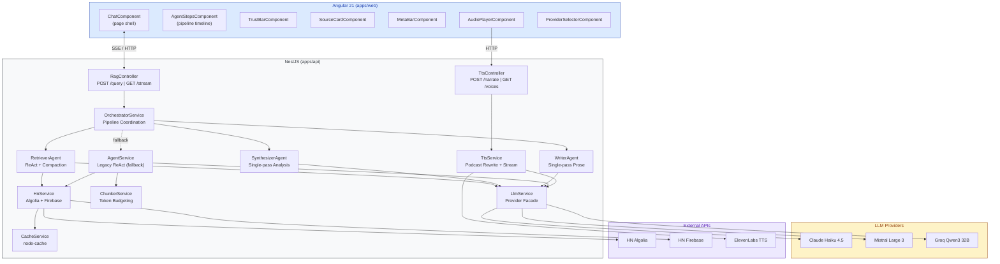
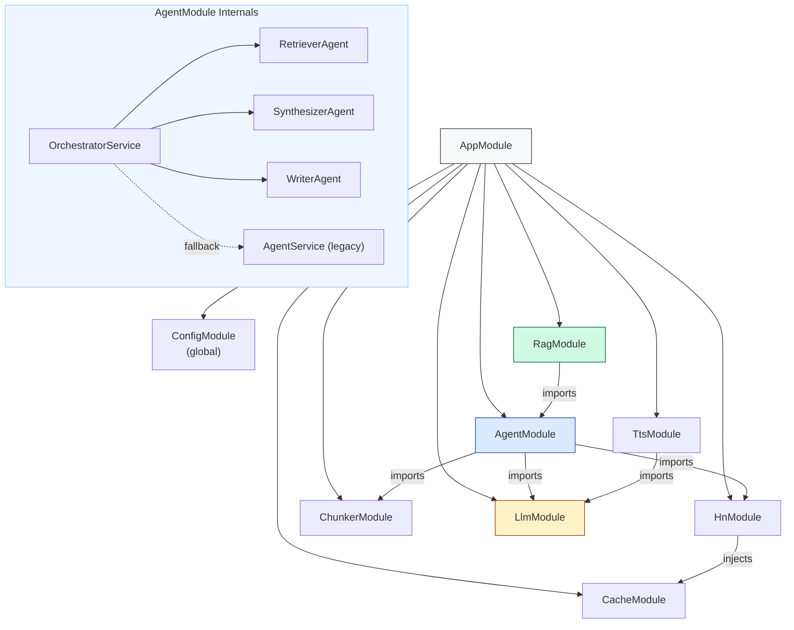
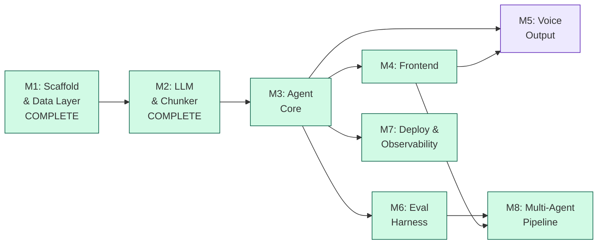

# VoxPopuli — Architecture & Implementation Plan

**Companion to:** [product.md](product.md) (what & why)
**This document:** how to build it, in what order, and how to track it in Linear

---

## Document Map

| Document                   | Purpose                                                                  |
| -------------------------- | ------------------------------------------------------------------------ |
| [product.md](product.md)   | Product vision, capabilities, API contracts, design decisions            |
| **architecture.md** (this) | Technical architecture, module design, milestones, Linear task breakdown |
| [README.md](README.md)     | Public-facing overview for users and contributors                        |

---

## 1. System Architecture

### 1.1 High-Level Diagram



### 1.2 Module Dependency Graph



### 1.3 Tech Stack

| Layer           | Technology       | Version                               |
| --------------- | ---------------- | ------------------------------------- |
| Monorepo        | Nx               | Latest                                |
| Backend         | NestJS           | 10+                                   |
| Frontend        | Angular          | 21                                    |
| LLM (quality)   | Claude Haiku 4.5 | LangChain.js (`@langchain/anthropic`) |
| LLM (cost)      | Mistral Large 3  | LangChain.js (`@langchain/mistralai`) |
| LLM (speed/dev) | Groq Qwen3 32B   | LangChain.js (`@langchain/groq`)      |
| TTS             | ElevenLabs       | elevenlabs SDK                        |
| Cache           | node-cache       | Latest                                |
| Shared Types    | TypeScript lib   | `@voxpopuli/shared-types`             |

### 1.4 Project Structure

```
voxpopuli/
+-- apps/
|   +-- api/src/
|   |   +-- app/           # AppModule, main.ts
|   |   +-- agent/         # Multi-agent pipeline
|   |   |   +-- orchestrator.service.ts  # Pipeline coordination
|   |   |   +-- retriever.agent.ts       # ReAct search + compaction
|   |   |   +-- synthesizer.agent.ts     # Single-pass analysis
|   |   |   +-- writer.agent.ts          # Single-pass prose
|   |   |   +-- agent.service.ts         # Legacy ReAct (fallback)
|   |   |   +-- tools.ts, system-prompt.ts
|   |   |   +-- prompts/                 # Per-agent system prompts
|   |   +-- cache/         # CacheService (node-cache wrapper)
|   |   +-- chunker/       # ChunkerService (HTML cleanup, token budgeting)
|   |   +-- hn/            # HnService (Algolia + Firebase + caching)
|   |   +-- llm/           # LlmService, LlmProviderInterface, providers/
|   |   +-- rag/           # RagController (POST + SSE)
|   |   +-- tts/           # TtsService, TtsController, podcast-rewrite prompt
|   +-- web/src/app/
|       +-- components/    # chat, agent-steps, trust-bar, source-card, meta-bar, provider-selector
|       +-- pages/         # design-system (Tailwind token playground)
|       +-- services/      # rag.service.ts
+-- libs/
|   +-- shared-types/src/  # All shared interfaces
|       +-- evidence.types.ts   # EvidenceBundle, ThemeGroup, EvidenceItem
|       +-- analysis.types.ts   # AnalysisResult, Insight, Contradiction
|       +-- response.types.ts   # AgentResponse v2, ResponseSection
|       +-- pipeline.types.ts   # PipelineConfig, PipelineEvent, PipelineResult
|       +-- index.ts            # barrel export + existing types
+-- evals/                 # Eval harness: queries.json, run-eval.ts, evaluators/, feedback.ts, results/
```

---

## 2. Module Specifications

### 2.1 Shared Types (`libs/shared-types`)

Single source of truth for all API contracts. Both apps import from `@voxpopuli/shared-types`.

**Key interfaces:**

| Interface         | Purpose                                                                        |
| ----------------- | ------------------------------------------------------------------------------ |
| `RagQuery`        | Query request shape                                                            |
| `AgentResponse`   | Full response: answer + steps + sources + meta                                 |
| `AgentStep`       | Single reasoning step (thought/action/observation)                             |
| `AgentSource`     | Story metadata with HN link                                                    |
| `StoryChunk`      | Chunked story for context window                                               |
| `CommentChunk`    | Chunked comment for context window                                             |
| `ToolDefinition`  | Agent tool schema (search_hn, get_story, get_comments)                         |
| `LlmMessage`      | Provider-agnostic message format                                               |
| `LlmResponse`     | Provider-agnostic response format                                              |
| `TtsRequest`      | TTS narration request shape                                                    |
| `EvidenceItem`    | Compacted insight from HN (1-3 sentences, classified)                          |
| `ThemeGroup`      | Themed group of evidence with sentiment and raw count                          |
| `EvidenceBundle`  | Retriever output: themes, sources, timeRange                                   |
| `Insight`         | Synthesizer finding with claim, strength, themes                               |
| `Contradiction`   | Where sources disagree, with assessment                                        |
| `AnalysisResult`  | Synthesizer output: insights, contradictions, confidence                       |
| `ResponseSection` | Writer section: heading, body, cited sources                                   |
| `PipelineConfig`  | Per-agent provider map, token budgets (incl. `synthesizerInput`), feature flag |
| `PipelineEvent`   | SSE event: stage, status, detail, elapsed                                      |
| `PipelineResult`  | Full result with intermediates, timing, token usage                            |

### 2.2 CacheModule

Wraps `node-cache` with typed get/set and TTL management.

| Method                           | TTL    | Description                      |
| -------------------------------- | ------ | -------------------------------- |
| `getOrSet<T>(key, fetcher, ttl)` | varies | Cache-aside pattern              |
| Search results                   | 15 min | Algolia responses                |
| Stories                          | 1 hour | Firebase item data               |
| Comments                         | 30 min | Firebase comment data            |
| Query results                    | 10 min | Full AgentResponse by query hash |

### 2.3 HnModule

Two HTTP clients behind one service, all calls wrapped with CacheService.

| Client   | Base URL                        | Methods                         |
| -------- | ------------------------------- | ------------------------------- |
| Algolia  | `hn.algolia.com/api/v1`         | `search()`, `searchByDate()`    |
| Firebase | `hacker-news.firebaseio.com/v0` | `getItem()`, `getCommentTree()` |

**Comment tree fetching:** Parallel batches of 10, hard cap 30 comments, skip deleted/dead. See product.md Section 6.3.

### 2.4 ChunkerModule

Transforms raw HN data into token-budgeted context for the LLM. Implemented in M2.

| Method                                        | Input                          | Output                        |
| --------------------------------------------- | ------------------------------ | ----------------------------- |
| `chunkStories(hits[])`                        | Algolia `HnSearchHit[]`        | `StoryChunk[]`                |
| `chunkComments(comments[])`                   | Firebase `HnComment[]`         | `CommentChunk[]`              |
| `buildContext(stories[], comments[], budget)` | Story + comment chunks, budget | `ContextWindow` (fits budget) |
| `formatForPrompt(context)`                    | `ContextWindow`                | String (ready for LLM)        |
| `estimateTokens(text)`                        | Plain text                     | Token count estimate          |
| `stripHtml(html)`                             | Raw HTML string                | Cleaned text                  |

**Token counting:** Character-based estimate (1 token ~ 4 characters). Simple and dependency-free; adequate for budgeting purposes without requiring tiktoken.

**HTML stripping:** Preserves `<code>` and `<pre>` blocks by converting them to markdown fenced code blocks. Converts `<a>` tags to markdown links. Decodes common HTML entities.

**Priority ordering in `buildContext()`:**

1. Story metadata (title, author, points) -- always included first
2. Story text bodies (Ask HN / Show HN) -- added if budget allows
3. Top-level comments (depth 0-1) -- highest priority comments
4. Nested comments (depth 2+) -- included with remaining budget

**Token budgets** (passed by caller, sourced from provider): Claude 80k, Mistral 100k, Groq 50k.

**Prompt format** (`formatForPrompt()`): Renders `=== STORIES ===` and `=== COMMENTS ===` sections with story IDs, metadata, and indented comments by depth. Appends a truncation notice when the context window was trimmed.

**Tests:** 57 unit tests covering chunking, HTML stripping, token estimation, context assembly, and prompt formatting. See `docs/adr/002-chunker-strategy.md` for design rationale.

### 2.5 LlmModule

Provider interface + facade pattern, implemented via LangChain.js. Implemented in M2.

All three providers wrap LangChain ChatModel classes rather than raw SDKs. LangChain handles tool-calling protocols (tool_use/tool_result content blocks, OpenAI-compatible function calls) internally, so the provider interface is simpler than originally specified -- no `formatTools()` or `buildToolResultMessage()` methods are needed.

| Component              | Responsibility                                                                      |
| ---------------------- | ----------------------------------------------------------------------------------- |
| `LlmProviderInterface` | Contract: `{ name, maxContextTokens, getModel(): BaseChatModel }`                   |
| `ClaudeProvider`       | `ChatAnthropic` wrapping `claude-haiku-4-5-20251001` (200k context)                 |
| `MistralProvider`      | `ChatMistralAI` wrapping `mistral-large-latest` (262k context)                      |
| `GroqProvider`         | `ChatGroq` wrapping `qwen/qwen3-32b` (131k context)                                 |
| `LlmService`           | Facade: reads `LLM_PROVIDER` env, lazy provider instantiation, per-request override |

**Key implementation details:**

- **Lazy instantiation:** Providers are created on first access via a factory map, not at module boot. The `ChatModel` instance within each provider is also lazily created on the first `getModel()` call.
- **API key validation:** Each provider validates its API key at construction time and throws immediately if missing.
- **Per-request override:** `LlmService.getModel(providerOverride?)` and `getMaxContextTokens(providerOverride?)` accept an optional provider name to use a different provider for a single call.
- **Provider registry:** A `PROVIDER_FACTORIES` map provides type-safe construction. Valid values: `groq`, `claude`, `mistral`.

**Tests:** 22 unit tests covering provider resolution, lazy instantiation, API key validation, override support, and error handling. See `docs/adr/003-llm-provider-architecture.md` for design rationale.

### 2.6 AgentModule

**Updated in v3.0:** The AgentModule now contains the multi-agent pipeline alongside the legacy single-agent path.

#### Multi-Agent Pipeline (v3.0)

| Component             | Pattern                    | Description                                                     |
| --------------------- | -------------------------- | --------------------------------------------------------------- |
| `OrchestratorService` | Pipeline coordinator       | Runs Retriever → Synthesizer → Writer, emits SSE PipelineEvents |
| `RetrieverAgent`      | ReAct loop + compaction    | Searches HN, collects data, compacts into `EvidenceBundle`      |
| `SynthesizerAgent`    | Single-pass structured I/O | Extracts insights from bundle, produces `AnalysisResult`        |
| `WriterAgent`         | Single-pass structured I/O | Composes prose from analysis, produces `AgentResponse`          |

**Pipeline flow:**

```
Query → OrchestratorService.run(query, config)
  ├── RetrieverAgent.retrieve(query)  →  EvidenceBundle
  ├── SynthesizerAgent.analyze(bundle)  →  AnalysisResult
  └── WriterAgent.compose(query, analysis, bundle)  →  AgentResponse
```

**Configuration:** `PipelineConfig` controls provider-per-agent mapping, token budgets (including `synthesizerInput` for bundle size guarding), and timeout.

**Default configuration:** All three agents use the globally selected provider (`LLM_PROVIDER`). Token budgets: retriever 2000, synthesizer 1500, writer 1000. Timeout: 30s.

Additional presets (`optimized`, `speed`, `cost`) are deferred until eval data shows a need for per-stage provider splitting. The eval harness can use cache bypass via environment variable (`CACHE_DISABLED=true`) rather than a dedicated preset.

**Eval mode:** The eval harness disables caching via `CACHE_DISABLED=true` environment variable and uses the default pipeline config with extended timeout (60s). No dedicated preset needed.

**Feature flag:** `PipelineConfig.useMultiAgent` (default: `false` during rollout). When `false`, falls back to legacy `AgentService`.

#### PipelineEvent Detail Contracts

The `detail` field is a free-form string for SSE simplicity, but both backend emitters and frontend renderers must follow these conventions:

**Retriever progress details:**

- `"Reformulating query..."`
- `"Searching HN for '{searchTerm}'..."`
- `"Fetching comments from {n} stories..."`
- `"Compacting {n} sources into themes..."`

**Retriever done summary:** `"{n} themes from {m} sources (~{t} tokens)"`

**Synthesizer progress details:**

- `"Analyzing {n} themes..."`
- `"Extracting insights and contradictions..."`

**Synthesizer done summary:** `"{n} insights, {m} contradictions, confidence: {level}"`

**Writer progress details:**

- `"Composing headline and sections..."`
- `"Attaching citations..."`

**Writer done summary:** `"{n} sections, {m} sources cited"`

**Error detail (any stage):** The error message string. Frontend displays as-is.

#### Bundle Size Guard

Before passing the `EvidenceBundle` to the Synthesizer, the Orchestrator validates that `bundle.tokenCount` does not exceed 4000 tokens. If oversized, the Orchestrator truncates to the highest-relevance themes. Implementation details deferred to M8 implementation.

#### Orchestrator Failure Modes

The pipeline can fail at three points. Each has a different recovery strategy:

| Failure Point                                 | What Happened                   | Recovery Strategy                                                                                                                                      |
| --------------------------------------------- | ------------------------------- | ------------------------------------------------------------------------------------------------------------------------------------------------------ |
| Retriever fails                               | No evidence collected           | Fall back to legacy `AgentService` via `runWithFallback()`                                                                                             |
| Retriever succeeds, Synthesizer fails         | Evidence exists but no analysis | **Retry Synthesizer once** with same `EvidenceBundle`. If second attempt fails, fall back to legacy.                                                   |
| Retriever + Synthesizer succeed, Writer fails | Analysis exists but no prose    | **Retry Writer once** with same `AnalysisResult`. If second attempt fails, return a raw/fallback response built directly from `AnalysisResult` fields. |

**Key rule:** Never re-run the Retriever on a downstream failure. The Retriever is the slowest and most expensive stage (ReAct loop + HN API calls). If its output exists, reuse it.

**Fallback response construction:** When the Writer fails after retry, `buildFallbackResponse()` constructs a minimal `AgentResponse` directly from `AnalysisResult` fields:

- `headline` = `analysis.summary`
- `sections` = one `ResponseSection` per insight (claim as heading, reasoning as body)
- `bottomLine` = `"Analysis confidence: ${analysis.confidence}. Gaps: ${analysis.gaps.join(', ')}"`
- `sources` = `bundle.allSources`

This ensures the user always gets something useful, even if the Writer agent is down. The response won't be polished prose, but it will contain the actual analysis.

#### JSON Parse Safety

The Synthesizer and Writer both depend on parsing structured JSON from LLM output. LLMs sometimes return invalid JSON (trailing commas, markdown fencing, hallucinated fields). The Orchestrator must:

1. Strip markdown code fences (` ```json ... ``` `) before parsing
2. Attempt `JSON.parse()` with a try/catch
3. On parse failure, retry the agent once with an appended "Respond with valid JSON only" instruction
4. Validate parsed output against the expected interface (check required fields exist)

This is more likely to fail in practice than bundle size overflow or partial pipeline failure.

#### Retriever Agent

The only agent with a ReAct loop (it needs tools and iteration). Two phases:

1. **Collection (ReAct):** Uses `search_hn`, `get_story`, `get_comments` tools. Max 8 iterations. Stops when evidence is sufficient or rounds exhausted.
2. **Compaction (single LLM call):** Converts raw HN data into 3-6 `ThemeGroup`s at ~600 tokens total. Each evidence item is classified (`evidence` | `anecdote` | `opinion` | `consensus`) and scored for relevance.

**Critical boundary:** No raw HN data crosses into the Synthesizer. Only the compacted `EvidenceBundle` passes through.

**Dry-well circuit breaker:** If the Retriever executes 3 consecutive tool calls that return zero relevant results (no stories above 5 points, no comments with substance), the ReAct loop exits early. The Retriever compacts whatever it has collected so far and returns a partial `EvidenceBundle`.

This prevents burning 8 iterations on a topic HN hasn't discussed. When early exit triggers:

- `themes` may be empty or sparse
- `totalSourcesScanned` will be low
- The Synthesizer handles this gracefully by setting `confidence: 'low'` and populating `gaps` with "Limited HN discussion found on this topic."

#### Synthesizer Agent

Single-pass structured output. Receives `EvidenceBundle`, produces `AnalysisResult`:

- 3-5 insights ranked by evidence strength (cap enforced)
- Contradictions where sources disagree
- Overall confidence rating (`high` | `medium` | `low`)
- Gaps in coverage

No tools, no iteration. The input is complete and bounded (~600 tokens).

#### Writer Agent

Single-pass structured output. Receives `AnalysisResult` + `EvidenceBundle` (for source IDs only), produces `AgentResponse`.

- Headline (lead with the answer, not the sources)
- Context paragraph (why this matters)
- 2-4 themed sections with inline citations
- Bottom line takeaway

**Critical prompt constraint:** The Writer receives the `EvidenceBundle` alongside the `AnalysisResult`, but ONLY as a citation lookup table. The Writer's system prompt must explicitly prohibit re-analysis:

```
## CITATION RULES
You receive two inputs:
1. AnalysisResult -- this is your SOLE source of truth for claims and insights.
2. EvidenceBundle -- this is ONLY for looking up source IDs to create citations.

You MUST NOT:
- Re-interpret evidence items in the bundle.
- Draw conclusions that contradict or extend the AnalysisResult.
- Add insights not present in AnalysisResult.insights.
- Change the confidence level or gaps.

If AnalysisResult says confidence is "low", your prose reflects that uncertainty.
If AnalysisResult lists a gap, your response includes that gap as a disclaimer.
You are a composer, not an analyst.
```

**Why this matters:** Without this constraint, the Writer will second-guess the Synthesizer. Different LLM providers will produce inconsistent answers because the Writer re-analyzes the same evidence and reaches different conclusions. The Synthesizer is the single source of truth for what the evidence means. The Writer decides how to say it.

**Test case:** Pass an `AnalysisResult` with `confidence: 'low'` and an `EvidenceBundle` with strong-looking evidence. Assert that the Writer's output reflects low confidence (matches the analysis), not high confidence (re-derived from the bundle).

#### Legacy AgentService (Fallback)

The original ReAct agent from v0.5.0. Retained as a fallback path via `OrchestratorService.runWithFallback()`.

| Method                      | Description                                   |
| --------------------------- | --------------------------------------------- |
| `run(query, options)`       | Execute full ReAct loop, return AgentResponse |
| `executeTool(name, params)` | Dispatch to HnService, return chunked results |

**Constraints:** Max 7 steps, 180s global timeout, 5 concurrent runs (semaphore).

**Tools:** `search_hn`, `get_story`, `get_comments`. Defined in `tools.ts`, system prompt in `system-prompt.ts`.

### 2.7 RagModule

Thin controller layer. No business logic.

| Endpoint          | Method | Description                      |
| ----------------- | ------ | -------------------------------- |
| `/api/rag/query`  | POST   | Full blocking response           |
| `/api/rag/stream` | GET    | SSE streaming of reasoning steps |
| `/api/health`     | GET    | Provider status + cache stats    |

**Middleware:** Rate limiting (10/min per IP, 60/min global) via `express-rate-limit`.

### 2.8 TtsModule

See product.md Section 18 for full pipeline, voice config, and cost analysis.

| Method                              | Description                                    |
| ----------------------------------- | ---------------------------------------------- |
| `TtsService.narrate(text, sources)` | Full pipeline: rewrite + stream audio          |
| `TtsService.rewriteForSpeech(text)` | LLM call to convert markdown to podcast script |
| `TtsService.streamAudio(script)`    | ElevenLabs streaming TTS                       |

| Endpoint           | Method | Description                  |
| ------------------ | ------ | ---------------------------- |
| `/api/tts/narrate` | POST   | Streaming MP3 audio response |
| `/api/tts/voices`  | GET    | Active narrator info         |

### 2.9 Frontend Architecture

#### Component Hierarchy

All components are **Angular 21 standalone components** (no NgModules). Reactive state is managed with **Angular signals** -- no RxJS stores or BehaviorSubjects.

```
ChatComponent (page shell — query input, answer display, conversation layout)
├── AgentStepsComponent    — pipeline stage timeline (retriever/synthesizer/writer); shows PipelineEvent progress; falls back to ReAct step view for legacy mode
├── TrustBarComponent      — trust metadata visualization (source count, recency, diversity)
├── SourceCardComponent    — story card with title, author, points, HN link
├── MetaBarComponent       — response metadata (provider, timing, step count)
└── ProviderSelectorComponent — LLM provider dropdown
```

| Component                   | Responsibility                                                                                                                         |
| --------------------------- | -------------------------------------------------------------------------------------------------------------------------------------- |
| `ChatComponent`             | Page shell: query input, answer display with `ngx-markdown` rendering, conversation layout                                             |
| `AgentStepsComponent`       | Pipeline stage timeline showing retriever/synthesizer/writer progress via PipelineEvent SSE; legacy mode falls back to ReAct step view |
| `TrustBarComponent`         | Trust metadata badges (source count, recency, viewpoint diversity)                                                                     |
| `SourceCardComponent`       | Story card with title, author, points, HN link                                                                                         |
| `MetaBarComponent`          | Response metadata: provider name, latency, step count                                                                                  |
| `ProviderSelectorComponent` | LLM provider dropdown                                                                                                                  |
| `AudioPlayerComponent`      | Listen button, play/pause, progress, speed, download (M5)                                                                              |
| `RagService`                | HTTP POST for blocking queries + native `EventSource` for SSE streaming                                                                |
| `TtsService`                | HTTP client for TTS endpoint, audio blob management (M5)                                                                               |

#### Styling

- **Tailwind CSS v4** with CSS-first `@theme` configuration (no `tailwind.config.js`)
- Design system utility classes: `vp-card`, `vp-prose`, `vp-badge`, etc.
- Light/dark theme via CSS custom property overrides on `:root` / `.dark`
- Markdown rendering via `ngx-markdown` (used in ChatComponent for answer display)

#### Dev Server Setup

- `npx nx serve api` — backend on port 3000
- `npx nx serve web --port 4201` — frontend on port 4201
- Proxy config at `apps/web/proxy.conf.json` forwards `/api/**` to `http://localhost:3000`

---

## 3. Milestones & Linear Task Breakdown

### How to Read This

```
Epic (Linear Project or Cycle)
  Story (Linear Issue, type: Story)
    Task (Linear Sub-issue or checklist item)
```

**Milestone = a shippable, testable vertical slice.** Each milestone ends with something you can demo.

---

### Milestone 1: Scaffold & Data Layer -- COMPLETE

**Goal:** Nx monorepo running, shared types defined, HN data flowing with caching.
**Demo:** `curl` an internal endpoint that returns cached HN search results.

#### Epic 1.1: Project Bootstrap

- **Story: Initialize Nx monorepo** (AI-101)

  - Create Nx workspace with `apps/api` (NestJS) and `apps/web` (Angular)
  - Create `libs/shared-types` library
  - Configure `tsconfig.base.json` path aliases
  - Add `.env.example` with all config keys
  - Verify `nx serve api` and `nx serve web` both start

- **Story: Define shared types** (AI-102)

  - Define `RagQuery`, `AgentResponse`, `AgentStep`, `AgentSource`
  - Define `StoryChunk`, `CommentChunk`, `ContextWindow`
  - Define `ToolDefinition`, `LlmMessage`, `LlmResponse`
  - Define `TtsRequest`
  - Export all from `@voxpopuli/shared-types`

- **Story: Configure .gitignore** (AI-137)
- **Story: Configure ESLint + Prettier** (AI-138)
- **Story: Set up GitHub Actions CI** (AI-139)
- **Story: Add pre-commit hooks** (AI-140)
- **Story: Add structured JSON logging** (AI-141)
- **Story: Configure graceful shutdown + port binding** (AI-142)
- **Story: Verify nx serve + build + test end-to-end** (AI-143)
- **Story: Create health check endpoint with integration test** (AI-151)
- **Story: Create project Makefile** (AI-152)
- **Story: Configure CORS for Angular dev server** (AI-156)
- **Story: Add Dockerfile and docker-compose** (AI-155)

#### Epic 1.2: HN Data Service

- **Story: Implement CacheModule** (AI-103)

  - Install `node-cache`
  - Implement `CacheService` with typed `getOrSet<T>()` pattern
  - Configure TTLs per data type
  - Add cache stats method (hits, misses, keys)

- **Story: Implement HnService (Algolia)** (AI-104)

  - HTTP client for `hn.algolia.com/api/v1`
  - `search(query, options)` with sort, min_points, max_results
  - `searchByDate(query, options)` for date-sorted results
  - Wrap all calls with CacheService (15 min TTL)
  - Type responses into shared types

- **Story: Implement HnService (Firebase)** (AI-105)

  - HTTP client for `hacker-news.firebaseio.com/v0`
  - `getItem(id)` with 1-hour cache
  - `getCommentTree(storyId, maxDepth)` with 30-comment cap
  - Parallel batching (10 concurrent), skip deleted/dead
  - 30 min cache per comment item

- **Story: Write HnService integration tests** (AI-147)

---

### Milestone 2: LLM & Chunker -- COMPLETE

**Goal:** Any of the 3 LLM providers can receive a prompt and return a response. Content fits token budgets.
**Demo:** A script sends an HN search result through the chunker and gets an LLM summary.

#### Epic 2.1: Content Chunker -- COMPLETE

- **Story: ADR: Chunker strategy and token budget design** (AI-144) -- DONE
  - Documented in `docs/adr/002-chunker-strategy.md`
- **Story: Implement ChunkerService** (AI-108) -- DONE
  - `chunkStories()` -- extract metadata, strip HTML, count tokens
  - `chunkComments()` -- filter deleted/dead, strip HTML, preserve depth
  - `buildContext()` -- 4-phase priority assembly (metadata, text, top-level comments, nested)
  - `formatForPrompt()` -- render context as LLM-ready string with `=== STORIES ===` / `=== COMMENTS ===` sections
  - `estimateTokens()` -- character-based estimate (1 token ~ 4 chars), no tiktoken dependency
  - `stripHtml()` -- preserves `<code>`/`<pre>` as markdown fenced code blocks, converts `<a>` to markdown links
- **Story: Write ChunkerService unit tests** (AI-148) -- DONE (57 tests)

#### Epic 2.2: LLM Provider Stack -- COMPLETE

- **Story: ADR: LLM provider architecture and tool protocol design** (AI-145) -- DONE
  - Documented in `docs/adr/003-llm-provider-architecture.md`
- **Story: Define LlmProviderInterface** (AI-109) -- DONE
  - Simplified from original spec: `{ name, maxContextTokens, getModel(): BaseChatModel }`
  - `chat()`, `formatTools()`, `buildToolResultMessage()` not needed -- LangChain.js handles tool protocols internally
  - No separate `ChatOptions`, `LlmMessage`, or `LlmResponse` types needed at the provider level
- **Story: Implement GroqProvider** (AI-110) -- DONE (`ChatGroq`, `qwen/qwen3-32b`, 131k)
- **Story: Implement ClaudeProvider** (AI-111) -- DONE (`ChatAnthropic`, `claude-haiku-4-5-20251001`, 200k)
- **Story: Implement MistralProvider** (AI-112) -- DONE (`ChatMistralAI`, `mistral-large-latest`, 262k)
- **Story: Implement LlmService facade** (AI-113) -- DONE (lazy instantiation, per-request override, 22 tests)

---

### Milestone 3: Agent Core

**Goal:** The ReAct loop works end-to-end. Ask a question, get a sourced answer.
**Demo:** `curl POST /api/rag/query` returns a full `AgentResponse` with steps and sources.
**Status:** DONE -- 14 issues, ~173 tests across 13 API test suites, live-tested with Mistral.

#### Epic 3.1: ReAct Agent

- **Story: ADR: ReAct agent design and tool selection strategy** (AI-146) -- DONE (`docs/adr/004-react-agent-design.md`)
- **Story: Add trust-related shared types** (AI-159) -- DONE (`TrustMetadata`, `RewriteTrustMetadata`, `Claim` in shared-types)
- **Story: Define agent tools** (AI-116) -- DONE (`search_hn`, `get_story`, `get_comments` via LangChain `tool()` helper with Zod schemas)
- **Story: Write system prompt** (AI-117) -- DONE (claim taxonomy, contrarian search, honesty rules from product.md Section 13)
- **Story: Implement AgentService.run()** (AI-118) -- DONE
  - Uses LangChain `createAgent` (v1.2+) instead of `createReactAgent` + `AgentExecutor`
  - Streaming via `.stream()` with `streamMode: "values"`
  - Max 7 steps via `recursionLimit`, 180s timeout via `AbortSignal.timeout()`
  - Concurrent run semaphore (max 5, simple counter)
  - Returns `AgentResponse` with steps, sources, trust metadata
- **Story: Implement trust metadata** (AI-160) -- DONE (source verification, recency, viewpoint diversity, Show HN detection, honesty flags)
- **Story: Return partial results on LLM failure** (AI-164) -- DONE (returns collected data on mid-loop errors, clean error on first-call failure)
- **Story: Add retry logic with exponential backoff** (AI-163) -- DONE (3 attempts, jitter, applied to Algolia + Firebase)
- **Story: Write AgentService integration tests** (AI-149) -- DONE (6 tests: execution, concurrency, semaphore cleanup, prompt template, source extraction)

#### Epic 3.2: RAG Endpoints

- **Story: Implement RagController** (AI-119) -- DONE
  - `POST /api/rag/query` -- blocking, cached (10 min TTL), returns full AgentResponse
  - `GET /api/rag/stream` -- SSE with thought/action/observation/answer/error events (post-completion replay model)
  - Rate limiting: global 60 req/min (timestamp array, no per-IP tracking)
  - Input validation via class-validator DTO + global ValidationPipe
- **Story: Implement global exception filter** (AI-154) -- DONE (400/429/502/500 mapping, structured error body, request context logging)
- **Story: Write RagController integration tests** (AI-150) -- DONE (7 tests: POST cached/uncached, SSE events, error events, input validation, rate limiting)

---

### Milestone 4: Frontend

**Goal:** Working chat UI with live reasoning visualization and source cards.
**Demo:** Open browser, ask a question, see the agent think in real time, get a sourced answer.

#### Epic 4.1: Core UI

- **Story: Set up Tailwind CSS** (AI-153)
- **Story: Implement ChatComponent** (AI-121)
- **Story: Implement AgentStepsComponent** (AI-122)
- **Story: Implement SourceCardComponent** (AI-123)
- **Story: Implement ProviderSelectorComponent + meta bar** (AI-124)
- **Story: Implement RagService (HTTP + EventSource)** (AI-125)

---

### Milestone 5: Voice Output

**Goal:** Click Listen on any answer and hear it narrated as a podcast.
**Demo:** Ask a question, get an answer, click Listen, hear the podcast-style narration.

#### Epic 5.1: TTS Backend

- **Story: Implement TtsService**

  - Install `elevenlabs` SDK
  - `rewriteForSpeech()` -- LLM call with podcast rewrite prompt
  - `streamAudio()` -- ElevenLabs streaming TTS API
  - `narrate()` -- full pipeline (rewrite + stream)
  - Voice config from env (voice ID, model ID)
  - Character count header for cost tracking

- **Story: Implement TtsController**

  - `POST /api/tts/narrate` -- streaming MP3 response
  - `GET /api/tts/voices` -- active narrator info
  - Input validation (text required, max length)
  - Rate limiting

- **Story: Write podcast rewrite prompt**
  - System prompt for conversational rewrite
  - Strip markdown, naturalize citations, add transitions
  - Target 800-1200 characters
  - Sign-off: "That's the signal from HN. I'm VoxPopuli."

#### Epic 5.2: TTS Frontend

- **Story: Implement AudioPlayerComponent**

  - Listen button on answer bubble
  - States: idle -> loading -> streaming -> paused -> complete
  - Play/pause, progress bar
  - Speed selector (0.75x / 1x / 1.25x / 1.5x)
  - Download MP3 button

- **Story: Implement TtsService (frontend)**
  - POST to `/api/tts/narrate`
  - Receive audio blob, create object URL
  - Feed to HTML5 `<audio>` element
  - Cleanup URLs on component destroy

---

### Milestone 6: Eval Harness -- COMPLETE

**Goal:** Automated quality checks catch regressions in agent behavior.
**Demo:** Run `npx tsx evals/run-eval.ts --provider groq` and get a scored report with per-query pass/fail, weighted scores, and timing. View traces and experiment comparisons in LangSmith dashboard.
**Status:** DONE -- first real run: 52% pass rate (13/25 passed), 32 evaluator unit tests.

**Approach:** Hybrid -- local `queries.json` (version-controlled) + LangSmith for tracing, feedback sync, and dashboard. Results saved both to LangSmith and locally in `evals/results/`.

**Dependencies:** `langsmith` SDK, `tsx`, `dotenv`, `commander`. LangSmith free tier (5k traces/month).

**CLI usage:**

```bash
# Run all queries against default provider
npx tsx evals/run-eval.ts

# Run against a specific provider
npx tsx evals/run-eval.ts --provider groq

# Run a single query by ID
npx tsx evals/run-eval.ts --query q01

# Filter by category
npx tsx evals/run-eval.ts --category trust

# Compare two providers side-by-side
npx tsx evals/run-eval.ts --compare groq,mistral

# Fast mode (skip LLM-as-judge)
npx tsx evals/run-eval.ts --no-judge

# List available queries
npx tsx evals/run-eval.ts --list

# Dry run (show what would execute)
npx tsx evals/run-eval.ts --dry-run

# Custom timeout and concurrency
npx tsx evals/run-eval.ts --timeout 600 --concurrency 5

# Disable LangSmith sync
npx tsx evals/run-eval.ts --no-langsmith
```

**Commander CLI flags:**

| Flag                  | Alias | Default         | Description                       |
| --------------------- | ----- | --------------- | --------------------------------- |
| `--provider <name>`   | `-p`  | `$LLM_PROVIDER` | LLM provider to eval              |
| `--compare <a,b>`     | `-c`  | --              | Side-by-side provider comparison  |
| `--query <id>`        | `-q`  | --              | Run a single query by ID          |
| `--category <name>`   | `-C`  | --              | Filter queries by category        |
| `--list`              |       | false           | List available queries and exit   |
| `--dry-run`           |       | false           | Show what would execute           |
| `--no-langsmith`      |       | false           | Disable LangSmith sync            |
| `--timeout <seconds>` | `-t`  | 300             | Per-query timeout in seconds      |
| `--concurrency <n>`   | `-n`  | 3               | Parallel query execution (max 5)  |
| `--no-judge`          |       | false           | Skip LLM-as-judge for faster runs |

#### Project Structure

```
evals/
├── queries.json              # 27 test queries (20 general + 7 trust)
├── types.ts                  # EvalQuery, EvalRunResult, EvalScore, EvalReport, EvaluatorResult
├── run-eval.ts               # CLI entry point (commander)
├── dataset.ts                # Query loading + LangSmith dataset sync
├── score.ts                  # Score aggregation, reporting, comparison tables
├── feedback.ts               # Post eval scores to LangSmith as run feedback
├── evaluators/
│   ├── source-accuracy.ts    # Firebase URL verification
│   ├── quality-judge.ts      # Mistral LLM-as-judge (strips markdown fences)
│   ├── efficiency.ts         # Steps vs maxAcceptableSteps
│   ├── latency.ts            # Provider-aware timing tiers
│   ├── cost.ts               # Token cost estimation vs $0.05 ceiling
│   └── __tests__/            # 5 test files, 32 tests total
├── results/.gitignore        # JSON results gitignored
└── tsconfig.json
```

#### Epic 6.1: Evaluation System

- **Story: Install eval dependencies** -- DONE

  - Added `langsmith`, `tsx`, `dotenv`, `commander` as devDependencies
  - Created `evals/tsconfig.json` extending `tsconfig.base.json`
  - Added `eval` and `eval:compare` npm scripts
  - Created `evals/results/.gitignore`

- **Story: Create eval test queries** -- DONE

  - 27 queries in `evals/queries.json`
  - 7 categories: tool comparisons (5), opinion (4), specific projects (3), recent events (3), deep-dive (3), edge cases (2), trust (7)
  - Each with `id`, `query`, `category`, `expectedQualities`, `expectedMinSources`, `maxAcceptableSteps`
  - Trust queries t06-t07 (podcast rewrite) deferred to M5

- **Story: Write eval type definitions** -- DONE

  - `EvalQuery`, `EvalRunResult`, `EvalScore`, `EvalReport`, `EvaluatorResult` in `evals/types.ts`
  - Import `AgentResponse` from `@voxpopuli/shared-types`

- **Story: Implement source accuracy evaluator** -- DONE

  - Firebase URL verification of `AgentSource.url`
  - `Promise.allSettled` with 5s timeout per request
  - Unit tests with mocked fetch

- **Story: Implement LLM-as-judge quality checklist evaluator** -- DONE

  - Mistral LLM-as-judge (decoupled from NestJS)
  - Checks each `expectedQuality` as PRESENT/ABSENT
  - Strips markdown code fences from Mistral responses before JSON parsing
  - Configurable judge provider via `EVAL_JUDGE_PROVIDER` env var
  - `--no-judge` flag skips LLM-as-judge for faster iteration
  - Unit tests with mocked API

- **Story: Implement efficiency, latency, and cost evaluators** -- DONE

  - Efficiency: linear scoring against `maxAcceptableSteps`
  - Latency: provider-aware tiered scoring (6s/13s/30s thresholds)
  - Cost: token-based estimation using real token counts from LangChain `usage_metadata`
  - 32 unit tests total across evaluator test suite

- **Story: Implement eval runner with Commander CLI** -- DONE

  - `run-eval.ts` CLI via Commander with full flag set (see CLI flags table above)
  - Health check verifies API is reachable before running
  - Parallel execution with configurable concurrency (default 3, max 5 to match API semaphore)
  - Per-query output: status icons (pass/fail/error), weighted score, elapsed time
  - Summary: pass/fail/error counts with overall pass rate
  - `dataset.ts`: sync `queries.json` to LangSmith dataset
  - Falls back to local-only mode without LangSmith API key
  - Saves results to `evals/results/{timestamp}-{provider}.json`

- **Story: Implement score aggregation and reporting** -- DONE

  - Weighted scoring: source (30%), quality (30%), efficiency (15%), latency (15%), cost (10%)
  - Summary table with pass/fail/error counts printed to stdout
  - `--compare` mode: side-by-side provider comparison table

- **Story: Implement LangSmith feedback sync** -- DONE

  - `feedback.ts`: posts eval scores as feedback on matching LangSmith runs
  - LangChain auto-traces when `LANGSMITH_TRACING=true` (no code changes needed)
  - LangSmith env vars added to `.env.example`

- **Story: Add token tracking to agent service** -- DONE

  - Agent now reports real token counts from LangChain `usage_metadata`
  - Previously hardcoded to 0, now tracks actual input/output tokens per run

- **Story: Update documentation for M6** -- IN PROGRESS

  - Update `architecture.md`, `product.md`, `CLAUDE.md`
  - Add eval commands to development docs

---

### Milestone 8: Multi-Agent Pipeline

**Goal:** Replace the single ReAct agent with a Retriever → Synthesizer → Writer pipeline for higher-quality answers.
**Demo:** Query returns a sectioned response with headline, context, themed sections, and bottom line. Agent steps timeline shows three pipeline stages. Legacy fallback works when `useMultiAgent: false`.
**Status:** IMPLEMENTED (pipeline + failure recovery)
**Depends on:** M3 (agent core), M4 (frontend), M6 (eval harness for A/B testing)

#### Epic 8.1: Pipeline Types & Shared Contracts

- **Story: Define evidence types** (AI-TBD)

  - `EvidenceItem`, `ThemeGroup`, `EvidenceBundle` in `libs/shared-types/src/evidence.types.ts`
  - `SourceMetadata` type for citation cards
  - Barrel export from `index.ts`

- **Story: Define analysis types** (AI-TBD)

  - `Insight`, `Contradiction`, `AnalysisResult` in `libs/shared-types/src/analysis.types.ts`

- **Story: Define response types v2** (AI-TBD)

  - `ResponseSection`, `AgentResponse` v2 in `libs/shared-types/src/response.types.ts`

- **Story: Define pipeline types** (AI-TBD)
  - `PipelineConfig`, `PipelineEvent`, `PipelineResult`, `PipelineStage`, `StageStatus`
  - Default pipeline configuration (single preset; additional presets deferred)
  - `tokenBudgets.synthesizerInput` field for bundle size guarding

#### Epic 8.2: Agent Implementation

- **Story: Implement RetrieverAgent** (AI-TBD)

  - ReAct loop reusing existing HN tools (`search_hn`, `get_story`, `get_comments`)
  - Compaction LLM call: raw data → `EvidenceBundle`
  - Retriever and compactor system prompts in `prompts/`
  - Max 8 ReAct iterations, 50k char truncation on raw evidence

- **Story: Implement SynthesizerAgent** (AI-TBD)

  - Single-pass: `EvidenceBundle` → `AnalysisResult`
  - 5-insight cap enforced post-parse
  - System prompt in `prompts/synthesizer.prompt.ts`

- **Story: Implement WriterAgent** (AI-TBD)

  - Single-pass: `AnalysisResult` + `EvidenceBundle` → `AgentResponse`
  - Citation validation: only IDs from `bundle.allSources`
  - System prompt in `prompts/writer.prompt.ts`

- **Story: Implement OrchestratorService** (AI-TBD)

  - Sequential pipeline: Retriever → Synthesizer → Writer
  - SSE `PipelineEvent` emissions at each stage transition
  - Global timeout via `Promise.race`
  - `runWithFallback()` degrades to legacy `AgentService` on error
  - `PipelineConfig` resolution (presets + global provider default)

- **Story: Implement orchestrator partial failure recovery** (AI-TBD)

  - Retry Synthesizer once on failure (reuse bundle)
  - Retry Writer once on failure (reuse analysis)
  - `buildFallbackResponse()` from raw AnalysisResult
  - Tests: Retriever-fail → legacy, Synth-fail → retry → fallback, Writer-fail → raw response

- **Story: Implement Retriever dry-well circuit breaker** (AI-TBD)

  - `shouldExitEarly()` after 3 consecutive empty tool results
  - Partial EvidenceBundle with sparse themes
  - Test: query about obscure topic → early exit → low confidence response

- **Story: Implement bundle size guard in Orchestrator** (AI-TBD)
  - `validateBundleSize()` before Synthesizer
  - `trimBundle()` with relevance-based pruning
  - Test: oversized bundle → trimmed to budget → Synthesizer succeeds

#### Epic 8.3: Testing (target: 60+ tests)

- **Story: RetrieverAgent unit + integration tests** (AI-TBD)

  - Unit: `extractRawEvidence`, `extractFromIntermediateSteps`, `compact`
  - Integration: full `retrieve()` with mocked HnService

- **Story: SynthesizerAgent tests** (AI-TBD)

  - Unit: valid `AnalysisResult`, 5-insight cap, valid theme indices
  - Edge: empty bundle → low confidence

- **Story: WriterAgent tests** (AI-TBD)

  - Unit: valid `AgentResponse`, `citedSources` validation, section count 2-4
  - Edge: low confidence → honest disclaimer

- **Story: OrchestratorService tests** (AI-TBD)
  - Unit: correct agent ordering, SSE event emission, timeout, fallback
  - Integration: full pipeline with mocked LLM responses

#### Epic 8.4: Frontend Integration

- **Story: Update AgentStepsComponent for PipelineEvent** (AI-TBD)

  - Three-stage timeline: retriever → synthesizer → writer
  - Progress detail display per stage
  - Elapsed time and summary on completion
  - Fallback to existing ReAct step view when `useMultiAgent: false`

- **Story: Update RagService for pipeline SSE** (AI-TBD)
  - Parse `PipelineEvent` SSE alongside legacy event types
  - Feature detection based on event shape

#### Epic 8.5: Rollout & Evaluation

- **Story: Wire feature flag** (AI-TBD)

  - `useMultiAgent` in `PipelineConfig`, default `false`
  - API parameter to enable per-request
  - Document toggle in `.env.example`

- **Story: A/B eval: multi-agent vs single-agent** (AI-TBD)

  - Run eval harness with both modes
  - Compare quality scores, latency, cost
  - Decision gate: enable by default only if multi-agent wins on quality

- **Story: Implement JSON parse safety in Orchestrator** (AI-TBD)

  - Strip markdown fences, try/catch parse, retry on failure
  - Validate required fields on parsed output
  - Test: malformed JSON → retry → success; total garbage → fallback

- **Story: Update documentation** (AI-TBD)
  - Update CLAUDE.md with new module structure and conventions
  - Add ADR for multi-agent pipeline design

---

## 4. Milestone Dependencies



**Critical path:** M1 -> M2 -> M3 -> M4

**Parallel after M3:** M5 (voice) and M6 (evals) can run in parallel with M4, but M5's frontend depends on M4.

**M8 (Multi-Agent Pipeline)** depends on M6 (eval harness, for A/B testing) and M4 (frontend, for pipeline timeline UI).

**Current status:** M1-M4, M6-M8 complete. M5 (voice) and M7 (deploy) remaining.

---

## 5. Implementation Order (Solo Dev)

As a solo developer, this is the recommended build order. Each milestone builds on the last and ends with something testable.

| Order | Milestone                  | Stories | Depends On | Status      |
| ----- | -------------------------- | ------- | ---------- | ----------- |
| 1     | M1: Scaffold & Data Layer  | 16      | --         | COMPLETE    |
| 2     | M2: LLM & Chunker          | 8       | M1         | COMPLETE    |
| 3     | M3: Agent Core             | 14      | M2         | COMPLETE    |
| 4     | M4: Frontend               | 22      | M3         | COMPLETE    |
| 5     | M7: Deploy & Observability | 13      | M3         | ~87%        |
| 6     | M6: Eval Harness           | 12      | M3         | COMPLETE    |
| 7     | M5: Voice Output           | 5       | M3, M4     | Not started |
| 8     | M8: Multi-Agent Pipeline   | ~20     | M3, M4, M6 | COMPLETE    |

> **M8 is now complete.** The multi-agent pipeline (Retriever → Synthesizer → Writer) is implemented with per-stage failure recovery. M5 (voice) and M7 (deploy) are the remaining milestones.

**Total: 8 milestones, ~100 stories.**

---

## 6. Environment Configuration

```env
# LLM Provider (required)
LLM_PROVIDER=groq                          # claude | mistral | groq

# API Keys (only active provider required)
GROQ_API_KEY=gsk_...
MISTRAL_API_KEY=...
ANTHROPIC_API_KEY=sk-ant-...

# ElevenLabs TTS (required for voice output)
ELEVENLABS_API_KEY=...
ELEVENLABS_VOICE_ID=nPczCjzI2devNBz1zQrb   # Brian (default narrator)
ELEVENLABS_MODEL=eleven_multilingual_v2

# Server
PORT=3000

# LangSmith (optional -- leave empty to disable tracing and eval dashboard)
LANGSMITH_API_KEY=
LANGSMITH_TRACING=true
LANGSMITH_PROJECT=voxpopuli-evals

# Eval config
EVAL_API_URL=http://localhost:3000
EVAL_JUDGE_PROVIDER=mistral
```

---

## 7. Key Technical Constraints

| Constraint                      | Value                       | Rationale                                        |
| ------------------------------- | --------------------------- | ------------------------------------------------ |
| Max agent steps                 | 7                           | Cost + latency cap                               |
| Agent timeout                   | 180s                        | Prevent runaway loops                            |
| Concurrent agents               | 5                           | Prevent cost blowout                             |
| Comment cap                     | 30 per story                | Firebase API latency                             |
| Query max length                | 500 chars                   | Input sanity                                     |
| Rate limit (per IP)             | 10 req/min                  | Abuse prevention                                 |
| Rate limit (global)             | 60 req/min                  | Cost protection                                  |
| Cache TTL (search)              | 15 min                      | Freshness vs cost                                |
| Cache TTL (stories)             | 1 hour                      | Stable data                                      |
| Cache TTL (comments)            | 30 min                      | Semi-stable data                                 |
| Cache TTL (query result)        | 10 min                      | Token savings                                    |
| Context window (Claude)         | 200k tokens                 | `claude-haiku-4-5-20251001` via LangChain        |
| Context window (Mistral)        | 262k tokens                 | `mistral-large-latest` via LangChain             |
| Context window (Groq)           | 131k tokens                 | `qwen/qwen3-32b` via LangChain                   |
| Token budget (Claude)           | 80k of 200k                 | Conservative headroom                            |
| Token budget (Mistral)          | 100k of 262k                | Conservative headroom                            |
| Token budget (Groq)             | 50k of 131k                 | Conservative headroom                            |
| Token estimation                | 1 char / 4                  | Character-based, no tiktoken dependency          |
| TTS max chars                   | 2500                        | ElevenLabs streaming limit                       |
| Eval query count                | 27                          | 20 general + 7 trust-specific                    |
| Eval default timeout            | 300s                        | Per-query timeout (configurable via CLI)         |
| Eval concurrency                | 3 (max 5)                   | Parallel queries, capped at API semaphore        |
| Eval pass threshold             | 0.6 weighted                | Minimum score for a query to "pass"              |
| Eval judge provider             | Mistral                     | Default for LLM-as-judge calls                   |
| Eval score weights              | 30/30/15/15/10              | Source/Quality/Efficiency/Latency/Cost           |
| LangSmith free tier             | 5k traces/mo                | Sufficient for eval harness usage                |
| Pipeline timeout                | 30s default                 | Global pipeline timeout cap                      |
| Retriever max iterations        | 8                           | ReAct loop safety cap                            |
| Retriever dry-well exit         | 3 consecutive empty results | Prevent wasting iterations on undiscussed topics |
| Retriever compaction truncation | 50k chars                   | Prevent blowing compactor context window         |
| Synthesizer input budget        | 4000 tokens                 | Prevent oversized bundles from choking analysis  |
| Synthesizer insight cap         | 5                           | Prevent unfocused analysis                       |
| Writer section cap              | 4                           | Prevent rambling responses                       |
| Pipeline output tokens          | 2000/1500/1000              | Retriever/Synthesizer/Writer budgets             |

---

## 8. Definition of Done

A story is **not done** until all of the following are met:

| Criterion         | Description                                                         |
| ----------------- | ------------------------------------------------------------------- |
| **Code complete** | Implementation matches the story description                        |
| **Tests pass**    | Unit/integration tests written and passing for the story's scope    |
| **CI green**      | `nx affected:lint` and `nx affected:test` pass                      |
| **Types safe**    | No `any` types. Strict mode. No TypeScript errors                   |
| **JSDoc**         | Public methods have JSDoc comments                                  |
| **No TODOs**      | No `TODO` or `FIXME` left in committed code for core functionality  |
| **Works E2E**     | The milestone's demo scenario still works after the story is merged |

**Per-milestone gate:** Before moving to the next milestone, run the milestone's demo scenario end-to-end and confirm it works. For M3+, also run the eval harness and confirm no regressions.

---

## 9. Cross-References to product.md

| This Document                      | product.md                                                                               |
| ---------------------------------- | ---------------------------------------------------------------------------------------- |
| Module specs (Section 2)           | API contracts (Section 7), Tool specs (Section 8)                                        |
| LLM providers (Section 2.5)        | Provider architecture (Section 5), Native tool protocol (Section 9)                      |
| Token budgets (Section 2.4)        | Data flow (Section 6.2)                                                                  |
| TTS module (Section 2.8)           | Voice output (Sections 3.8, 18)                                                          |
| Constraints (Section 7)            | NFRs (Section 13), Rate limiting (Section 3.7)                                           |
| Milestones (Section 3)             | Roadmap (Section 14)                                                                     |
| Multi-agent pipeline (Section 2.6) | Pipeline architecture (Section 3.3), Pipeline config (Section 9.5), Types (Section 13.9) |

### ADRs

| ADR                                              | Milestone | Decision                                                  |
| ------------------------------------------------ | --------- | --------------------------------------------------------- |
| `docs/adr/002-chunker-strategy.md`               | M2        | Token budgeting approach and priority ordering            |
| `docs/adr/003-llm-provider-architecture.md`      | M2        | LangChain.js wrapper pattern, lazy provider instantiation |
| `docs/adr/006-multi-agent-pipeline.md` (planned) | M8        | Three-agent pipeline vs single ReAct, compaction design   |
