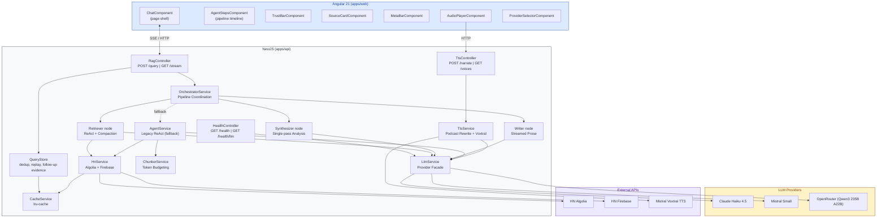
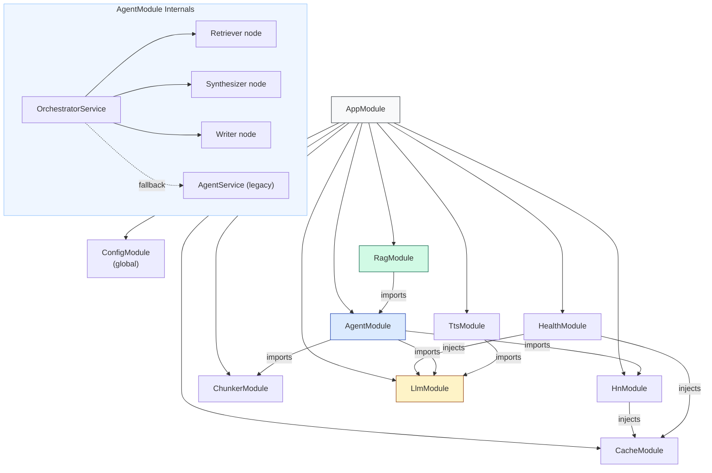
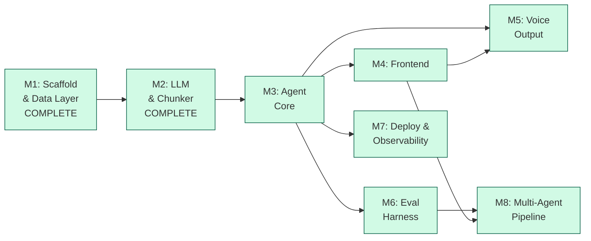

# VoxPopuli — Architecture & Implementation Plan

**Companion to:** [product.md](product.md) (what & why)
**This document:** how to build it, in what order, and how to track it in Linear

---

## Document Map

| Document                   | Purpose                                                                  |
| -------------------------- | ------------------------------------------------------------------------ |
| [product.md](product.md)   | Product vision, capabilities, API contracts, design decisions            |
| **architecture.md** (this) | Technical architecture, module design, milestones, Linear task breakdown |
| [README.md](../README.md)  | Public-facing overview for users and contributors                        |

---

## Table of Contents

- [1. System Architecture](#1-system-architecture)
  - [1.1 High-Level Diagram](#11-high-level-diagram)
  - [1.2 Module Dependency Graph](#12-module-dependency-graph)
  - [1.3 Tech Stack](#13-tech-stack)
  - [1.4 Project Structure](#14-project-structure)
- [2. Module Specifications](#2-module-specifications)
  - [2.1 Shared Types](#21-shared-types-libsshared-types)
  - [2.2 CacheModule](#22-cachemodule)
  - [2.3 HnModule](#23-hnmodule)
  - [2.4 ChunkerModule](#24-chunkermodule)
  - [2.5 LlmModule](#25-llmmodule)
  - [2.6 AgentModule](#26-agentmodule)
  - [2.7 RagModule](#27-ragmodule)
  - [2.8 TtsModule](#28-ttsmodule)
  - [2.9 Frontend Architecture](#29-frontend-architecture)
- [3. Milestones & Linear Task Breakdown](#3-milestones--linear-task-breakdown)
  - [Milestone 1: Scaffold & Data Layer](#milestone-1-scaffold--data-layer----complete)
  - [Milestone 2: LLM & Chunker](#milestone-2-llm--chunker----complete)
  - [Milestone 3: Agent Core](#milestone-3-agent-core)
  - [Milestone 4: Frontend](#milestone-4-frontend)
  - [Milestone 5: Voice Output](#milestone-5-voice-output)
  - [Milestone 6: Eval Harness](#milestone-6-eval-harness----complete)
  - [Milestone 8: Multi-Agent Pipeline](#milestone-8-multi-agent-pipeline)
- [4. Milestone Dependencies](#4-milestone-dependencies)
- [5. Implementation Order (Solo Dev)](#5-implementation-order-solo-dev)
- [6. Environment Configuration](#6-environment-configuration)
- [7. Key Technical Constraints](#7-key-technical-constraints)
- [8. Definition of Done](#8-definition-of-done)
- [9. Cross-References to product.md](#9-cross-references-to-productmd)

---

## 1. System Architecture

### 1.1 High-Level Diagram



### 1.2 Module Dependency Graph



### 1.3 Tech Stack

| Layer         | Technology                                  | Version                                                 |
| ------------- | ------------------------------------------- | ------------------------------------------------------- |
| Monorepo      | Nx                                          | Latest                                                  |
| Backend       | NestJS                                      | 11                                                      |
| Frontend      | Angular                                     | 21                                                      |
| Pipeline      | LangGraph.js (`@langchain/langgraph`)       | `StateGraph` + `createReactAgent` (Retriever)           |
| LLM (default) | Mistral Small (`mistral-small-latest`)      | LangChain.js (`@langchain/mistralai`)                   |
| LLM (quality) | Claude Haiku 4.5                            | LangChain.js (`@langchain/anthropic`)                   |
| LLM (gateway) | OpenRouter Qwen3 235B A22B 2507             | LangChain.js (`@langchain/openai`, OpenRouter base URL) |
| TTS           | Mistral Voxtral (`voxtral-mini-tts-latest`) | native `fetch` → `/v1/audio/speech`, base64 MP3         |
| Cache         | lru-cache                                   | 11 (max 5000 entries)                                   |
| Shared Types  | TypeScript lib                              | `@voxpopuli/shared-types`                               |

### 1.4 Project Structure

```
voxpopuli/
+-- apps/
|   +-- api/src/
|   |   +-- app/           # AppModule, main.ts
|   |   +-- agent/         # Multi-agent pipeline
|   |   |   +-- orchestrator.service.ts  # LangGraph pipeline coordination
|   |   |   +-- pipeline-graph.ts        # LangGraph StateGraph definition + retry wrappers
|   |   |   +-- nodes/                   # Pipeline node implementations
|   |   |   |   +-- retriever.node.ts    # ReAct search + compaction
|   |   |   |   +-- compaction-parse.ts  # parseCompactedThemes (lenient, salvaging parser)
|   |   |   |   +-- parse-llm-json.ts    # cleanLlmOutput (fences, <think> tags, prose)
|   |   |   |   +-- synthesizer.node.ts  # Single-pass analysis, applyEvidenceFloor, merged-mode node
|   |   |   |   +-- writer.node.ts       # Single-pass prose (first attempt streamed)
|   |   |   |   +-- writer-draft.ts      # renderAnswerMarkdown, WriterDraftStreamer
|   |   |   +-- fallback-response.ts     # buildFallbackResponse (Writer failed twice)
|   |   |   +-- agent.service.ts         # Legacy ReAct (fallback)
|   |   |   +-- tools.ts, system-prompt.ts, trust.ts
|   |   |   +-- prompts/                 # Per-agent system prompts (incl. merged-writer.prompt.ts)
|   |   +-- cache/         # CacheService (lru-cache wrapper), QueryStore
|   |   +-- chunker/       # ChunkerService (HTML cleanup, token budgeting)
|   |   +-- health/        # HealthController (GET /health, GET /health/llm)
|   |   +-- hn/            # HnService (Algolia + Firebase + caching)
|   |   +-- llm/           # LlmService, LlmProviderInterface, providers/, model-ids.ts,
|   |   |                  # llm-errors.ts, invoke-with-retry.ts
|   |   +-- rag/           # RagController (POST + SSE + result lookup)
|   |   +-- tts/           # TtsService, TtsController, narrator prompt, mp3-xing.ts
|   +-- web/src/app/
|       +-- components/    # chat, agent-steps, trust-bar, source-card, meta-bar, provider-selector, audio-player
|       +-- pages/         # design-system (Tailwind token playground)
|       +-- services/      # rag.service.ts, tts.service.ts
+-- libs/
|   +-- shared-types/src/lib/  # All shared interfaces
|       +-- evidence.types.ts   # EvidenceBundle, ThemeGroup, EvidenceItem, SourceMetadata
|       +-- analysis.types.ts   # AnalysisResult, Insight, Contradiction
|       +-- response-v2.types.ts # AgentResponseV2, ResponseSection
|       +-- pipeline.types.ts   # PipelineConfig, PipelineEvent, PipelineResult, PriorEvidence
|       +-- shared-types.ts     # AgentResponse, AgentStep, QueryResult, LlmHealthResponse, ...
+-- evals/                 # Eval harness: queries.json, run-eval.ts, evaluators/, feedback.ts, results/
```

---

## 2. Module Specifications

### 2.1 Shared Types (`libs/shared-types`)

Single source of truth for all API contracts. Both apps import from `@voxpopuli/shared-types`.

**Key interfaces:**

| Interface           | Purpose                                                                               |
| ------------------- | ------------------------------------------------------------------------------------- |
| `RagQuery`          | Query request shape                                                                   |
| `AgentResponse`     | Full response: answer + steps + sources + meta (`meta.cached`, `meta.error`)          |
| `AgentStep`         | Single reasoning step (thought/action/observation)                                    |
| `AgentSource`       | Story metadata with HN link and `postedDate` (YYYY-MM-DD, from the HN API)            |
| `StoryChunk`        | Chunked story for context window                                                      |
| `CommentChunk`      | Chunked comment for context window                                                    |
| `ToolDefinition`    | Agent tool schema (search_hn, get_story, get_comments)                                |
| `LlmMessage`        | Provider-agnostic message format                                                      |
| `LlmResponse`       | Provider-agnostic response format                                                     |
| `TtsRequest`        | TTS narration request shape                                                           |
| `EvidenceItem`      | Compacted insight from HN (1-3 sentences, classified)                                 |
| `ThemeGroup`        | Themed group of evidence with sentiment and raw count                                 |
| `SourceMetadata`    | Source row recorded by the tools (title, url, author, points, `postedDate`)           |
| `EvidenceBundle`    | Retriever output: themes, `allSources`, `totalSourcesScanned`, `tokenCount`           |
| `Insight`           | Synthesizer finding with claim, strength, themes                                      |
| `Contradiction`     | Where sources disagree, with assessment                                               |
| `AnalysisResult`    | Synthesizer output: insights, contradictions, confidence                              |
| `ResponseSection`   | Writer section: heading, body, cited sources                                          |
| `AgentResponseV2`   | Writer output: headline, context, 2-4 sections, bottom line, sources                  |
| `PipelineConfig`    | Per-agent provider map, token budgets (incl. `synthesizerInput`), feature flag        |
| `PipelineEvent`     | SSE event: stage, status, detail, elapsed                                             |
| `PipelineResult`    | Full result with intermediates, timing, token usage                                   |
| `PriorEvidence`     | A finished run's question, `EvidenceBundle` and Retriever steps (follow-ups)          |
| `QueryResult`       | Stored query lifecycle: status, buffered events/steps, response, error                |
| `LlmHealthResponse` | `GET /api/health/llm` result: provider, ok, latency, `error: 'auth' \| 'unavailable'` |

### 2.2 CacheModule

`CacheService` wraps `lru-cache` (max 5000 entries, per-entry TTL) with typed get/set, a cache-aside `getOrSet<T>()`, and hit/miss stats for the health endpoint. The module also provides `QueryStore` (see Section 2.7).

| Entry                            | TTL    | Description                                         |
| -------------------------------- | ------ | --------------------------------------------------- |
| `getOrSet<T>(key, fetcher, ttl)` | varies | Cache-aside pattern                                 |
| Search results                   | 15 min | Algolia responses                                   |
| Stories                          | 1 hour | Firebase item data                                  |
| Comments                         | 30 min | Firebase comment data                               |
| `POST /api/rag/query` results    | 10 min | Full AgentResponse keyed by query + mode            |
| QueryStore: running query        | 5 min  | Buffered pipeline events and steps                  |
| QueryStore: completed answer     | 15 min | Replayed to identical questions (`meta.cached`)     |
| QueryStore: evidence             | 30 min | `PriorEvidence` for follow-up questions             |
| LLM health probe                 | 60 s   | Result of `GET /api/health/llm` (limits probe cost) |

### 2.3 HnModule

Two HTTP clients behind one service, all calls wrapped with CacheService.

| Client   | Base URL                        | Methods                         |
| -------- | ------------------------------- | ------------------------------- |
| Algolia  | `hn.algolia.com/api/v1`         | `search()`, `searchByDate()`    |
| Firebase | `hacker-news.firebaseio.com/v0` | `getItem()`, `getCommentTree()` |

**Comment tree fetching:** `getCommentTree(storyId, maxDepth = 3)` fetches one depth level at a time, with every parent's replies requested in parallel, so a tree costs one round-trip per depth rather than one per comment. Limits: 15 top-level comments, 3 replies per comment, 30 comments in total (depth-first order), deleted/dead items skipped. Depth-2 replies are only fetched for depth-1 comments that still fall inside the cap. See product.md Section 6.3.

**Retries:** Algolia and Firebase calls retry up to 3 times with exponential backoff and jitter on network errors and 5xx; 4xx responses are not retried.

**Search filter relaxation (`search_hn` tool):** if a search with `min_points` returns fewer than `MIN_FILTERED_HITS` (3) stories, the tool re-runs it without the filter. If that finds more stories it uses them and prepends a note telling the model the filter was removed; otherwise the note says removing the filter found nothing extra, so the model doesn't repeat the search itself.

### 2.4 ChunkerModule

Transforms raw HN data into token-budgeted context for the LLM. Implemented in M2.

| Method                                        | Input                          | Output                        |
| --------------------------------------------- | ------------------------------ | ----------------------------- |
| `chunkStories(hits[])`                        | Algolia `HnSearchHit[]`        | `StoryChunk[]`                |
| `chunkComments(comments[])`                   | Firebase `HnComment[]`         | `CommentChunk[]`              |
| `buildContext(stories[], comments[], budget)` | Story + comment chunks, budget | `ContextWindow` (fits budget) |
| `formatForPrompt(context)`                    | `ContextWindow`                | String (ready for LLM)        |
| `estimateTokens(text)`                        | Plain text                     | Token count estimate          |
| `stripHtml(html)`                             | Raw HTML string                | Cleaned text                  |

**Token counting:** Character-based estimate (1 token ~ 4 characters). Simple and dependency-free; adequate for budgeting purposes without requiring tiktoken.

**HTML stripping:** Preserves `<code>` and `<pre>` blocks by converting them to markdown fenced code blocks. Converts `<a>` tags to markdown links. Decodes common HTML entities.

**Priority ordering in `buildContext()`:**

1. Story metadata (title, author, points) -- always included first
2. Story text bodies (Ask HN / Show HN) -- added if budget allows
3. Top-level comments (depth 0-1) -- highest priority comments
4. Nested comments (depth 2+) -- included with remaining budget

**Token budgets** (passed by caller, sourced from provider): Claude 80k, Mistral 100k, OpenRouter 50k.

**Prompt format** (`formatForPrompt()`): Renders `=== STORIES ===` and `=== COMMENTS ===` sections with story IDs, metadata, and indented comments by depth. Appends a truncation notice when the context window was trimmed.

**Tests:** 57 unit tests covering chunking, HTML stripping, token estimation, context assembly, and prompt formatting. See `docs/adr/002-chunker-strategy.md` for design rationale.

### 2.5 LlmModule

Provider interface + facade pattern, implemented via LangChain.js. Implemented in M2.

All three providers wrap LangChain ChatModel classes rather than raw SDKs. LangChain handles tool-calling protocols (tool_use/tool_result content blocks, OpenAI-compatible function calls) internally, so the provider interface is simpler than originally specified -- no `formatTools()` or `buildToolResultMessage()` methods are needed.

| Component              | Responsibility                                                                                                                           |
| ---------------------- | ---------------------------------------------------------------------------------------------------------------------------------------- |
| `LlmProviderInterface` | Contract: `{ name, maxContextTokens, getModel(options?: ModelOptions): BaseChatModel }`                                                  |
| `ModelOptions`         | Per-call-site tuning: `{ maxTokens?: number; json?: boolean }` (output-token cap; provider JSON mode, ignored by Claude)                 |
| `ClaudeProvider`       | `ChatAnthropic` wrapping `claude-haiku-4-5-20251001` (200k context)                                                                      |
| `MistralProvider`      | `FailFastChatMistralAI` (a `ChatMistralAI` subclass) wrapping `mistral-small-latest` (262k context)                                      |
| `OpenRouterProvider`   | `ChatOpenAI` → `https://openrouter.ai/api/v1`, model `qwen/qwen3-235b-a22b-2507` or `OPENROUTER_MODEL` (128k budget, throughput routing) |
| `LlmService`           | Facade: reads `LLM_PROVIDER` env (default `mistral`), lazy provider instantiation, per-request override                                  |
| `model-ids.ts`         | Single registry of model IDs (LLM and TTS)                                                                                               |
| `llm-errors.ts`        | `isAuthError()`, `LlmAuthError`, `failFastOnClientError()`, `PROVIDER_KEY_ENV`                                                           |
| `invoke-with-retry.ts` | `invokeWithRetry()` for pipeline LLM calls: on a TPM / request-too-large error, retries once with the longest message cut in half        |

**Key implementation details:**

- **Lazy instantiation:** Providers are created on first access via a factory map, not at module boot. Each provider lazily creates its `ChatModel` on the first `getModel()` call and caches one instance per `maxTokens`/`json` combination.
- **API key validation:** Each provider validates its API key at construction time and throws immediately if missing.
- **Per-request override:** `LlmService.getModel(providerOverride?, options?: ModelOptions)` and `getMaxContextTokens(providerOverride?)` accept an optional provider name to use a different provider for a single call. The Retriever's ReAct model is requested with `{ maxTokens: 768 }`; the LLM health probe uses `{ maxTokens: 5 }`; compaction, Synthesizer and Writer use `{ json: true }`.
- **Provider registry:** A `PROVIDER_FACTORIES` map provides type-safe construction. Valid values: `openrouter`, `claude`, `mistral`. The deprecated name `groq` is aliased to `openrouter` with a warning.
- **OpenRouter output cap:** Without a call-site cap, OpenRouter requests send `max_tokens: 8192`, because some hosts otherwise default the completion to the whole context window and reject the request. Provider routing prefers the highest-throughput host (`provider: { sort: 'throughput' }`).
- **Fail fast on bad keys:** `isAuthError()` recognises 401/403 from `status`, `statusCode` (Mistral SDK) or `response.status`, and auth phrases in the message. LangChain's retry layer does not read Mistral's `statusCode`, so a rejected key used to be retried with backoff for about 2 minutes. `FailFastChatMistralAI` disables the inner retries and wraps `completionWithRetry` in its own `AsyncCaller` (6 retries) whose `failFastOnClientError` policy stops on auth errors, aborts and other 4xx, and retries only 408, 429 and 5xx. `LlmAuthError` names the env var to fix (`MISTRAL_API_KEY`, `ANTHROPIC_API_KEY` or `OPENROUTER_API_KEY`).

**Tests:** See `apps/api/src/llm/*.spec.ts` and `providers/*.spec.ts`. See `docs/adr/003-llm-provider-architecture.md` for design rationale.

### 2.6 AgentModule

**Updated in v3.0:** The AgentModule now contains the multi-agent pipeline alongside the legacy single-agent path.

#### Multi-Agent Pipeline (v3.0)

| Component             | Pattern                    | Description                                                                                          |
| --------------------- | -------------------------- | ---------------------------------------------------------------------------------------------------- |
| `OrchestratorService` | Pipeline coordinator       | Builds and streams the LangGraph `StateGraph` (Retriever → Synthesizer → Writer), emits SSE events   |
| Retriever node        | ReAct loop + compaction    | Searches HN, records sources in a `SourceRegistry`, compacts raw data into `EvidenceBundle` themes   |
| Synthesizer node      | Single-pass structured I/O | Extracts insights from the bundle, produces `AnalysisResult`, applies the evidence floor             |
| Writer node           | Single-pass structured I/O | Composes prose from the analysis, produces `AgentResponseV2`; its first attempt streams a live draft |

The nodes are factory functions (`createRetrieverNode`, `createSynthesizerNode`, `createWriterNode`) in `agent/nodes/`, not separate Nest services. The orchestrator builds them per request.

**Pipeline flow:**

The pipeline is orchestrated by a LangGraph `StateGraph` defined in `pipeline-graph.ts`. The graph declares a `PipelineAnnotation` that tracks query, bundle, analysis, response, steps, and token usage across nodes. Each node corresponds to one pipeline stage, connected by linear edges (retriever → synthesizer → writer). The orchestrator streams the graph with `streamMode: ['updates', 'custom']`: `updates` chunks mark a node finishing, `custom` chunks carry live events written by the nodes (`retriever_step`, `writer_draft`).

```
Query → OrchestratorService.runWithFallback(query, config, prior?)
  └── runStream():
        sources = new SourceRegistry()            (filled by search_hn / get_story)
        retriever node  →  EvidenceBundle         (or stored PriorEvidence for a follow-up)
          custom 'retriever_step' events → SSE thought / action / observation
        synthesizer node  →  AnalysisResult       (applyEvidenceFloor; no LLM in merged mode)
        writer node  →  AgentResponseV2           (prose only; sources attached by code)
          custom 'writer_draft' events → SSE token (append-only markdown deltas)
        complete → AgentResponse (answer = renderAnswerMarkdown(response)) + PriorEvidence
  └── SSE `pipeline` events at each stage start / done / error
```

**Who writes what:** The LLMs only generate what needs judgement. The tools record every story they surface (`SourceMetadata`, including `postedDate` from the HN API) into a per-request `SourceRegistry`; the compactor outputs only `themes`; the Writer outputs only prose fields (`headline`, `context`, `sections`, `bottomLine`). Code fills in `EvidenceBundle.allSources`, `totalSourcesScanned` and `tokenCount`, and attaches `sources` to the Writer's output. Transcribing the source table was slow (thousands of output tokens) and produced null or invented fields. See `docs/adr/009-pipeline-latency.md`.

**Retry logic:** Pipeline LLM calls go through `invokeWithRetry` (`apps/api/src/llm/invoke-with-retry.ts`), which retries once with the longest message halved when a provider returns a TPM / request-too-large error. The Retriever's ReAct model additionally uses LangChain `withRetry` (up to 3 attempts, 15 s wait, TPM errors only). Other transient errors are retried inside the provider client (LangChain's `AsyncCaller`; for Mistral, `FailFastChatMistralAI`). The Synthesizer and Writer each make one in-node repair call on a parse or schema failure (see JSON Parse Safety).

**LangGraph wrappers:** `pipeline-graph.ts` exports `withRetry` (run a node function once more if it throws) and `withWriterFallback` (retry once, then return a fallback state). Both log the swallowed error's first line as a warning (`Node failed, retrying once: …`, `Writer failed, retrying once: …`, `Writer retry failed, using fallback response: …`). The Writer retry runs without the graph config, so it cannot stream a second copy of the draft into the UI.

**Configuration:** `PipelineConfig` holds the provider-per-agent mapping, token budgets (including `synthesizerInput`) and a timeout. Only `providerMap` is read by the orchestrator today; `tokenBudgets` and `timeout` are defined in the schema but not enforced. Output length is bounded by the prompts, the Retriever's ReAct cap (`RETRIEVER_REACT_MAX_TOKENS = 768`) and, for OpenRouter, the provider's 8192-token default cap.

**Default configuration:** All three agents use the provider passed by the client, or the globally selected provider (`LLM_PROVIDER`, default: `mistral`). Schema defaults: token budgets retriever 2000, synthesizer 1500, synthesizerInput 4000, writer 1000; timeout 30 s.

**Merged writer mode (opt-in):** With `PIPELINE_MERGED_WRITER=true` the Synthesizer's LLM call is skipped. `createMergedSynthesizerNode()` builds an extractive `AnalysisResult` in code (`analysisFromThemes()`: one insight per theme, evidence floor applied), and the Writer runs in `fromEvidence` mode with `MERGED_WRITER_SYSTEM_PROMPT`, writing directly from the formatted evidence themes plus the confidence and gaps. The UI still shows three stages; the Synthesizer completes at once as "Merged into writer". If the Writer fails twice, the fallback response is built from the extractive analysis. Off by default; see `docs/adr/010-merged-writer-and-model-speed.md` for the eval comparison (27% lower mean latency on its run).

**Follow-up questions:** When a pipeline run completes, the orchestrator returns its evidence as `PriorEvidence` (`{ query, bundle, steps }`), and the controller stores it for 30 minutes. A request with `followUpOf=<queryId>` swaps the Retriever node for one that returns the stored bundle immediately (query annotated as a follow-up to the original question), so only the Synthesizer and Writer run. If the evidence has expired, the question runs as a fresh query.

**Eval mode:** The eval harness talks to the API over HTTP (SSE pipeline by default) and uses the default pipeline config. There is no dedicated preset.

**Feature flag:** On `GET /api/rag/stream` the pipeline runs only when the request passes `useMultiAgent=true`; any other value uses the legacy `AgentService`. The frontend always sends `useMultiAgent=true`, so the pipeline is the production path. `POST /api/rag/query` uses the pipeline when the body has `useMultiAgent: true`. (`PipelineConfigSchema.useMultiAgent` defaults to `false` but is not what selects the path.)

#### PipelineEvent Detail Contracts

The `detail` field is a free-form string for SSE simplicity. These are the strings `OrchestratorService` emits today (the schema also allows a `progress` status, which the orchestrator does not currently emit; live progress comes through the Retriever's step events instead):

| Stage       | Status    | Detail                                                                                                                            |
| ----------- | --------- | --------------------------------------------------------------------------------------------------------------------------------- |
| retriever   | `started` | `Searching HN for "{query}"...` (follow-up: `Reusing {n} sources from "{original question}"...`)                                  |
| retriever   | `done`    | `{n} themes from {m} sources`                                                                                                     |
| synthesizer | `started` | `Analyzing {n} themes...`                                                                                                         |
| synthesizer | `done`    | `{n} insights, confidence: {level}` (merged mode: `Merged into writer, confidence: {level}`)                                      |
| writer      | `started` | `Composing headline and sections...`                                                                                              |
| writer      | `done`    | `{n} sections, {m} sources` (Writer failed twice: `Using fallback response from analysis`)                                        |
| any         | `error`   | `API key rejected`, `Rate limit reached — retrying with fallback agent...`, or `Pipeline error — retrying with fallback agent...` |

Error events are emitted only for stages that had not already completed. The frontend displays the detail as-is.

#### Bundle Size Guard

The original plan was for the Orchestrator to check `bundle.tokenCount` against `tokenBudgets.synthesizerInput` (4000) and trim low-relevance themes. This is **not implemented**. The bundle is bounded instead by the compactor: its prompt asks for 3-6 themes in under 600 tokens, `parseCompactedThemes()` keeps at most 6 themes, and the raw data passed to the compactor is truncated to 50k characters.

#### Orchestrator Failure Modes

Each failure point has a different recovery strategy:

| Failure Point                                     | What Happened                   | Recovery Strategy                                                                                                                                                                                                                      |
| ------------------------------------------------- | ------------------------------- | -------------------------------------------------------------------------------------------------------------------------------------------------------------------------------------------------------------------------------------- |
| Retriever hits its tool budget                    | `GraphRecursionError`           | **Not a failure.** The ReAct loop stops and the evidence collected so far is compacted.                                                                                                                                                |
| Retriever finds almost nothing                    | Dry well                        | Compaction is skipped and a one-theme "no substantial discussion" bundle is returned; the evidence floor then sets low confidence.                                                                                                     |
| Compaction output is malformed                    | Bad JSON or labels              | `parseCompactedThemes()` normalizes labels and salvages themes before a JSON syntax error; one repair call asks for the complete object. Only when neither attempt yields a usable theme does the Retriever throw (→ legacy fallback). |
| Retriever fails                                   | No evidence collected           | Fall back to legacy `AgentService` via `runWithFallback()`, **on the provider the user chose** (`config.providerMap.retriever`).                                                                                                       |
| Retriever succeeds, Synthesizer fails             | Evidence exists but no analysis | **Retry Synthesizer once** (`withRetry`) with the same `EvidenceBundle`. If the second attempt fails, fall back to legacy.                                                                                                             |
| Retriever + Synthesizer succeed, Writer fails     | Analysis exists but no prose    | **Retry Writer once** (`withWriterFallback`, without streaming) with the same `AnalysisResult`. If that fails, return a fallback response built directly from `AnalysisResult` fields (`meta.error: true`).                            |
| Any stage: provider rejects the API key (401/403) | Nothing can succeed on this key | **No fallback.** Emit `API key rejected` for unfinished stages and throw `LlmAuthError`, which names the env var to fix. The legacy agent would fail the same way.                                                                     |

**Key rule:** Never re-run the Retriever on a downstream failure. The Retriever is the slowest and most expensive stage (ReAct loop + HN API calls). If its output exists, reuse it.

**Partial-stage error reporting:** `OrchestratorService.runWithFallback()` tracks which pipeline stages completed before an error occurred and only emits error events for stages that did not complete, then emits a `thought` step ("Pipeline unavailable — switching to single-agent mode.") before streaming the legacy agent's events.

**Fallback response construction:** When the Writer fails after retry, `buildFallbackResponse()` (`fallback-response.ts`) constructs a minimal `AgentResponse` directly from `AnalysisResult` fields:

- headline (`## …`) = `analysis.summary`
- one `###` section per insight (claim as heading, reasoning as body)
- `**Bottom line:**` = `Confidence: {confidence}. Gaps: {gaps joined with '; '}.`
- `sources` = `bundle.allSources` (with `postedDate`); `meta.error = true`

This ensures the user always gets something useful, even if the Writer agent is down. The response won't be polished prose, but it will contain the actual analysis.

#### JSON Parse Safety

The compactor, Synthesizer and Writer all parse structured JSON from LLM output. LLMs sometimes return invalid JSON (trailing commas, markdown fencing, reasoning tags, hallucinated fields). Each node:

1. Cleans the output with `cleanLlmOutput()`: strips `<think>…</think>` blocks and markdown code fences, and trims prose around the outermost JSON object
2. Parses with `JSON.parse()` and validates against the Zod schema (`AnalysisResultSchema`, the Writer's output schema without `sources`)
3. On failure, makes one repair call that includes its previous answer and either the validation errors or "not valid JSON", and asks for the **complete** JSON object
4. If the repair also fails, throws, which triggers the node-level wrapper (Synthesizer: retry then legacy fallback; Writer: retry then fallback response)

The compactor is more lenient (see Retriever Agent): a complete response with odd labels is accepted without a repair call, and partially valid output is salvaged.

#### Retriever Agent

The only agent with a ReAct loop (it needs tools and iteration). Two phases:

1. **Collection (ReAct):** LangGraph `createReactAgent` with `search_hn`, `get_story`, `get_comments`. Max 8 iterations (`recursionLimit` 17). The ReAct model is output-capped at 768 tokens per turn (`RETRIEVER_REACT_MAX_TOKENS`), because its turns only emit tool calls and the cap bounds the occasional closing monologue. Each tool call and result is written to the graph's custom stream as a `retriever_step` event; observations are sent as short summaries (`summarizeToolOutput()`, e.g. `Found 8 stories`, `Read 24 comments` counted from `[Story <id>]` lines) while the full tool output is kept for trust computation. If the loop exceeds its recursion limit (`GraphRecursionError`), collection stops and the evidence gathered so far is compacted rather than failing the run.
2. **Compaction (single LLM call):** Converts raw HN data (truncated to 50k chars) into 3-6 `ThemeGroup`s at ~600 tokens. Each evidence item is classified (`evidence` | `anecdote` | `opinion` | `consensus`) and scored for relevance. The compactor writes only `themes`; the source table comes from the `SourceRegistry`.

**Compaction parsing:** `parseCompactedThemes()` (`nodes/compaction-parse.ts`) is deliberately lenient, because a rejected compaction sent the whole query to the legacy agent:

- Unknown item `type` becomes `opinion`; `relevance` is clamped to 0-1 (default 0.5); items without a numeric `sourceId` or text are dropped; at most 6 themes are kept.
- If the JSON has a syntax error (e.g. an unescaped quote mid-array), everything before the error is parsed with `parsePartialJson` and the themes found there are kept (`salvaged: true`).
- A complete response is used immediately. A salvaged or unusable one triggers one repair call; the complete retry wins, otherwise the best salvaged result is used. The Retriever throws only if neither attempt produced a usable theme.

**Critical boundary:** No raw HN data crosses into the Synthesizer. Only the compacted `EvidenceBundle` passes through.

**Dry-well circuit breaker:** After collection, `isDryWell()` checks the raw data. If it is under 200 characters, or contains nothing story-like (no point counts or story references), the compaction call is skipped and `buildDryWellBundle()` returns a single "No substantial discussion found" theme with no sources. The evidence floor then caps confidence at `low` and adds a gap saying the answer is not grounded in HN discussion.

#### Synthesizer Agent

Single-pass structured output. Receives the `EvidenceBundle` (rendered as compact text by `formatBundleForSynthesizer()`), produces `AnalysisResult`:

- 1-5 insights ranked by evidence strength (cap enforced by the schema)
- Contradictions where sources disagree
- Overall confidence rating (`high` | `medium` | `low`)
- Gaps in coverage

No tools, no iteration. The input is complete and bounded (~600 tokens of themes plus the source list).

**Evidence floor:** `applyEvidenceFloor(analysis, sourceCount)` keeps the stated confidence honest. The compactor can build several themes from one story's comments, after which the model would report `high` confidence. With fewer than 3 distinct sources (`THIN_EVIDENCE_SOURCES`), confidence is capped (0-1 sources → `low`, 2 → `medium`) and a gap is added that says how few stories were found. The Writer's prompt surfaces both.

#### Writer Agent

Single-pass structured output. Receives `AnalysisResult` + the source table (`bundle.allSources`, for citation IDs only), produces `AgentResponseV2`:

- Headline (lead with the answer, not the sources)
- Context paragraph (why this matters)
- 2-4 themed sections with inline `[storyId]` citations and a `citedSources` list
- Bottom line takeaway

The Writer outputs prose fields only; `sources` is attached from the bundle by code. `renderAnswerMarkdown()` turns the result into the answer markdown (`## headline`, context, `### section` headings, `**Bottom line:**`).

**Streamed draft:** When the graph supplies a stream writer, the Writer's first attempt uses `model.stream()`. `WriterDraftStreamer` (`nodes/writer-draft.ts`) partially parses the growing JSON (after any `<think>` block), renders it with the same `renderAnswerMarkdown()`, and emits only the new suffix as a `writer_draft` event, which the orchestrator forwards as an SSE `token` event. Deltas are append-only: renderings that are not an extension of the text already sent are skipped, and `endsMidEscape()` holds back text that stops inside a JSON string escape. The final `answer` event replaces the draft, so an imperfect delta only affects the preview. If the provider fails before producing any output, the Writer falls back to a normal `invokeWithRetry` call; a failure mid-stream is rethrown so `withWriterFallback` retries (without streaming).

**Critical prompt constraint:** The Writer receives the source table alongside the `AnalysisResult`, but ONLY as a citation lookup table. The Writer's system prompt explicitly prohibits re-analysis:

```
## CITATION RULES
You MUST NOT:
- Draw conclusions that contradict or extend the AnalysisResult.
- Add insights not present in AnalysisResult.insights.
- Change the confidence level or gaps.

If AnalysisResult says confidence is "low", your prose reflects that uncertainty.
If AnalysisResult lists a gap, your response includes that gap as a disclaimer.
You are a composer, not an analyst.
```

**Why this matters:** Without this constraint, the Writer will second-guess the Synthesizer. Different LLM providers will produce inconsistent answers because the Writer re-analyzes the same evidence and reaches different conclusions. The Synthesizer is the single source of truth for what the evidence means. The Writer decides how to say it. (Merged writer mode deliberately relaxes this: the Writer analyzes the themes itself, but confidence and gaps still come from code.)

**Test case:** Pass an `AnalysisResult` with `confidence: 'low'` and a source table with strong-looking sources. Assert that the Writer's output reflects low confidence (matches the analysis), not high confidence.

#### Legacy AgentService (Fallback)

The original ReAct agent from v0.5.0. Retained as a fallback path via `OrchestratorService.runWithFallback()`.

| Method                      | Description                                                                     |
| --------------------------- | ------------------------------------------------------------------------------- |
| `runStream(query, options)` | AsyncGenerator: yields each step during the ReAct loop, then the final response |
| `run(query, options)`       | Consumes `runStream()` and returns the `AgentResponse`                          |

Built with LangChain `createAgent`. Options: `maxSteps` (1-7) and `provider`.

**Constraints:** Max 7 steps, 180s global timeout, 5 concurrent runs (semaphore).

**Tools:** `search_hn`, `get_story`, `get_comments`. Defined in `tools.ts`, system prompt in `system-prompt.ts`. The legacy agent creates its tools without a `SourceRegistry` and still parses its source list from the tool text, so its sources have no `postedDate`.

### 2.7 RagModule

Thin controller layer over `OrchestratorService`, `AgentService` and `QueryStore`. No pipeline logic.

| Endpoint                    | Method | Description                                                                        |
| --------------------------- | ------ | ---------------------------------------------------------------------------------- |
| `/api/rag/query`            | POST   | Full blocking response (pipeline when `useMultiAgent: true`), cached 10 min        |
| `/api/rag/stream`           | GET    | SSE stream. Query params: `query`, `provider`, `useMultiAgent`, `followUpOf`       |
| `/api/rag/query/:id/result` | GET    | Fetch stored query result by queryId (202 while in-flight, 404 if unknown/expired) |
| `/api/health`               | GET    | Liveness: uptime, cache stats, heap memory (`HealthController`)                    |
| `/api/health/llm`           | GET    | Live 1-call provider probe, cached 60 s; 503 with `error: 'auth' \| 'unavailable'` |

**SSE event types** (`GET /api/rag/stream`). Every event carries an incrementing `id`; the first one sets `retry: 5000`.

| Event                                | Payload                                                         | When                                                                        |
| ------------------------------------ | --------------------------------------------------------------- | --------------------------------------------------------------------------- |
| `init`                               | `{ queryId }`                                                   | Always first; the client uses it for result lookup and follow-ups           |
| `pipeline`                           | `PipelineEvent` (`stage`, `status`, `detail`, `elapsed`)        | Stage started / done / error (pipeline mode only)                           |
| `thought` / `action` / `observation` | `AgentStep` (without `toolOutput`)                              | Retriever ReAct steps, or legacy agent steps                                |
| `token`                              | `{ content }`: append-only markdown delta of the Writer's draft | While the Writer's first attempt streams (pipeline mode only)               |
| `answer`                             | `{ answer, sources, trust, meta }`                              | Final answer; replaces any draft. `meta.cached: true` on a replay           |
| `error`                              | `{ message }`                                                   | Run failed (e.g. `LlmAuthError`, or the legacy fallback also failed)        |
| `ping`                               | empty                                                           | Heartbeat every 10 s (keeps mobile connections open, feeds stall detection) |

**QueryStore:** An in-memory `QueryStore` (`apps/api/src/cache/query-store.ts`, on top of `CacheService`) manages the query lifecycle. `create()` returns a UUID queryId; pipeline events and steps are buffered with `appendEvent()` / `appendStep()`; `complete()` / `fail()` set the final state.

- **Dedup and replay:** Before starting a run, the controller calls `findReusable(query, storeKey)`. The key hashes the query with case and whitespace normalized, plus a mode-specific store key: `<provider>:pipeline`, `<provider>:legacy`, or `<provider>:pipeline:followup:<parentId>` (`provider` is `default` when the client didn't send one). If an identical query is **still running**, the new SSE connection attaches to it via `pollExistingQuery()` (polls the store every 2 s and re-emits buffered events) instead of spawning a second agent run. If one **completed within the last 15 minutes** (`COMPLETED_TTL = 900`), the stored answer is replayed immediately, with `meta.cached: true`. Failed queries are never reused. A running entry lives 5 minutes (`QUERY_TTL`).
- **Follow-up evidence:** When a pipeline run completes with evidence, the controller calls `setEvidence(queryId, PriorEvidence)` (kept 30 minutes, `EVIDENCE_TTL = 1800`). `GET /api/rag/stream?followUpOf=<queryId>` looks it up with `getEvidence()` and passes it to the orchestrator, which skips the Retriever. Follow-ups are keyed by their parent, so they never replay an unrelated answer; an expired parent makes the question run as a fresh query.
- **Result endpoint:** `GET /api/rag/query/:id/result` returns a 202 response with a full `QueryResult` shape (including `response: null`, `error: null`, `createdAt`, and `completedAt: null`) while the query is still running, enforced at compile time via `satisfies QueryResult`. Once the query completes, it returns 200 with the populated result.

**Middleware:** A global rate limit of 60 requests/min, implemented in the controller (timestamp array, no per-IP tracking); 429 when exceeded. `TtsController` has its own limiter. Input validation via `class-validator` DTO (`query` max 500 chars) and a global exception filter.

### 2.8 TtsModule

Narration via Mistral Voxtral, using the same `MISTRAL_API_KEY` as the LLM provider. See product.md Section 18 and `docs/adr/008-voxtral-tts.md`.

| Method                                  | Description                                                                                           |
| --------------------------------------- | ----------------------------------------------------------------------------------------------------- |
| `TtsService.narrate(text, options)`     | Full pipeline: optional rewrite (default on), then synthesize. Options: `rewrite`, `voiceId`          |
| `TtsService.rewriteForSpeech(text)`     | Single-turn LLM call (active provider) turning the answer into a podcast script, capped at 2500 chars |
| `TtsService.synthesize(script, voice?)` | `POST https://api.mistral.ai/v1/audio/speech` (native `fetch`, 60 s timeout) → base64 MP3 → Buffer    |
| `addXingHeader(mp3)` (`mp3-xing.ts`)    | Adds a Xing VBR header with the exact frame count, byte count and seek table                          |

Voxtral returns variable-bitrate MP3 without a Xing header, so browsers misjudge the duration; iOS Safari stopped playback early. `synthesize()` therefore passes the audio through `addXingHeader()` before returning it.

| Endpoint           | Method | Description                                                                               |
| ------------------ | ------ | ----------------------------------------------------------------------------------------- |
| `/api/tts/narrate` | POST   | MP3 response (`audio/mpeg`, `Content-Length`, `X-TTS-Characters`); input max 10,000 chars |
| `/api/tts/voices`  | GET    | Active narrator: voice id and model (`MISTRAL_TTS_VOICE`, `MISTRAL_TTS_MODEL`)            |

### 2.9 Frontend Architecture

#### Component Hierarchy

All components are **Angular 21 standalone components** (no NgModules). Reactive state is managed with **Angular signals** -- no RxJS stores or BehaviorSubjects.

```
ChatComponent (page shell — sticky header with query input, live draft, answer display, follow-up box, cancel button, background-resilient elapsed timer)
├── AgentStepsComponent    — pipeline stage timeline (retriever/synthesizer/writer) with per-stage elapsed counters and stall detection; shows PipelineEvent progress; falls back to ReAct step view for legacy mode
├── TrustBarComponent      — trust metadata visualization (source count, recency, diversity)
├── SourceCardComponent    — story card with title, author, points, HN link
├── MetaBarComponent       — response metadata (provider, timing, step count)
├── AudioPlayerComponent   — Listen button and narration playback
└── ProviderSelectorComponent — LLM provider dropdown
```

| Component                   | Responsibility                                                                                                                                                                                                                                                                                                                                                                                                                                                                                                                                                                                                                       |
| --------------------------- | ------------------------------------------------------------------------------------------------------------------------------------------------------------------------------------------------------------------------------------------------------------------------------------------------------------------------------------------------------------------------------------------------------------------------------------------------------------------------------------------------------------------------------------------------------------------------------------------------------------------------------------ |
| `ChatComponent`             | Page shell: query input (sticky header), answer display with `ngx-markdown` rendering, query display during streaming, cancel button, background-resilient elapsed timer. `token` events are appended to a `tokenContent` signal shown as a "Drafting answer…" card (`data-testid="answer-draft"`) until the `answer` event replaces it. Under a finished answer, an "Ask a follow-up" box (`data-testid="follow-up"`) re-streams with `followUpOf=<queryId>`. Event handling is extracted into a shared `handleStreamEvent()` method used by both `submit()` (via `reconnectStream()`) and the visibility handler's reconnect path. |
| `AgentStepsComponent`       | Pipeline stage timeline showing retriever/synthesizer/writer progress via PipelineEvent SSE with per-stage elapsed counters (capped at 180 s, `MAX_STAGE_ELAPSED_MS`); research rows count comments from `[Story <id>]` lines; legacy mode falls back to ReAct step view                                                                                                                                                                                                                                                                                                                                                             |
| `TrustBarComponent`         | Trust metadata badges (source count, recency, viewpoint diversity)                                                                                                                                                                                                                                                                                                                                                                                                                                                                                                                                                                   |
| `SourceCardComponent`       | Story card with title, author, points, HN link                                                                                                                                                                                                                                                                                                                                                                                                                                                                                                                                                                                       |
| `MetaBarComponent`          | Response metadata: provider name, latency, step count                                                                                                                                                                                                                                                                                                                                                                                                                                                                                                                                                                                |
| `ProviderSelectorComponent` | LLM provider dropdown                                                                                                                                                                                                                                                                                                                                                                                                                                                                                                                                                                                                                |
| `AudioPlayerComponent`      | Listen button, play/pause, progress, speed, download. On the Listen tap it "unlocks" the audio element (iOS Safari only allows `play()` inside a user gesture, and the narration arrives seconds later) and reuses that element for playback                                                                                                                                                                                                                                                                                                                                                                                         |
| `RagService`                | HTTP POST for blocking queries + native `EventSource` for SSE streaming (`init`, `pipeline`, step, `token`, `answer`, `error` events; optional `followUpOf`) with 300-second stall detection watchdog                                                                                                                                                                                                                                                                                                                                                                                                                                |
| `TtsService`                | HTTP client for `POST /api/tts/narrate`, audio blob management                                                                                                                                                                                                                                                                                                                                                                                                                                                                                                                                                                       |

#### Styling

- **Tailwind CSS v4** with CSS-first `@theme` configuration (no `tailwind.config.js`)
- Design system utility classes: `vp-card`, `vp-prose`, `vp-badge`, etc.
- Dark theme by default; light theme via CSS custom property overrides under a `.light` class on `<html>`
- Markdown rendering via `ngx-markdown` (used in ChatComponent for answer display)

#### Dev Server Setup

- `npx nx serve api` — backend on port 3000
- `npx nx serve web --port 4201` — frontend on port 4201
- Proxy config at `apps/web/proxy.conf.json` forwards `/api/**` to `http://localhost:3000`

---

## 3. Milestones & Linear Task Breakdown

### How to Read This

```
Epic (Linear Project or Cycle)
  Story (Linear Issue, type: Story)
    Task (Linear Sub-issue or checklist item)
```

**Milestone = a shippable, testable vertical slice.** Each milestone ends with something you can demo.

---

### Milestone 1: Scaffold & Data Layer -- COMPLETE

**Goal:** Nx monorepo running, shared types defined, HN data flowing with caching.
**Demo:** `curl` an internal endpoint that returns cached HN search results.

#### Epic 1.1: Project Bootstrap

- **Story: Initialize Nx monorepo** (AI-101)

  - Create Nx workspace with `apps/api` (NestJS) and `apps/web` (Angular)
  - Create `libs/shared-types` library
  - Configure `tsconfig.base.json` path aliases
  - Add `.env.example` with all config keys
  - Verify `nx serve api` and `nx serve web` both start

- **Story: Define shared types** (AI-102)

  - Define `RagQuery`, `AgentResponse`, `AgentStep`, `AgentSource`
  - Define `StoryChunk`, `CommentChunk`, `ContextWindow`
  - Define `ToolDefinition`, `LlmMessage`, `LlmResponse`
  - Define `TtsRequest`
  - Export all from `@voxpopuli/shared-types`

- **Story: Configure .gitignore** (AI-137)
- **Story: Configure ESLint + Prettier** (AI-138)
- **Story: Set up GitHub Actions CI** (AI-139)
- **Story: Add pre-commit hooks** (AI-140)
- **Story: Add structured JSON logging** (AI-141)
- **Story: Configure graceful shutdown + port binding** (AI-142)
- **Story: Verify nx serve + build + test end-to-end** (AI-143)
- **Story: Create health check endpoint with integration test** (AI-151)
- **Story: Create project Makefile** (AI-152)
- **Story: Configure CORS for Angular dev server** (AI-156)
- **Story: Add Dockerfile and docker-compose** (AI-155)

#### Epic 1.2: HN Data Service

- **Story: Implement CacheModule** (AI-103)

  - Install `node-cache` _(since replaced by `lru-cache`)_
  - Implement `CacheService` with typed `getOrSet<T>()` pattern
  - Configure TTLs per data type
  - Add cache stats method (hits, misses, keys)

- **Story: Implement HnService (Algolia)** (AI-104)

  - HTTP client for `hn.algolia.com/api/v1`
  - `search(query, options)` with sort, min_points, max_results
  - `searchByDate(query, options)` for date-sorted results
  - Wrap all calls with CacheService (15 min TTL)
  - Type responses into shared types

- **Story: Implement HnService (Firebase)** (AI-105)

  - HTTP client for `hacker-news.firebaseio.com/v0`
  - `getItem(id)` with 1-hour cache
  - `getCommentTree(storyId, maxDepth)` with 30-comment cap
  - Parallel batching (10 concurrent), skip deleted/dead
  - 30 min cache per comment item

- **Story: Write HnService integration tests** (AI-147)

---

### Milestone 2: LLM & Chunker -- COMPLETE

**Goal:** Any of the 3 LLM providers can receive a prompt and return a response. Content fits token budgets.
**Demo:** A script sends an HN search result through the chunker and gets an LLM summary.

#### Epic 2.1: Content Chunker -- COMPLETE

- **Story: ADR: Chunker strategy and token budget design** (AI-144) -- DONE
  - Documented in `docs/adr/002-chunker-strategy.md`
- **Story: Implement ChunkerService** (AI-108) -- DONE
  - `chunkStories()` -- extract metadata, strip HTML, count tokens
  - `chunkComments()` -- filter deleted/dead, strip HTML, preserve depth
  - `buildContext()` -- 4-phase priority assembly (metadata, text, top-level comments, nested)
  - `formatForPrompt()` -- render context as LLM-ready string with `=== STORIES ===` / `=== COMMENTS ===` sections
  - `estimateTokens()` -- character-based estimate (1 token ~ 4 chars), no tiktoken dependency
  - `stripHtml()` -- preserves `<code>`/`<pre>` as markdown fenced code blocks, converts `<a>` to markdown links
- **Story: Write ChunkerService unit tests** (AI-148) -- DONE (57 tests)

#### Epic 2.2: LLM Provider Stack -- COMPLETE

- **Story: ADR: LLM provider architecture and tool protocol design** (AI-145) -- DONE
  - Documented in `docs/adr/003-llm-provider-architecture.md`
- **Story: Define LlmProviderInterface** (AI-109) -- DONE
  - Simplified from original spec: `{ name, maxContextTokens, getModel(): BaseChatModel }`
  - `chat()`, `formatTools()`, `buildToolResultMessage()` not needed -- LangChain.js handles tool protocols internally
  - No separate `ChatOptions`, `LlmMessage`, or `LlmResponse` types needed at the provider level
- **Story: Implement GroqProvider** (AI-110) -- DONE (`ChatGroq`, `qwen/qwen3-32b`, 131k) _(since replaced by `OpenRouterProvider`; `groq` is now an alias for `openrouter`)_
- **Story: Implement ClaudeProvider** (AI-111) -- DONE (`ChatAnthropic`, `claude-haiku-4-5-20251001`, 200k)
- **Story: Implement MistralProvider** (AI-112) -- DONE (`ChatMistralAI`, `mistral-large-latest`, 262k) _(now `FailFastChatMistralAI` with `mistral-small-latest`)_
- **Story: Implement LlmService facade** (AI-113) -- DONE (lazy instantiation, per-request override, 22 tests)

---

### Milestone 3: Agent Core

**Goal:** The ReAct loop works end-to-end. Ask a question, get a sourced answer.
**Demo:** `curl POST /api/rag/query` returns a full `AgentResponse` with steps and sources.
**Status:** DONE -- 14 issues, live-tested with Mistral. Test counts at M3 completion: 293 API tests, 243 Web tests (536 total). _These counts are historical; the suites have grown since._

#### Epic 3.1: ReAct Agent

- **Story: ADR: ReAct agent design and tool selection strategy** (AI-146) -- DONE (`docs/adr/004-react-agent-design.md`)
- **Story: Add trust-related shared types** (AI-159) -- DONE (`TrustMetadata`, `RewriteTrustMetadata`, `Claim` in shared-types)
- **Story: Define agent tools** (AI-116) -- DONE (`search_hn`, `get_story`, `get_comments` via LangChain `tool()` helper with Zod schemas)
- **Story: Write system prompt** (AI-117) -- DONE (claim taxonomy, contrarian search, honesty rules from product.md Section 13)
- **Story: Implement AgentService.run()** (AI-118) -- DONE
  - Uses LangChain `createAgent` (v1.2+) instead of `createReactAgent` + `AgentExecutor`
  - Streaming via `.stream()` with `streamMode: "values"`
  - Max 7 steps via `recursionLimit`, 180s timeout via `AbortSignal.timeout()`
  - Concurrent run semaphore (max 5, simple counter)
  - Returns `AgentResponse` with steps, sources, trust metadata
- **Story: Implement trust metadata** (AI-160) -- DONE (source verification, recency, viewpoint diversity, Show HN detection, honesty flags)
- **Story: Return partial results on LLM failure** (AI-164) -- DONE (returns collected data on mid-loop errors, clean error on first-call failure)
- **Story: Add retry logic with exponential backoff** (AI-163) -- DONE (3 attempts, jitter, applied to Algolia + Firebase)
- **Story: Write AgentService integration tests** (AI-149) -- DONE (6 tests: execution, concurrency, semaphore cleanup, prompt template, source extraction)

#### Epic 3.2: RAG Endpoints

- **Story: Implement RagController** (AI-119) -- DONE
  - `POST /api/rag/query` -- blocking, cached (10 min TTL), returns full AgentResponse
  - `GET /api/rag/stream` -- SSE with thought/action/observation/answer/error events (post-completion replay model)
  - Rate limiting: global 60 req/min (timestamp array, no per-IP tracking)
  - Input validation via class-validator DTO + global ValidationPipe
- **Story: Implement global exception filter** (AI-154) -- DONE (400/429/502/500 mapping, structured error body, request context logging)
- **Story: Write RagController integration tests** (AI-150) -- DONE (7 tests: POST cached/uncached, SSE events, error events, input validation, rate limiting)

---

### Milestone 4: Frontend

**Goal:** Working chat UI with live reasoning visualization and source cards.
**Demo:** Open browser, ask a question, see the agent think in real time, get a sourced answer.

#### Epic 4.1: Core UI

- **Story: Set up Tailwind CSS** (AI-153)
- **Story: Implement ChatComponent** (AI-121)
- **Story: Implement AgentStepsComponent** (AI-122)
- **Story: Implement SourceCardComponent** (AI-123)
- **Story: Implement ProviderSelectorComponent + meta bar** (AI-124)
- **Story: Implement RagService (HTTP + EventSource)** (AI-125)

---

### Milestone 5: Voice Output

**Goal:** Click Listen on any answer and hear it narrated as a podcast.
**Demo:** Ask a question, get an answer, click Listen, hear the podcast-style narration.
**Status:** IMPLEMENTED. Originally built on ElevenLabs, since replaced by Mistral Voxtral (`docs/adr/008-voxtral-tts.md`). See Section 2.8 for the current design.

_The stories below are the original ElevenLabs plan. Current implementation: no SDK (native `fetch` to `/v1/audio/speech`), a complete MP3 response rather than a stream, voice and model from `MISTRAL_TTS_VOICE` / `MISTRAL_TTS_MODEL`, a Xing header added for correct duration, and an iOS gesture unlock in the player._

#### Epic 5.1: TTS Backend

- **Story: Implement TtsService**

  - Install `elevenlabs` SDK
  - `rewriteForSpeech()` -- LLM call with podcast rewrite prompt
  - `streamAudio()` -- ElevenLabs streaming TTS API
  - `narrate()` -- full pipeline (rewrite + stream)
  - Voice config from env (voice ID, model ID)
  - Character count header for cost tracking

- **Story: Implement TtsController**

  - `POST /api/tts/narrate` -- streaming MP3 response
  - `GET /api/tts/voices` -- active narrator info
  - Input validation (text required, max length)
  - Rate limiting

- **Story: Write podcast rewrite prompt**
  - System prompt for conversational rewrite
  - Strip markdown, naturalize citations, add transitions
  - Target 800-1200 characters
  - Sign-off: "That's the signal from HN. I'm VoxPopuli."

#### Epic 5.2: TTS Frontend

- **Story: Implement AudioPlayerComponent**

  - Listen button on answer bubble
  - States: idle -> loading -> streaming -> paused -> complete
  - Play/pause, progress bar
  - Speed selector (0.75x / 1x / 1.25x / 1.5x)
  - Download MP3 button

- **Story: Implement TtsService (frontend)**
  - POST to `/api/tts/narrate`
  - Receive audio blob, create object URL
  - Feed to HTML5 `<audio>` element
  - Cleanup URLs on component destroy

---

### Milestone 6: Eval Harness -- COMPLETE

**Goal:** Automated quality checks catch regressions in agent behavior.
**Demo:** Run `npx tsx evals/run-eval.ts --provider openrouter` and get a scored report with per-query pass/fail, weighted scores, and timing. View traces and experiment comparisons in LangSmith dashboard.
**Status:** DONE -- first real run: 52% pass rate (13/25 passed), 32 evaluator unit tests.

**Approach:** Hybrid -- local `queries.json` (version-controlled) + LangSmith for tracing, feedback sync, and dashboard. Results saved both to LangSmith and locally in `evals/results/`.

**Dependencies:** `langsmith` SDK, `tsx`, `dotenv`, `commander`. LangSmith free tier (5k traces/month).

**CLI usage:**

```bash
# Run all queries against default provider
npx tsx evals/run-eval.ts

# Run against a specific provider
npx tsx evals/run-eval.ts --provider openrouter

# Run a single query by ID
npx tsx evals/run-eval.ts --query q01

# Filter by category
npx tsx evals/run-eval.ts --category trust

# Compare two providers side-by-side
npx tsx evals/run-eval.ts --compare openrouter,mistral

# Fast mode (skip LLM-as-judge)
npx tsx evals/run-eval.ts --no-judge

# List available queries
npx tsx evals/run-eval.ts --list

# Dry run (show what would execute)
npx tsx evals/run-eval.ts --dry-run

# Custom timeout and concurrency
npx tsx evals/run-eval.ts --timeout 600 --concurrency 5

# Disable LangSmith sync
npx tsx evals/run-eval.ts --no-langsmith

# Evaluate the legacy single agent instead of the pipeline
npx tsx evals/run-eval.ts --legacy

# Compare latency against an earlier report
npx tsx evals/run-eval.ts --baseline evals/results/<earlier-report>.json
```

**Commander CLI flags:**

| Flag                  | Alias | Default         | Description                                          |
| --------------------- | ----- | --------------- | ---------------------------------------------------- |
| `--provider <name>`   | `-p`  | `$LLM_PROVIDER` | LLM provider to eval                                 |
| `--compare <a,b>`     | `-c`  | --              | Side-by-side provider comparison                     |
| `--query <id>`        | `-q`  | --              | Run a single query by ID                             |
| `--category <name>`   | `-C`  | --              | Filter queries by category                           |
| `--list`              |       | false           | List available queries and exit                      |
| `--dry-run`           |       | false           | Show what would execute                              |
| `--no-langsmith`      |       | false           | Disable LangSmith sync                               |
| `--timeout <seconds>` | `-t`  | 300             | Per-query timeout in seconds                         |
| `--concurrency <n>`   | `-n`  | 3               | Parallel query execution (max 5)                     |
| `--no-judge`          |       | false           | Skip LLM-as-judge for faster runs                    |
| `--legacy`            |       | false           | Evaluate the legacy single agent (default: pipeline) |
| `--no-stream`         |       | false           | Use `POST /rag/query` instead of SSE (default: SSE)  |
| `--baseline <report>` |       | --              | Print latency change vs a previous results JSON      |

_`--multi-agent` and `--stream` are still accepted as no-ops: the pipeline over SSE is now the default, matching production. Reports include `summary.latency` (mean/p50/p95, per-stage timings, fallback count)._

#### Project Structure

```
evals/
├── queries.json              # 27 test queries (20 general + 7 trust)
├── types.ts                  # EvalQuery, EvalRunResult, EvalScore, EvalReport, EvaluatorResult
├── run-eval.ts               # CLI entry point (commander)
├── dataset.ts                # Query loading + LangSmith dataset sync
├── score.ts                  # Score aggregation, reporting, comparison tables
├── feedback.ts               # Post eval scores to LangSmith as run feedback
├── evaluators/
│   ├── source-accuracy.ts    # Firebase URL verification
│   ├── quality-judge.ts      # Mistral LLM-as-judge (strips markdown fences)
│   ├── efficiency.ts         # Steps vs maxAcceptableSteps
│   ├── latency.ts            # Provider-aware timing tiers
│   ├── cost.ts               # Token cost estimation vs $0.05 ceiling
│   └── __tests__/            # 5 test files, 32 tests total
├── results/.gitignore        # JSON results gitignored
└── tsconfig.json
```

#### Epic 6.1: Evaluation System

- **Story: Install eval dependencies** -- DONE

  - Added `langsmith`, `tsx`, `dotenv`, `commander` as devDependencies
  - Created `evals/tsconfig.json` extending `tsconfig.base.json`
  - Added `eval` and `eval:compare` npm scripts
  - Created `evals/results/.gitignore`

- **Story: Create eval test queries** -- DONE

  - 27 queries in `evals/queries.json`
  - 7 categories: tool comparisons (5), opinion (4), specific projects (3), recent events (3), deep-dive (3), edge cases (2), trust (7)
  - Each with `id`, `query`, `category`, `expectedQualities`, `expectedMinSources`, `maxAcceptableSteps`
  - Trust queries t06-t07 (podcast rewrite) deferred to M5

- **Story: Write eval type definitions** -- DONE

  - `EvalQuery`, `EvalRunResult`, `EvalScore`, `EvalReport`, `EvaluatorResult` in `evals/types.ts`
  - Import `AgentResponse` from `@voxpopuli/shared-types`

- **Story: Implement source accuracy evaluator** -- DONE

  - Firebase URL verification of `AgentSource.url`
  - `Promise.allSettled` with 5s timeout per request
  - Unit tests with mocked fetch

- **Story: Implement LLM-as-judge quality checklist evaluator** -- DONE

  - Mistral LLM-as-judge (decoupled from NestJS)
  - Checks each `expectedQuality` as PRESENT/ABSENT
  - Strips markdown code fences from Mistral responses before JSON parsing
  - Configurable judge provider via `EVAL_JUDGE_PROVIDER` env var
  - `--no-judge` flag skips LLM-as-judge for faster iteration
  - Unit tests with mocked API

- **Story: Implement efficiency, latency, and cost evaluators** -- DONE

  - Efficiency: linear scoring against `maxAcceptableSteps`
  - Latency: provider-aware tiered scoring (6s/13s/30s thresholds)
  - Cost: token-based estimation using real token counts from LangChain `usage_metadata`
  - 32 unit tests total across evaluator test suite

- **Story: Implement eval runner with Commander CLI** -- DONE

  - `run-eval.ts` CLI via Commander with full flag set (see CLI flags table above)
  - Health check verifies API is reachable before running
  - Parallel execution with configurable concurrency (default 3, max 5 to match API semaphore)
  - Per-query output: status icons (pass/fail/error), weighted score, elapsed time
  - Summary: pass/fail/error counts with overall pass rate
  - `dataset.ts`: sync `queries.json` to LangSmith dataset
  - Falls back to local-only mode without LangSmith API key
  - Saves results to `evals/results/{timestamp}-{provider}.json`

- **Story: Implement score aggregation and reporting** -- DONE

  - Weighted scoring: source (30%), quality (30%), efficiency (15%), latency (15%), cost (10%)
  - Summary table with pass/fail/error counts printed to stdout
  - `--compare` mode: side-by-side provider comparison table

- **Story: Implement LangSmith feedback sync** -- DONE

  - `feedback.ts`: posts eval scores as feedback on matching LangSmith runs
  - LangChain auto-traces when `LANGSMITH_TRACING=true` (no code changes needed)
  - LangSmith env vars added to `.env.example`

- **Story: Add token tracking to agent service** -- DONE

  - Agent now reports real token counts from LangChain `usage_metadata`
  - Previously hardcoded to 0, now tracks actual input/output tokens per run

- **Story: Update documentation for M6** -- IN PROGRESS

  - Update `architecture.md`, `product.md`, `CLAUDE.md`
  - Add eval commands to development docs

---

### Milestone 8: Multi-Agent Pipeline

**Goal:** Replace the single ReAct agent with a Retriever → Synthesizer → Writer pipeline for higher-quality answers.
**Demo:** Query returns a sectioned response with headline, context, themed sections, and bottom line. Agent steps timeline shows three pipeline stages. Legacy fallback works when `useMultiAgent: false`.
**Status:** IMPLEMENTED (pipeline + failure recovery)
**Depends on:** M3 (agent core), M4 (frontend), M6 (eval harness for A/B testing)

#### Epic 8.1: Pipeline Types & Shared Contracts

- **Story: Define evidence types** (AI-TBD)

  - `EvidenceItem`, `ThemeGroup`, `EvidenceBundle` in `libs/shared-types/src/evidence.types.ts`
  - `SourceMetadata` type for citation cards
  - Barrel export from `index.ts`

- **Story: Define analysis types** (AI-TBD)

  - `Insight`, `Contradiction`, `AnalysisResult` in `libs/shared-types/src/analysis.types.ts`

- **Story: Define response types v2** (AI-TBD)

  - `ResponseSection`, `AgentResponse` v2 in `libs/shared-types/src/response.types.ts`

- **Story: Define pipeline types** (AI-TBD)
  - `PipelineConfig`, `PipelineEvent`, `PipelineResult`, `PipelineStage`, `StageStatus`
  - Default pipeline configuration (single preset; additional presets deferred)
  - `tokenBudgets.synthesizerInput` field for bundle size guarding

#### Epic 8.2: Agent Implementation

- **Story: Implement RetrieverAgent** (AI-TBD)

  - ReAct loop reusing existing HN tools (`search_hn`, `get_story`, `get_comments`)
  - Compaction LLM call: raw data → `EvidenceBundle`
  - Retriever and compactor system prompts in `prompts/`
  - Max 8 ReAct iterations, 50k char truncation on raw evidence

- **Story: Implement SynthesizerAgent** (AI-TBD)

  - Single-pass: `EvidenceBundle` → `AnalysisResult`
  - 5-insight cap enforced post-parse
  - System prompt in `prompts/synthesizer.prompt.ts`

- **Story: Implement WriterAgent** (AI-TBD)

  - Single-pass: `AnalysisResult` + `EvidenceBundle` → `AgentResponse`
  - Citation validation: only IDs from `bundle.allSources`
  - System prompt in `prompts/writer.prompt.ts`

- **Story: Implement OrchestratorService** (AI-TBD)

  - LangGraph `StateGraph` pipeline: Retriever → Synthesizer → Writer (defined in `pipeline-graph.ts`)
  - `PipelineAnnotation` tracks query, bundle, analysis, response, steps, and token usage across nodes
  - SSE `PipelineEvent` emissions at each stage transition
  - Global timeout via `Promise.race` _(not implemented: `PipelineConfig.timeout` is currently unused)_
  - `runWithFallback()` degrades to legacy `AgentService` on error
  - Shared `invokeWithRetry` utility for all three nodes (TPM rate limit detection, truncate-and-retry)
  - `PipelineConfig` resolution (global provider default; presets deferred)

- **Story: Implement orchestrator partial failure recovery** (AI-TBD)

  - Retry Synthesizer once on failure (reuse bundle)
  - Retry Writer once on failure (reuse analysis)
  - `buildFallbackResponse()` from raw AnalysisResult
  - Tests: Retriever-fail → legacy, Synth-fail → retry → fallback, Writer-fail → raw response

- **Story: Implement Retriever dry-well circuit breaker** (AI-TBD)

  - `shouldExitEarly()` after 3 consecutive empty tool results _(as built: `isDryWell()` checks the collected raw data after the loop and skips compaction; see Section 2.6)_
  - Partial EvidenceBundle with sparse themes
  - Test: query about obscure topic → early exit → low confidence response

- **Story: Implement bundle size guard in Orchestrator** (AI-TBD) _(not implemented; see Section 2.6, Bundle Size Guard)_
  - `validateBundleSize()` before Synthesizer
  - `trimBundle()` with relevance-based pruning
  - Test: oversized bundle → trimmed to budget → Synthesizer succeeds

#### Epic 8.3: Testing (target: 60+ tests)

- **Story: RetrieverAgent unit + integration tests** (AI-TBD)

  - Unit: `extractRawEvidence`, `extractFromIntermediateSteps`, `compact`
  - Integration: full `retrieve()` with mocked HnService

- **Story: SynthesizerAgent tests** (AI-TBD)

  - Unit: valid `AnalysisResult`, 5-insight cap, valid theme indices
  - Edge: empty bundle → low confidence

- **Story: WriterAgent tests** (AI-TBD)

  - Unit: valid `AgentResponse`, `citedSources` validation, section count 2-4
  - Edge: low confidence → honest disclaimer

- **Story: OrchestratorService tests** (AI-TBD)
  - Unit: correct agent ordering, SSE event emission, timeout, fallback
  - Integration: full pipeline with mocked LLM responses

#### Epic 8.4: Frontend Integration

- **Story: Update AgentStepsComponent for PipelineEvent** (AI-TBD)

  - Three-stage timeline: retriever → synthesizer → writer with merged compact rows
  - Progress detail display per stage with per-stage elapsed counters
  - Stall detection: counters freeze beyond threshold to prevent runaway display
  - Elapsed time and summary on completion
  - Fallback to existing ReAct step view when `useMultiAgent: false`

- **Story: Frontend UX hardening** (AI-TBD)

  - Sticky header with query input during streaming
  - Cancel button to abort active SSE stream (preserves collected steps/events)
  - Background-resilient elapsed timer using `Date.now()` wall-clock comparison
  - Background tab recovery: on tab return, kills the stale SSE subscription, fetches the stored result by queryId, and if the query is still running reconnects the SSE stream. The backend's `findRunning` dedup routes the reconnected SSE to `pollExistingQuery`, preventing duplicate agent runs. A shared `handleStreamEvent()` method processes events for both the initial submit path and the reconnect path.
  - 300-second stall detection watchdog in RagService that surfaces user-friendly error
  - Simplified 3-state `ConnectionState` (streaming, done, error) replaces the prior 8-state reconnection state machine

- **Story: Update RagService for pipeline SSE** (AI-TBD)
  - Parse `PipelineEvent` SSE alongside legacy event types
  - Feature detection based on event shape

#### Epic 8.5: Rollout & Evaluation

- **Story: Wire feature flag** (AI-TBD)

  - `useMultiAgent` in `PipelineConfig`, default `true` (pipeline is the default mode)
  - Frontend always passes `useMultiAgent: true` in SSE stream URL
  - API parameter available per-request for toggling

- **Story: A/B eval: multi-agent vs single-agent** (AI-TBD)

  - Run eval harness with both modes
  - Compare quality scores, latency, cost
  - Decision gate: enable by default only if multi-agent wins on quality

- **Story: Implement JSON parse safety in Orchestrator** (AI-TBD)

  - Strip markdown fences, try/catch parse, retry on failure
  - Validate required fields on parsed output
  - Test: malformed JSON → retry → success; total garbage → fallback

- **Story: Update documentation** (AI-TBD)
  - Update CLAUDE.md with new module structure and conventions
  - Add ADR for multi-agent pipeline design

---

## 4. Milestone Dependencies



**Critical path:** M1 -> M2 -> M3 -> M4

**Parallel after M3:** M5 (voice) and M6 (evals) can run in parallel with M4, but M5's frontend depends on M4.

**M8 (Multi-Agent Pipeline)** depends on M6 (eval harness, for A/B testing) and M4 (frontend, for pipeline timeline UI).

**Current status:** M1-M6 and M8 complete (M5 TTS now on Mistral Voxtral). M7 (deploy) is the remaining milestone. Post-M8 work (pipeline latency, fail-fast auth errors, streamed drafts, answer replay and follow-ups, merged writer) is recorded in ADR-009, ADR-010 and the CHANGELOG.

---

## 5. Implementation Order (Solo Dev)

As a solo developer, this is the recommended build order. Each milestone builds on the last and ends with something testable.

| Order | Milestone                  | Stories | Depends On | Status   |
| ----- | -------------------------- | ------- | ---------- | -------- |
| 1     | M1: Scaffold & Data Layer  | 16      | --         | COMPLETE |
| 2     | M2: LLM & Chunker          | 8       | M1         | COMPLETE |
| 3     | M3: Agent Core             | 14      | M2         | COMPLETE |
| 4     | M4: Frontend               | 22      | M3         | COMPLETE |
| 5     | M7: Deploy & Observability | 13      | M3         | ~87%     |
| 6     | M6: Eval Harness           | 12      | M3         | COMPLETE |
| 7     | M5: Voice Output           | 5       | M3, M4     | COMPLETE |
| 8     | M8: Multi-Agent Pipeline   | ~20     | M3, M4, M6 | COMPLETE |

> **M8 is now complete.** The multi-agent pipeline (Retriever → Synthesizer → Writer) is implemented with per-stage failure recovery. M7 (deploy) is the remaining milestone.

**Total: 8 milestones, ~100 stories.**

---

## 6. Environment Configuration

```env
# LLM Provider (required)
LLM_PROVIDER=mistral                        # claude | mistral | openrouter

# API Keys (only active provider required)
OPENROUTER_API_KEY=sk-or-...
OPENROUTER_MODEL=                           # optional slug override (default: qwen/qwen3-235b-a22b-2507)
MISTRAL_API_KEY=...
ANTHROPIC_API_KEY=sk-ant-...

# Experimental: skip the Synthesizer's LLM call (see ADR-010)
PIPELINE_MERGED_WRITER=false

# TTS via Mistral Voxtral (uses MISTRAL_API_KEY)
MISTRAL_TTS_MODEL=voxtral-mini-tts-latest    # optional override
MISTRAL_TTS_VOICE=en_paul_neutral            # preset slug or custom voice UUID

# Server
PORT=3000
LOG_LEVEL=info
NODE_ENV=development
FRONTEND_URL=http://localhost:4200          # CORS origin(s), comma-separated

# Sentry (optional)
SENTRY_DSN=

# LangSmith (optional -- leave empty to disable tracing and eval dashboard)
LANGSMITH_API_KEY=
LANGSMITH_TRACING=true
LANGSMITH_PROJECT=voxpopuli-evals

# Eval config
EVAL_API_URL=http://localhost:3000
EVAL_JUDGE_PROVIDER=mistral
```

---

## 7. Key Technical Constraints

| Constraint                      | Value                      | Rationale                                        |
| ------------------------------- | -------------------------- | ------------------------------------------------ |
| Max agent steps                 | 7                          | Cost + latency cap                               |
| Agent timeout                   | 180s                       | Prevent runaway loops                            |
| Concurrent agents               | 5                          | Prevent cost blowout                             |
| Comment cap                     | 30 per story               | Firebase API latency                             |
| Query max length                | 500 chars                  | Input sanity                                     |
| Rate limit (global)             | 60 req/min                 | Cost protection (no per-IP limit)                |
| Cache TTL (search)              | 15 min                     | Freshness vs cost                                |
| Cache TTL (stories)             | 1 hour                     | Stable data                                      |
| Cache TTL (comments)            | 30 min                     | Semi-stable data                                 |
| Cache TTL (POST query result)   | 10 min                     | Token savings                                    |
| Completed-answer replay (SSE)   | 15 min                     | One pipeline run per popular question per window |
| Follow-up evidence TTL          | 30 min                     | Follow-ups skip the Retriever                    |
| LLM health probe cache          | 60 s                       | Probe can't be used to run up provider costs     |
| Context window (Claude)         | 200k tokens                | `claude-haiku-4-5-20251001` via LangChain        |
| Context window (Mistral)        | 262k tokens                | `mistral-small-latest` via LangChain             |
| Context window (OpenRouter)     | 128k tokens                | `qwen/qwen3-235b-a22b-2507` (smallest host cap)  |
| Token budget (Claude)           | 80k of 200k                | Conservative headroom                            |
| Token budget (Mistral)          | 100k of 262k               | Conservative headroom                            |
| Token budget (OpenRouter)       | 50k of 128k                | Conservative headroom                            |
| Token estimation                | 1 char / 4                 | Character-based, no tiktoken dependency          |
| TTS max chars                   | 2500                       | Narration script cap (cost + latency)            |
| Eval query count                | 27                         | 20 general + 7 trust-specific                    |
| Eval default timeout            | 300s                       | Per-query timeout (configurable via CLI)         |
| Eval concurrency                | 3 (max 5)                  | Parallel queries, capped at API semaphore        |
| Eval pass threshold             | 0.6 weighted               | Minimum score for a query to "pass"              |
| Eval judge provider             | Mistral                    | Default for LLM-as-judge calls                   |
| Eval score weights              | 30/30/15/15/10             | Source/Quality/Efficiency/Latency/Cost           |
| LangSmith free tier             | 5k traces/mo               | Sufficient for eval harness usage                |
| Pipeline timeout                | 30s (config only)          | Defined in `PipelineConfig`, not enforced        |
| Retriever max iterations        | 8 (`recursionLimit` 17)    | ReAct loop safety cap; overflow is compacted     |
| Retriever ReAct output cap      | 768 tokens per turn        | Output tokens dominate latency (ADR-009)         |
| Retriever dry-well check        | < 200 chars or no stories  | Skip compaction when HN has nothing on the topic |
| Retriever compaction truncation | 50k chars                  | Prevent blowing compactor context window         |
| Compaction theme cap            | 6                          | Bounds the bundle passed to the Synthesizer      |
| `search_hn` filter relaxation   | < 3 hits with `min_points` | Retry without the points filter                  |
| Evidence floor                  | < 3 sources                | Caps confidence (≤1 → low, 2 → medium) + gap     |
| Synthesizer input budget        | 4000 tokens (config only)  | Planned bundle guard; not enforced               |
| Synthesizer insight cap         | 5                          | Prevent unfocused analysis                       |
| Writer section count            | 2-4                        | Prevent rambling responses                       |
| Pipeline output budgets         | 2000/1500/1000 (config)    | Defined in `PipelineConfig`, not enforced        |
| OpenRouter default output cap   | 8192 tokens                | Some hosts reject requests without `max_tokens`  |

---

## 8. Definition of Done

A story is **not done** until all of the following are met:

| Criterion         | Description                                                         |
| ----------------- | ------------------------------------------------------------------- |
| **Code complete** | Implementation matches the story description                        |
| **Tests pass**    | Unit/integration tests written and passing for the story's scope    |
| **CI green**      | `nx affected:lint` and `nx affected:test` pass                      |
| **Types safe**    | No `any` types. Strict mode. No TypeScript errors                   |
| **JSDoc**         | Public methods have JSDoc comments                                  |
| **No TODOs**      | No `TODO` or `FIXME` left in committed code for core functionality  |
| **Works E2E**     | The milestone's demo scenario still works after the story is merged |

**Per-milestone gate:** Before moving to the next milestone, run the milestone's demo scenario end-to-end and confirm it works. For M3+, also run the eval harness and confirm no regressions.

---

## 9. Cross-References to product.md

| This Document                      | product.md                                                                               |
| ---------------------------------- | ---------------------------------------------------------------------------------------- |
| Module specs (Section 2)           | API contracts (Section 7), Tool specs (Section 8)                                        |
| LLM providers (Section 2.5)        | Provider architecture (Section 5), Native tool protocol (Section 9)                      |
| Token budgets (Section 2.4)        | Data flow (Section 6.2)                                                                  |
| TTS module (Section 2.8)           | Voice output (Sections 3.8, 18)                                                          |
| Constraints (Section 7)            | NFRs (Section 13), Rate limiting (Section 3.7)                                           |
| Milestones (Section 3)             | Roadmap (Section 14)                                                                     |
| Multi-agent pipeline (Section 2.6) | Pipeline architecture (Section 3.3), Pipeline config (Section 9.5), Types (Section 13.9) |
| RagModule / QueryStore (2.7)       | API contracts (Section 7)                                                                |

### ADRs

| ADR                                             | Milestone | Decision                                                    |
| ----------------------------------------------- | --------- | ----------------------------------------------------------- |
| `docs/adr/002-chunker-strategy.md`              | M2        | Token budgeting approach and priority ordering              |
| `docs/adr/003-llm-provider-architecture.md`     | M2        | LangChain.js wrapper pattern, lazy provider instantiation   |
| `docs/adr/004-react-agent-design.md`            | M3        | ReAct agent design, tool selection, LangChain `createAgent` |
| `docs/adr/005-true-sse-streaming.md`            | --        | AsyncGenerator-based mid-loop SSE streaming                 |
| `docs/adr/006-adaptive-query-decomposition.md`  | M8        | LangGraph pipeline design, adaptive query decomposition     |
| `docs/adr/007-query-id-resilience.md`           | --        | Query IDs: decouple result delivery from SSE                |
| `docs/adr/008-voxtral-tts.md`                   | M5        | Mistral Voxtral for text-to-speech                          |
| `docs/adr/009-pipeline-latency.md`              | Post-M8   | Cut latency by generating less (source registry, caps)      |
| `docs/adr/010-merged-writer-and-model-speed.md` | Post-M8   | Opt-in merged writer, model throughput                      |
